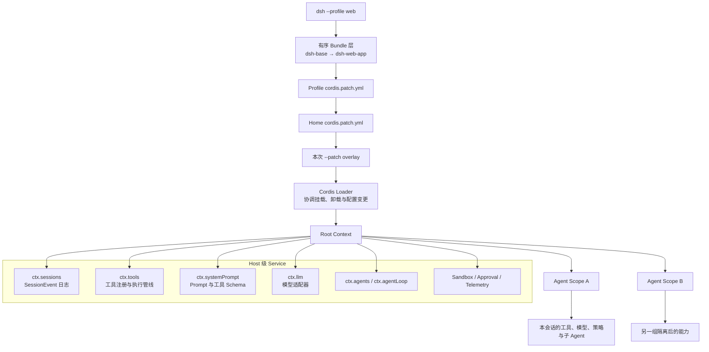
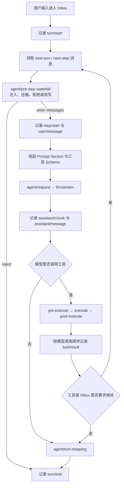
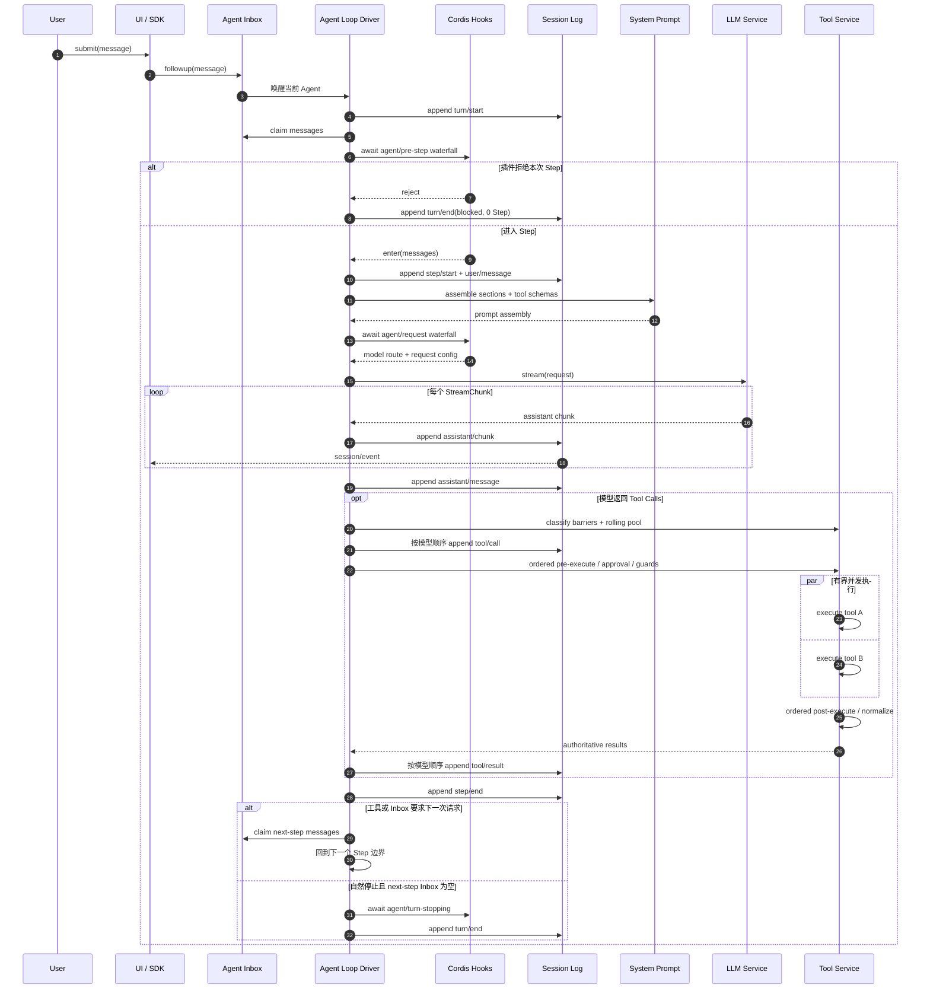
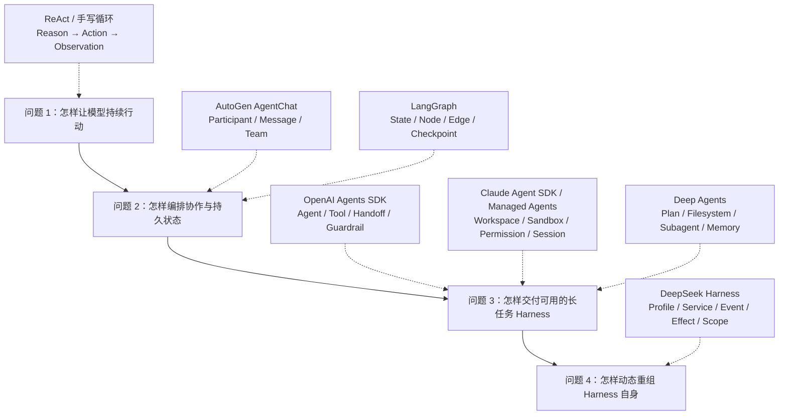

执行一条命令，就能在本地启动一个可以读写文件、运行命令、维护计划、调用子 `Agent` 的完整应用：

```bash
npx @deepseek-ai/dsh web
```

浏览器打开 `http://127.0.0.1:3080`，在 **Settings → Models** 中配置模型，在 **Choose workspace** 中选择工作目录，随后就能把任务交给它。界面看起来和其他编程 `Agent` 没有太大差别。

真正有意思的东西藏在另一条命令里：

```bash
npx @deepseek-ai/dsh --profile web --dump-config
```

它打印的不是一份普通应用配置，而是一棵插件树。模型适配器、系统提示词、工具注册表、会话日志、审批、沙箱、上下文压缩、子 `Agent`，连默认的 `Agent Loop` 都只是树上的插件。DeepSeek Harness 没有把这些能力硬编码进同一个 `Agent Loop`；Cordis 的上下文与加载器承担最小装配内核。

截至 2026 年 8 月，DeepSeek Harness 仍处于 `developer preview`，官方明确提醒会出现破坏兼容性的修改。它目前更适合研究架构、开发插件和验证新的 `Agent Runtime` 组合，不宜因为热度直接作为稳定生产基座。

## Harness 比 Agent Loop 多了什么

最小的 `Agent Loop` 并不复杂：模型读取消息，决定是否调用工具，把工具结果放回上下文，再请求模型。几十行代码就能写出来。

问题从第二天开始。会话需要恢复，流式输出需要重放，工具要审批，命令要进入沙箱，模型上下文会溢出，用户会在执行中追加指令，子 `Agent` 还要继承一部分能力、隔离另一部分能力。此时系统维护的已经不是一段循环，而是一次任务的完整生命周期。

我更愿意把 `Agent Harness` 理解成模型循环外面的承重结构：

| 层次 | 负责的事情 |
| --- | --- |
| 模型层 | 模型路由、流式响应、重试、上下文窗口 |
| 执行层 | `Turn`、`Step`、工具调度、取消、继续 |
| 能力层 | 文件系统、终端、搜索、`MCP`、子 `Agent` |
| 控制层 | 审批、权限、沙箱、预算、超时、策略 |
| 状态层 | 会话日志、持久化、重放、分叉、压缩 |
| 产品层 | `Web UI`、命令行、`SDK`、遥测、配置 |

[[相比层出不穷的 Agent 框架，不变的 Agent Protocol 是什么]] 讨论的是外部世界如何通过 `Thread / Run / Step / Event / Artifact / Checkpoint` 理解一次任务。Harness 位于协议之后，负责真的把模型、工具、状态和权限装配起来。

## 从 Profile 到 Agent Scope

DeepSeek Harness 启动的不是一个固定应用，而是一个 `Profile`。`web` 与 `headless` 都是预置 `Profile`：前者加上浏览器应用，后者执行一次任务、打印结果后退出。

`Profile` 由多层 `Bundle` 和补丁叠加而成。`dsh-base` 先挂载模型、工具、持久化、策略、凭据和遥测；上层 `Bundle` 再加入 `Web UI` 或一次性运行器。用户可以在 `Profile`、`Harness Home` 或本次启动的 `--patch` 中替换配置行。



补丁按 `row id` 替换整份配置，不做深度合并；上层覆盖时必须重述要保留的字段。

`Profile` 解决“这次启动要装什么”，`Scope` 解决“这个 `Agent` 能看见什么”。同一个服务键可以在不同作用域中解析成不同实现。一个会话可以使用本地文件系统和 DeepSeek 模型，另一个会话可以使用远程沙箱和其他模型，而消费方仍然依赖相同的 `ctx.fs` 与 `ctx.llm` 契约。

## Cordis 提供的不是普通依赖注入

把 `ctx.llm` 看成一个可替换接口，只解释了 Cordis 的一半。

普通依赖注入通常在应用启动时选择实现：

```ts
const llm: LLM = new DeepSeekLLM()
```

Cordis 关注的是运行中的依赖拓扑。插件通过 `Service` 发布能力，通过 `inject` 声明依赖。所需 `Provider` 出现后，`Consumer` 才能激活；依赖被撤回或换了身份，运行时重新协调相关组件。调用方依赖 `ctx.<key>`，不直接导入具体实现。

这个机制对应论文《[A Programming Paradigm for Spatiotemporal Composability](https://github.com/cordiverse/paper)》中的空间可组合性。组件不再各自轮询依赖是否存在，依赖变化由统一上下文协调。

时间可组合性由可逆 `Effect` 支撑。插件注册一个工具、事件监听器或 `Prompt Section` 时，同时把清理动作交给运行时。插件卸载后，Cordis 按生命周期撤销这些注册，让受管上下文恢复到安装前的状态。

```ts
ctx.effect(() => {
  const resource = installSomething()
  return () => resource.dispose()
})
```

它比只约定 `activate()` / `deactivate()` 的生命周期更进一步：副作用登记、所有权和回收动作被绑定在同一处。

但“可逆”不能被写成魔法。已经发送的邮件、已经成交的订单、没有备份的文件删除，都不会因为插件卸载自动消失。Cordis 能回收的是进入其追踪范围、并且提供逆操作的 `Effect`。外部副作用仍需要幂等键、事务、补偿动作和人工审批。

## Service、Event 与 Effect 各自做什么

DeepSeek Harness 没有让所有插件通过异步事件互相喊话。三个机制承担不同职责：

| 机制 | 适合的事情 | 例子 |
| --- | --- | --- |
| `Service` | 直接调用一项能力 | `ctx.llm.stream()`、`ctx.tools.execute()` |
| `Event` | 观察、改写或拦截生命周期节点 | 请求路由、审批、工具前后处理 |
| `Effect` | 记录安装产生的副作用及其回收动作 | 注册工具、监听器、适配器 |

`Agent Loop` 的关键路径主要使用四种调度语义：

| 模式 | 调度方式 | 适用位置 |
| --- | --- | --- |
| `emit` | 同步通知，不等待返回的 `Promise` | 状态广播、观测 |
| `parallel` | 并发执行，等待全部完成 | 相互独立的异步观察者 |
| `serial` | 按注册顺序等待，可提前给出结果 | 终止检查、顺序决策 |
| `waterfall` | 洋葱式调用，监听器通过 `next()` 委托下游 | 请求改写、审批、策略、适配器 |

`waterfall` 让插件拥有明确的控制权。只想记录指标的监听器应调用 `next()`；审批插件可以不调用 `next()`，直接拒绝操作；路由插件可以先改写请求，再等待下游结果。

这也解释了为什么异步插件没有打乱 `Agent Loop`。同一个 `Agent` 的控制流仍然按 `Turn` 和 `Step` 串行推进。会影响下一阶段的 `waterfall` 与 `serial` 会被 `Driver` 等待；纯观测的 `emit` 不允许承担关键业务决策。异步只是等待模型、网络、磁盘和工具时不阻塞线程，不等于所有插件同时修改状态。

## Turn、Step 与 SessionEvent

`Turn` 从 `turn/start` 打开，到系统不再欠下一次请求时以 `turn/end` 关闭；它可以包含零个或多个 `Step`。每个 `Step` 对应一次模型请求，以及该响应触发的工具调用。

模型没有要求工具时，当前 `Turn` 可以结束。模型返回工具调用时，Harness 执行工具、记录结果，再进入下一个 `Step`。用户在执行中追加的信息会进入统一 `Inbox`，根据 `followup`、`steer` 或 `inject` 的语义，在下一 `Turn` 或下一 `Step` 被领取。



这条流程中，`turn/*`、`step/*`、`user/message`、`assistant/*`、`tool/*` 是写入 `SessionEvent` 日志的持久事实；`agent/*` 与 `tools/*` 多数是运行中的控制点。

两类事件不能混用。界面如果需要断线重放聊天内容，应消费 `session/event`；插件如果要在本次请求发出前修改模型参数，应监听 `agent/request`。前者回答“发生过什么”，后者回答“现在是否允许继续以及怎样继续”。

官方架构里有一条很硬的约束：模型可见的信息必须已经进入日志。下一次请求不是从若干插件的临时内存拼凑历史，而是通过 `deriveMessages()` 从 `SessionEvent` 投影出来。恢复、分叉、转录和 `UI` 重放因此共享同一份事实源。

## 一次请求的时序



工具调度把执行顺序与提交顺序拆开。多个标记为 `parallel` 的工具可以进入有界并发池，真正的工具体允许重叠执行；执行前策略保持顺序，执行后结果仍按模型给出的调用顺序提交。遇到 `exclusive` 工具就形成屏障。

这让系统同时保留吞吐量和确定性。天气查询与数据库读取可以并发，后一个工具即使先返回，也不会抢先改变模型看到的结果次序。策略插件在前一个结果落盘后改变注册表时，尚未启动的工具还会重新分类。

## 工具管线为什么做得这么长

工具执行不是 `tool(args)` 一次函数调用。DeepSeek Harness 把它拆成：

```text
tool/call 写日志
  → tools/pre-execute
  → approval
  → monotonic guards
  → tools/execute
  → tool body
  → tools/post-execute
  → result normalization
  → tools/result
  → tool/result 写日志
```

审批、沙箱、文件写入保护、超时、重试、指标和结果改写都能接入同一条管线，而工具本身不需要导入某个具体策略服务。

`monotonic guard` 的意义是策略只能从允许走向拒绝，后面的插件不能把前面已经拒绝的高风险操作重新打开。工具结果经过规范化后成为唯一的模型可见结果，`UI` 卡片和下一次模型请求都围绕这份结果工作。

安全不是某个工具作者记得写的一段 `if`，而是注册在统一能力边界上的系统策略。

## 这套设计赢在哪里

### 能力替换发生在 Runtime 内部

换一个 `LLM Provider`、文件系统、沙箱或子 `Agent Provider`，消费方不需要跟着分叉。文件系统与子进程 `Provider` 共享同一个执行世界；将这组实现协调替换为远程沙箱后，文件工具、终端与语言服务才能一起迁移。

普通接口也能替换实现，但 Cordis 还知道依赖何时满足、插件作用于哪个 `Scope`、安装时产生了哪些 `Effect`。这才构成运行时热插拔。

### 控制面不用侵入 Agent Loop

审批、压缩、请求路由、工具策略和遥测都挂在稳定事件边界。默认 Driver 仍然保持一条容易审计的主线，不必为每项横切能力增加条件分支。

### 状态事实与实时控制分开

`SessionEvent` 保存可回放事实，`agent/*` 保存活跃对象上的控制动作。断线重连不会要求复活旧的监听器，插件也不必把临时决策伪装成历史事实。

### 产品形态只是不同 Profile

`Web UI`、一次性 `headless` 运行器和未来其他入口可以复用同一个能力图。差异被表达成 `Bundle` 与补丁层，而不是复制一套应用再慢慢漂移。

### 给实验和演化留下可回收边界

[[Agent-Native]] 中的 `Production Plane` 希望 `Agent` 能观察、诊断、修改并验证产品能力。Cordis 为这件事提供了比“改完代码重启整个进程”更细的实验单元：挂载组件、限定 `Scope`、观察结果、卸载并回收受管副作用。

它提供的是可审计的变更容器，不是自修改正确性的证明。模型生成的插件仍然要经过测试、权限检查、资源预算和发布策略。

## 代价也写在架构里

### 调用链变得间接

看到 `ctx.tools.execute()` 并不能立刻知道最后由谁处理。`Profile`、`Bundle`、`Scope`、`Service Provider` 和 `waterfall` 都可能影响结果。排障必须先打印真实装配树，再沿事件生产者、消费者和作用域追踪。

### 插件顺序成为公共语义

两个都能改写请求的 `waterfall` 插件，顺序不同就可能产生不同结果。监听器忘记调用 `next()` 会意外截断下游；把关键逻辑放进 `emit`，主流程又不会等待它完成。类型系统只能检查事件签名，不能证明插件组合的业务语义正确。

### 可逆 Effect 有明确边界

进程内注册容易回收，远程系统的不可逆动作很难。数据库迁移、外部消息、支付、云资源创建仍然需要传统事务和补偿机制。Cordis 不能替代部署系统，也不能替代分布式工作流引擎。

### 热插拔必须尊重执行边界

已经开始的模型流或工具调用不能随意换掉半边实现。合理的切换点通常是下一次请求、下一个 `Step` 或新会话。进行中的调用要持有稳定的 `Provider` 引用，并通过 `AbortSignal`、超时与清理协议结束。

### 生态和稳定性尚未成熟

“一切皆插件”只有在插件契约、诊断工具、版本策略和第三方生态成熟后才会产生复利。当前版本仍快速变化，配置和扩展点的学习成本不应低估。

## 适合与不适合的场景

### 适合

- 同一产品要支持多种模型、工具、沙箱、存储和权限组合；
- 桌面或本地 `Agent Host` 要按工作区、用户或会话隔离能力；
- 团队准备建设第三方插件生态，希望能力可以独立安装与卸载；
- 安全策略、审批、遥测和上下文压缩需要跨越大量工具统一生效；
- 正在研究 `Agent` 自修改，但希望每次实验都有作用域和回收边界。

### 不适合

- 只有一个模型和几个固定工具的聊天应用；
- 控制流长期稳定、分支明确，状态图比运行时插件树更容易审计；
- 组织没有插件版本治理，却准备让大量第三方代码进入主进程；
- 需求首先是跨机器的持久队列、租约、灾难恢复与 `exactly-once` 语义；
- 强监管系统要求每次能力变化都绑定不可变制品、审批单和完整验证记录。

最后两类场景不是绝对不能使用 DeepSeek Harness，而是 Cordis 只解决进程内组合。外部仍要部署、数据库、队列、审计和供应链安全承接。

## Agent Harness 的沿革

图中的实线表示问题范围扩展，虚线把项目放到它主要回答的架构问题旁边，不表示代码依赖或直接继承。



早期 `ReAct` 把 `Reasoning → Action → Observation` 固定成最小循环。框架首先解决的是“怎样让模型重复调用工具”。

`AutoGen AgentChat` 把协作单位变成参与者、消息和团队，多 `Agent` 对话成为编排方式。它的底层 `autogen-core` 进一步提供事件驱动模型，但产品抽象仍然围绕谁和谁对话。

`LangGraph` 把共享 `State`、`Node`、`Edge` 和 `Checkpoint` 放进图运行时，长任务的分支、循环、持久化、暂停和恢复更容易表达。它是一套低层编排 `Runtime`，并不替开发者决定完整的 Harness 应该带哪些工具与上下文策略。

`OpenAI Agents SDK` 选择更轻的代码优先路线。`SDK` 接管循环，提供工具、`Handoff`、`Guardrail`、状态和观测；应用仍拥有服务部署、工具实现、存储和审批决策。它适合希望保留普通代码结构、不想先建图的团队。

`Claude Agent SDK` 把成熟的编程 `Agent Loop` 暴露给应用，文件、命令、`MCP`、权限、`Hook` 和子 `Agent` 都围绕工作空间运行。后续的 `Claude Managed Agents` 又把 Agent、Environment、Session 和 Event 变成托管资源，进一步接管沙箱与长任务基础设施。

`Deep Agents` 则明确把自己称为构建在 LangGraph 之上的 `Agent Harness`。它把计划、文件系统、上下文压缩、记忆、权限和子 `Agent` 组合成有主见的默认体验。

DeepSeek Harness 再向下走了一层。它没有发明另一种推理循环，而是追问：当模型、工具、循环、会话、权限和界面都需要被替换时，运行时怎样保持可组合？它给出的答案是把 `Harness` 自身也变成 Cordis 组件图。

## 横向看它们的架构重心

| 项目 | 主要控制容器 | 一等对象 | 主要解决的问题 | 扩展的主要粒度 |
| --- | --- | --- | --- | --- |
| `AutoGen AgentChat` | 多 `Agent` 消息与团队 | `Agent`、`Message`、`Team` | 对话式协作与角色分工 | `Agent` 与消息处理器 |
| `LangGraph` | 状态图运行时 | `State`、`Node`、`Edge`、`Checkpoint` | 可恢复的复杂控制流 | 节点、边、子图 |
| `OpenAI Agents SDK` | 代码优先的 `Runner` | `Agent`、`Tool`、`Handoff`、`Guardrail` | 轻量地接管循环和多 `Agent` 路由 | `Agent`、工具、生命周期回调 |
| `Claude Agent SDK / Managed Agents` | 编程 `Agent Loop` 或托管 `Session` | `Workspace`、`Tool`、`Permission`、`Session`、`Event` | 带沙箱的长任务与编程执行 | 工具、`Hook`、子 `Agent`、环境 |
| `Deep Agents` | LangGraph 上的预制 `Harness` | `Plan`、`Filesystem`、`Subagent`、`Memory` | 长任务的上下文管理与委派 | `Middleware`、`Backend`、`Skill` |
| `DeepSeek Harness` | Cordis 插件树中的默认 `Driver` | `Profile`、`Service`、`Event`、`Effect`、`Scope`、`SessionEvent` | 运行时能力的细粒度替换与组合 | 几乎所有 `Harness` 组件 |

这些选择没有统一终点。业务流程清晰时，图比插件树容易推理；只想快速接管循环时，代码优先的 `SDK` 更轻；要交付一个可配置的本地 `Agent Host`，DeepSeek Harness 的装配方式更有吸引力。

## 装配树不是生产保证

DeepSeek Harness 最值得看的地方，不是又出现了一个会调用工具的 `Agent`。这部分早已不是稀缺能力。

它把过去散落在构造函数、全局变量、事件监听器和启动脚本里的 Runtime 依赖，放进同一个可追踪上下文。安装插件时，系统知道它需要谁、提供什么、改了什么；卸载插件时，系统知道该撤回哪些受管副作用。默认 `Agent Loop` 仍然顺序推进，但每个重要边界都允许插件在明确的调度语义下参与。

这套设计很适合未来需要频繁重组能力的 Harness，也确实为组件级自修改提供了实验基础。真正困难的部分并没有消失：谁有权改装插件树，改动怎样评测，外部副作用如何补偿，坏插件如何被隔离，跨进程状态如何恢复。

`--dump-config` 只说明这台机器此刻装了什么。生产系统还得证明它为什么这样装，以及怎样安全地换回去。

## 相关内容

- [[相比层出不穷的 Agent 框架，不变的 Agent Protocol 是什么]]
- [[从指令到意图：AI Agent 架构范式演进史]]
- [[Agent-Native]]
- [[从Claude Code到 OneAgent：如何做好上下文工程]]
- [[LangGraph Agent Event 消费指南]]

## 资料

- [DeepSeek Harness](https://github.com/deepseek-ai/deepseek-harness)
- [DeepSeek Harness Architecture](https://github.com/deepseek-ai/deepseek-harness/blob/master/docs/architecture.md)
- [Cordis Primer](https://github.com/deepseek-ai/deepseek-harness/blob/master/docs/cordis-primer.md)
- [Agent Turn And Step Lifecycle](https://github.com/deepseek-ai/deepseek-harness/blob/master/docs/agent-lifecycle.md)
- [Tool Execution Pipeline](https://github.com/deepseek-ai/deepseek-harness/blob/master/docs/tool-execution-pipeline.md)
- [A Programming Paradigm for Spatiotemporal Composability](https://github.com/cordiverse/paper)
- [LangGraph overview](https://docs.langchain.com/oss/python/langgraph/overview)
- [Deep Agents overview](https://docs.langchain.com/oss/python/deepagents/overview)
- [OpenAI Agents SDK](https://developers.openai.com/api/docs/guides/agents)
- [AutoGen AgentChat](https://microsoft.github.io/autogen/stable/user-guide/agentchat-user-guide/index.html)
- [Claude Managed Agents overview](https://platform.claude.com/docs/en/managed-agents/overview)
- [Claude Agent SDK to Managed Agents migration](https://platform.claude.com/docs/en/managed-agents/migration)
