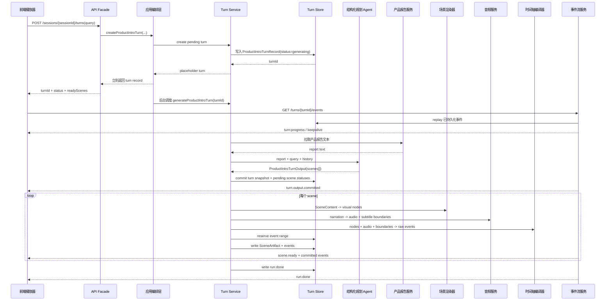

# 从对话到交互式音画同步动画讲解：一次保险产品介绍 AIGC 链路的工程化实践

> 本文讨论的不是“如何让 LLM 回答保险产品问题”，而是如何把一次产品咨询重构成一段可播放、可交互、音画同步、可续传的动画讲解。

保险产品介绍天然不是一段普通文本。用户关心的往往不是“这款产品有哪些条款”，而是“我能不能快速听懂它适合谁、保什么、哪里有限制、接下来该问什么”。如果只把产品报告丢给 LLM，让它生成一段长文本，内容可能是对的，但体验仍然像在读报告。

我们希望构建的是另一种形态：用户发起一次咨询，系统返回的不是一段回答，而是一段由多个场景组成的讲解流。每个场景都有画面、配音、字幕、节点出现节奏和可追问建议；前端不是重新理解业务逻辑，而是消费后端生产好的事件流，按统一时间轴播放。

动画讲解的核心不是生成文件，而是生成一条可播放事件流：音频、字幕、视觉节点和进度都由后端编排，前端按时间轴增量播放。它更接近“可交互播放器”，而不是“文件生成器”。

这个目标背后有两个真实问题。

第一个是音画不同步。早期链路里，文本、画面、音频、字幕和播放状态是多个产物各自生成、各自到达。结果是画面可能已经切到下一个重点，音频还在解释上一段；或者字幕 token 和配音节奏不一致，用户看到与听到的不是同一件事。

第二个是慢。一次完整讲解生成超过 20 秒时，用户感受到的不是“实时智能”，而是在等待一段复杂动画讲解完成生产。这里需要坦诚一点：端到端 20 秒以上的问题目前还没有彻底解决。当前阶段优先解决的是把慢从黑盒等待拆成可观测阶段，并让前端能尽早拿到进度和已完成场景；后续仍需要继续压缩首幕 ready 和整体完成时间。

所以本文的核心主张是：**AIGC 产品讲解不应停留在“生成内容”，而要走向“生产体验”——让 LLM 做内容导演，让后端做确定性制片，让前端播放可续传事件。**

---

## 一、整体架构：从一次 query 到一条动画讲解流

这一章先回答一个工程师最关心的问题：一次用户请求进来后，系统里到底有哪些角色，它们如何协作，哪些模块能修改生成状态，哪些模块只负责观察和播放。

### 1.1 角色分工

为了适合对外表达，本文隐藏内部 RPC 名、存储名、模型名和服务代号，但保留对象结构、字段语义、事件协议、状态流转和工程取舍。

| 正文用语       | 职责                                       | 保留的工程细节                                                                 |
| -------------- | ------------------------------------------ | ------------------------------------------------------------------------------ |
| 产品报告服务   | 提供产品介绍事实来源                       | 返回产品报告文本，作为规划 Agent 的 grounding context                          |
| 结构化规划 Agent | 基于报告、query、历史上下文生成讲解剧本     | 输出 `ProductIntroTurnOutput`，包含 `scenes`、`responseText`、`suggestedQueries` |
| 场景渲染器     | 把 `SceneContent` 渲染为安全视觉节点        | 按 `SceneKind` 分发，输出受控 SVG/KUAICHA node                                  |
| 音频服务       | 为每个 scene 的 narration 生成讲解音频      | 输出音频 URL、时长、文本 hash、字幕边界                                         |
| 时间轴编译器   | 把音频、字幕、视觉节点编译成播放事件       | 输出 `scene:start`、`subtitle:token`、`node:commit`、`scene:end`                 |
| 事件流服务     | 将进度和播放事件推给前端                   | 支持 SSE、`Last-Event-ID`、durable replay、终态事件                             |
| 前端播放器     | 按事件协议播放讲解                         | 不重新解释产品逻辑，只消费后端 committed events                                |

整体数据流如下：

```text
用户 query
   │
   ▼
产品报告服务
   │  report text
   ▼
结构化规划 Agent
   │  ProductIntroTurnOutput
   │  ├─ title
   │  ├─ responseText
   │  ├─ scenes[]
   │  └─ suggestedQueries[]
   ▼
逐 scene 制片流水线
   │
   ├─ 场景渲染器：SceneContent -> visual nodes
   ├─ 音频服务：narration -> audio + subtitle boundaries
   ├─ 时间轴编译器：nodes + audio + boundaries -> ProductIntroEvent[]
   └─ 事件存储：分配连续事件 ID，支持 replay
   │
   ▼
SSE 事件流
   │
   ├─ turn:progress
   ├─ scene:start
   ├─ subtitle:token
   ├─ node:commit
   ├─ scene:end
   └─ run:done / run:error
   │
   ▼
前端播放器
```

这里最重要的边界是：**结构化规划 Agent 不生成动画产物，不生成 SVG、HTML、CSS、音频或事件；它只生成可制片的结构化 scenes。**

### 1.2 请求时序：创建 turn 和播放事件不是同一个阶段

创建 turn 的 HTTP 请求并不会等完整动画讲解生成完成。它先创建一个可见的 placeholder turn，然后后台继续生成 output、scene artifact 和事件流。



这张时序图对应三个体验事实：

1. **创建 turn 要快。** API 返回的是“任务已接收并可订阅”，不是“动画讲解已完成”。
2. **生成过程要可观察。** 前端通过 SSE 先看到 progress，再看到 scene 级播放事件。
3. **播放事件要可恢复。** 已持久化事件可以根据 `Last-Event-ID` replay，live progress 只补充实时等待感。

### 1.3 模块依赖：规划层不能反向依赖制片层

如果把依赖关系画出来，核心是单向流动：越靠前越偏语义，越靠后越偏确定性产物。

```text
API Facade
   │
   ▼
应用编排层
   │
   ▼
Turn Service ───────────────┐
   │                         │
   ├─> 产品报告服务           │
   │                         │
   ├─> Context Assembler      │
   │        │                │
   │        ▼                │
   ├─> 结构化规划 Agent       │
   │        │                │
   │        ▼                │
   │   ProductIntroTurnOutput│
   │                         │
   ├─> Turn Store <──────────┤
   │                         │
   ├─> Scene Artifact Builder│
   │        │                │
   │        ├─> Scene Validator
   │        ├─> 场景渲染器
   │        ├─> 音频服务
   │        └─> 时间轴编译器
   │                         │
   └─> 事件流服务 ───────────> 前端播放器
```

依赖关系里最关键的是几条“不允许反向依赖”的边界：

| 边界                 | 允许                                      | 不允许                          | 原因                                           |
| -------------------- | ----------------------------------------- | ------------------------------- | ---------------------------------------------- |
| 规划 Agent -> 制片层 | 输出 `ProductIntroTurnOutput`             | 输出 SVG、audio、events、Redis key | 避免模型跨过安全和播放协议边界                 |
| Renderer -> Agent    | 消费 `SceneContent`                       | 反向调用 Agent 补字段            | renderer 必须确定性，缺字段应该由 schema/validator 暴露 |
| 前端播放器 -> 业务语义 | 消费 `ProductIntroEvent`                  | 自己理解 `SceneKind` 或产品条款  | 前端越轻，协议越要硬                           |
| SSE -> 生成流程      | 读取 durable events + live progress       | 直接驱动生成                    | SSE 是观察与传输层，不应该改变生产状态         |
| Store -> 业务逻辑    | 保存 record/snapshot/events               | 决定 scene 内容                 | 存储只保证一致性和 replay，不承载业务判断      |

也就是说，`Turn Service` 是这条链路里的生命周期中枢：它知道什么时候创建 placeholder、什么时候调用规划 Agent、什么时候逐 scene 制片、什么时候提交事件、什么时候写终态。其他模块都围绕这个中枢做单一职责。

### 1.4 数据依赖：每一层只消费上一层的稳定产物

对象之间的依赖可以按下面这条链理解：

```text
ProductIntroTurnInput
   │  report + query + history
   ▼
ProductIntroContextText
   │  bounded prompt context + contextHash
   ▼
ProductIntroTurnOutputEnvelope
   │  output + producer metadata
   ▼
SceneContent
   │  semantic scene spec
   ▼
SceneArtifactDraft
   │  nodes + audio + boundaries + rawEvents
   ▼
SceneArtifact
   │  final event IDs + validated events
   ▼
ProductIntroEvent
   │  SSE frame
   ▼
前端播放器状态
```

这条链的好处是每层都有明确的输入输出，可以独立校验：

- `ProductIntroContextText` 校验 prompt 是否越界；
- `ProductIntroTurnOutputEnvelope` 校验模型是否输出非法字段；
- `SceneContent` 校验 scene kind 与字段数量；
- `SceneArtifact` 校验音频 hash、字幕边界、节点白名单、事件时间；
- `ProductIntroEvent` 校验事件类型、`atMs`、payload 形态。

---

## 二、语义规划层：让 LLM 生成导演脚本，而不是页面

这一章聚焦规划层。它解决的问题是：LLM 到底应该输出什么，如何避免它跨过边界，如何把一次 query 组织成可制片的 scenes。

### 2.1 为什么不是让 LLM 直接生成页面

最直观的方案是让 LLM 直接输出页面：HTML、SVG、CSS、时间线、甚至字幕和动画配置。这样看似链路短，但对线上产品并不友好。

第一，视觉不可控。产品讲解需要稳定的品牌风格、字体层级、颜色系统和布局规则。如果让模型直接生成视觉节点，页面每次都可能长得不一样，前端也很难判断哪些差异是设计意图，哪些是模型漂移。

第二，安全不可控。页面产物里一旦混入 `style`、`script`、`class`、事件 handler 或未白名单组件，前端就要承担额外的清洗风险。相比事后过滤，工程上更稳的方式是根本不让模型进入页面生成层。

第三，播放不可控。音频、字幕和画面节点必须共享同一个时间轴。模型可以描述“这里出现一个重点卡片”，但不能可靠地产生和真实 TTS 音频对齐的 `atMs`。

第四，续传不可控。用户刷新、网络抖动、SSE 重连都是常态。播放协议需要稳定事件 ID、终态事件、历史 replay 和 `Last-Event-ID` 处理，这些都应由后端确定性维护，而不是交给模型自由生成。

因此我们选择的是另一种边界：

```text
LLM 负责：讲什么、分几幕、每幕表达什么
后端负责：怎么画、怎么配音、何时出现、如何续传
前端负责：按协议播放 committed events
```

### 2.2 ProductIntroTurnInput：定义“这一轮要回答什么”

生成链路的输入不是裸 query，而是一个完整的 turn input。

```text
ProductIntroTurnInput
  ├─ sessionId
  ├─ turnId
  ├─ prodNo
  ├─ reportVersion
  ├─ query
  └─ previousTurnIds
```

| 字段              | 设计目的                         | 为什么需要                                           |
| ----------------- | -------------------------------- | ---------------------------------------------------- |
| `sessionId`       | 标识一次多轮产品介绍会话         | 多轮追问需要共享 thread history，不能把每轮都当首轮 |
| `turnId`          | 标识当前生成任务                 | 用于幂等、日志、事件 ID 前缀、SSE 订阅和失败定位    |
| `prodNo`          | 标识产品                         | 拉取产品报告、构造缓存 key、生成音频资产路径都需要它 |
| `reportVersion`   | 标识报告版本                     | 避免同一产品不同版本报告混用，便于缓存和回放一致性   |
| `query`           | 当前用户真正问的问题             | 结构化规划 Agent 必须优先回答当前 query，而不是机械做完整总览 |
| `previousTurnIds` | 当前 session 已提交的历史 turn   | 判断首轮/追问，决定报告裁剪策略、输出场景数量和上下文承接方式 |

这里有个容易被忽略的点：`previousTurnIds` 不是为了把所有历史内容拼进 prompt，而是为了告诉系统“这是第几轮、之前是否已经讲过”。首轮可以做短版总览；追问则应该围绕当前 query 聚焦回答，避免每次都重新生成完整产品介绍。

### 2.3 ProductIntroTurnOutput：定义“LLM 要交付什么”

结构化规划 Agent 的输出核心是 `ProductIntroTurnOutput`。

```text
ProductIntroTurnOutput
  ├─ title
  ├─ responseText
  ├─ scenes[]
  └─ suggestedQueries[]
```

| 字段               | 面向谁       | 设计目的                                               |
| ------------------ | ------------ | ------------------------------------------------------ |
| `title`            | 前端和用户   | 给这一轮讲解一个短标题，用于播放器顶部、历史记录或分享摘要 |
| `responseText`     | 对话层       | 保留一份自然语言回答，保证即使不播放动画讲解，用户也能读到完整答复 |
| `scenes`           | 制片流水线   | 把回答拆成 1~8 个可渲染、可配音、可编排的场景          |
| `suggestedQueries` | 下一轮交互   | 把动画讲解重新接回对话，引导用户继续问保障、费用、限制或适用性 |

为什么同时需要 `responseText` 和 `scenes`？因为它们面向的消费场景不同。`responseText` 是“对话回答”，需要语义完整；`scenes` 是“播放剧本”，需要可视化、可配音、可分段。二者可以表达同一轮回答，但不能互相替代。

如果只有 `responseText`，后端无法稳定生成音画同步场景；如果只有 `scenes`，用户在弱网络、无声播放、历史回看或无播放器环境里会缺少完整文本答案。

`ProductIntroTurnOutput` 外面还有一层 envelope：

```text
ProductIntroTurnOutputEnvelope
  ├─ output
  └─ metadata
```

`metadata` 不是给模型自由输出的，而是 adapter 补充的生产元信息：

| 字段              | 设计目的                                           |
| ----------------- | -------------------------------------------------- |
| `producerName`    | 标识由哪类 producer 生成，便于灰度和排查           |
| `producerVersion` | 标识规划策略版本，避免旧缓存污染新策略             |
| `sourceHash`      | 标识原始来源；当前链路主要使用 context hash 表达来源身份 |
| `contextHash`     | 标识本轮拼给 Agent 的上下文，便于复现与缓存判断    |
| `query`           | 记录本轮 query，避免只看 output 时丢失用户意图     |
| `mode`            | 标识生成模式，支持后续多 producer 扩展             |

这个分层的关键是：**模型只输出业务语义，系统补充生产元信息。** 模型不应该输出 `metadata`、`sourceHash`、`events`、`audio` 这类越界字段。

### 2.4 SceneContent：定义“一幕应该表达什么”

`scenes[]` 里的每一项是 `SceneContent`。

```text
SceneContent
  ├─ spec
  │   ├─ sceneId
  │   ├─ title
  │   ├─ eyebrow
  │   ├─ layer
  │   ├─ kind
  │   └─ narration
  ├─ metrics
  ├─ pills
  ├─ warnings
  ├─ checklist
  ├─ comparison
  └─ infoCards
```

`spec` 决定一幕的身份与讲解文案：

| 字段        | 设计目的             | 消费方                                           |
| ----------- | -------------------- | ------------------------------------------------ |
| `sceneId`   | 稳定标识一幕         | 节点 ID 前缀、字幕边界、事件 payload、失败定位  |
| `title`     | 一幕的短判断句       | 画面主标题，帮助用户快速抓重点                   |
| `eyebrow`   | 场景眉标             | 提供轻量分类，例如“费用门槛”“保障范围”           |
| `layer`     | 场景层级             | 表达这一幕在讲解结构里的位置，例如“先看结论”“再看限制” |
| `kind`      | 场景类型             | 决定 renderer 使用哪套布局和字段规则             |
| `narration` | 可直接配音的讲解稿   | TTS 输入、字幕 token 来源、时间轴基准            |

`narration` 是这里最重要的字段之一。它不是给前端展示的普通描述，而是音频服务的输入。后续字幕边界、音频时长、scene end 时间都从它派生出来。

`SceneKind` 则是保险产品讲解里的镜头语言：

```text
identity       产品身份、定位、核心价值
eligibility    适用人群、投保条件
deductible     免赔额、起付线、赔付门槛
coverage       保障责任、权益内容
renewal        续保、连续保障
hospital       医院范围、服务网络
drug_device    药品、器械、特材
risk_summary   限制、风险、除外责任
```

视觉素材字段不是越多越好，每种 `SceneKind` 都有字段数量约束：

| 字段         | 适合表达                       | 设计边界                                             |
| ------------ | ------------------------------ | ---------------------------------------------------- |
| `metrics`    | 数字、比例、期限、额度、次数   | 必须来自报告可支持的信息，并带 `sourceFactId`        |
| `pills`      | 标签、卖点、适用人群、资源类型 | 短文本，适合横向排列                                 |
| `warnings`   | 限制、除外、风险、前提条件     | 压缩成短提醒，避免长段落进入画面                     |
| `checklist`  | 有顺序或并列关系的要点         | 部分 kind 要求特殊格式，如 `value|label`             |
| `comparison` | 明确两侧对比                   | 适合免赔、方案差异、前后变化                         |
| `infoCards`  | 并列短信息                     | 适合保障分层、续保路径、风险/适合人群卡片            |

| SceneKind      | 典型字段要求                                      | 目的                                               |
| -------------- | ------------------------------------------------- | -------------------------------------------------- |
| `identity`     | `metrics>=2`、`pills>=1`、`warnings>=1`、`infoCards>=1` | 让产品身份页同时有数字、标签、边界提醒             |
| `eligibility`  | `metrics>=2`、`warnings>=1`、`checklist>=3`       | 让适用条件以时间线/清单形式表达                    |
| `deductible`   | `metrics>=1`、`warnings>=1`、`comparison` 必填    | 免赔额必须能形成“门槛前/门槛后”的对比              |
| `coverage`     | `infoCards=3`                                     | 保障责任按三层结构稳定呈现                         |
| `renewal`      | `infoCards=2`、`warnings>=1`                      | 续保通常是两条路径或两个条件对照                   |
| `risk_summary` | `infoCards=2`、`checklist>=1`、`warnings>=1`      | 同时表达适合谁、风险点、总结提醒                   |

这套规则的价值是：模型可以决定“讲什么”，但不能产出 renderer 无法承接的数据。

### 2.5 一个实际的 ProductIntroTurnOutput 样例

下面是一个脱敏后的示例。假设用户追问：“免赔额是什么意思？”

```json
{
  "title": "免赔额怎么理解",
  "responseText": "免赔额可以理解为理赔前需要先由自己承担的费用门槛。只有超过免赔额的部分，才会进入后续赔付计算。具体金额和适用范围要以产品报告中的条款为准。",
  "scenes": [
    {
      "spec": {
        "sceneId": "deductible_001",
        "title": "先过费用门槛",
        "eyebrow": "免赔额",
        "layer": "理赔前提",
        "kind": "deductible",
        "narration": "免赔额可以理解为理赔前的费用门槛。没有超过这条线的费用，通常需要自己承担；超过之后，才进入产品约定的赔付计算。"
      },
      "metrics": [
        {
          "value": "门槛",
          "label": "先自付",
          "sourceFactId": "report:deductible"
        }
      ],
      "pills": [],
      "warnings": [
        "具体金额和适用范围以条款为准。"
      ],
      "checklist": [],
      "comparison": {
        "leftLabel": "未超过",
        "leftValue": "自付",
        "rightLabel": "超过后",
        "rightValue": "再计算"
      },
      "infoCards": []
    }
  ],
  "suggestedQueries": [
    "这个免赔额是一年累计吗？",
    "哪些费用不计入免赔额？",
    "超过免赔额后怎么赔？"
  ]
}
```

这段输出里没有 SVG、音频 URL、字幕边界、事件 ID。它只说明“这一幕要讲什么”。后续的视觉、音频、字幕和播放时序由后端制片流水线完成。

## 三、场景制片层：从 SceneContent 到可播放 SceneArtifact

这一章聚焦后端制片。它解决的问题是：一幕结构化语义如何变成可播放资产，字幕如何真正对齐音频，视觉节点如何保持安全和确定性。

### 3.1 SceneArtifact：把一幕变成可播放资产

`SceneContent` 还是剧本，不能直接播放。后端逐 scene 生产 `SceneArtifact`。

```text
SceneArtifact
  ├─ sceneId
  ├─ sceneIndex
  ├─ startMs
  ├─ endMs
  ├─ eventCount
  ├─ endEventIndex
  ├─ content
  ├─ audio
  ├─ boundaries
  ├─ nodes
  └─ events
```

| 字段            | 设计目的                                                     |
| --------------- | ------------------------------------------------------------ |
| `sceneId`       | 关联原始 `SceneContent`，也是节点、字幕、事件 payload 的主键 |
| `sceneIndex`    | 当前是第几幕，用于布局纵向偏移和播放顺序                     |
| `startMs`       | 这一幕在整个 turn 时间轴上的开始时间                         |
| `endMs`         | 这一幕结束时间，通常由音频时长 + hold 时间决定               |
| `eventCount`    | 这一幕会产生多少事件，用于预留事件 ID 区间                   |
| `endEventIndex` | 这一幕最后一个事件在 turn 内的编号                           |
| `content`       | 原始语义输入，便于回放、调试、重建                           |
| `audio`         | 讲解音频资产，包括 URL、时长、hash、对齐级别                 |
| `boundaries`    | 字幕 token 与音频时间的映射                                  |
| `nodes`         | 受控视觉节点，前端按 `node:commit` 增量绘制                  |
| `events`        | 最终可回放播放事件                                           |

这里有两个阶段对象：

```text
SceneArtifactDraft    # 已有 nodes/audio/boundaries/rawEvents，但还没有最终事件 ID
SceneArtifact         # 已分配最终事件 ID，可写入并对前端可见
```

为什么需要 draft？因为事件 ID 必须连续、稳定、可续传。后端要先知道这一幕会生成多少事件，再向存储层预留 event range，最后把 raw events materialize 成带最终 ID 的 events。

制片流程如下：

```text
SceneContent
  -> validate_scene_content
  -> render_scene_nodes
  -> build_scene_audio
  -> build_raw_scene_events
  -> reserve event range
  -> materialize_scene_artifact
  -> write_scene_ready
```

这里的“逐 scene”不是等所有 scene 都制片完成后再一次性输出。当前链路会先让结构化规划 Agent 一次性产出完整 `scenes[]`，保证这一轮讲解有统一导演脚本；随后后端按 scene 顺序制片，每完成一幕就写入该幕的事件 shard 和 ready 状态。SSE 侧会周期性读取已 ready 的连续 scene 前缀，因此第一幕 ready 后就可以被前端播放，后续 scene 继续生成。

这也是为什么简单把 scene 制片并行化，收益未必直接。真正耗时的前置瓶颈往往是完整 `ProductIntroTurnOutput` 的规划：只要仍然坚持“先由 LLM 统一导演整轮脚本”，并行只能优化规划之后的 TTS、上传和事件编译阶段。并行化还要处理事件区间预留、连续 ready 前缀、scene 顺序、失败隔离和资源限流；它是后续优化方向，但不是解决首段可播放的唯一手段。当前更关键的体验策略是：完整脚本一次性规划，制片阶段逐 scene ready，前端尽早消费第一段 committed events。

### 3.2 视觉节点：受控 SVG，而不是模型生成页面

场景渲染器根据 `SceneKind` 分发到不同布局：

```text
identity     -> 产品身份卡片
eligibility  -> 条件时间线 + 指标卡
deductible   -> 核心数字 + 对比卡
coverage     -> 三层保障 stack
renewal      -> 续保路径
hospital      -> 服务网络
risk_summary -> 适合/风险决策卡
```

渲染结果是节点列表。一个节点大致长这样：

```json
{
  "id": "deductible_001:metric-left-value",
  "type": "text",
  "anchorY": 142,
  "props": {
    "x": 89,
    "y": 142,
    "fontSize": 24,
    "fontWeight": "900",
    "textAnchor": "middle",
    "fill": "#1677ff"
  },
  "text": "门槛"
}
```

节点协议有几个关键约束：

- `id` 必须以 `sceneId` 开头，便于定位和去重；
- `type` 只允许 `rect`、`circle`、`line`、`path`、`text` 等有限类型；
- `props` 只允许坐标、尺寸、颜色、字体等白名单字段；
- 禁止 `component`、`class`、`style`、`script`、`on*` 这类字段；
- 节点必须在画布边界内，颜色必须来自允许集合。

这就是“让模型做导演，不让模型当前端工程师”的具体落点。模型决定 `deductible_001` 要讲免赔额，renderer 决定它应该画成什么节点、放在哪、用什么字号和颜色。

### 3.3 音频资产：narration 如何变成可校验音频

每个 scene 的 `narration` 会进入音频服务，生成 `SceneAudioAsset`：

```text
SceneAudioAsset
  ├─ sceneId
  ├─ voiceId
  ├─ speechRate
  ├─ format
  ├─ sampleRate
  ├─ durationMs
  ├─ url
  ├─ fileId
  ├─ textHash
  ├─ audioHash
  ├─ alignmentLevel
  ├─ storageMode
  └─ urlExpireSeconds
```

| 字段               | 设计目的                                                   |
| ------------------ | ---------------------------------------------------------- |
| `durationMs`       | 后续编译 `scene:end` 和 node 分布时间必须依赖真实音频时长 |
| `url`              | 前端播放音频的地址                                         |
| `textHash`         | 校验音频对应的就是当前 narration                           |
| `audioHash`        | 标识音频内容，便于排查重复生成和缓存问题                   |
| `alignmentLevel`   | 标识字幕边界来自真实字词时间，还是估算                     |
| `urlExpireSeconds` | 告诉前端音频 URL 的有效期，避免长期缓存误用                |

### 3.4 字幕边界：narration 的哪段文字何时出现

字幕边界是 `SubtitleBoundary`：

```text
SubtitleBoundary
  ├─ sceneId
  ├─ token
  ├─ startMs
  ├─ endMs
  ├─ charStart
  └─ charEnd
```

它回答的是：**narration 的哪一段文字，应该在音频的哪个时间范围内出现。** 如何实现？

第一步，音频服务返回原始 TTS meta events，里面可能包含 `timeLineList`。系统会把所有 `timeLineList` 拉平，并只保留字段完整的 timeline item：

```text
TimelineItem
  ├─ data
  ├─ startIndex
  ├─ endIndex
  ├─ startTime
  ├─ endTime
  └─ sentence
```

第二步，系统会把 narration 切成 subtitle token。切分规则很克制：遇到中文标点 `，。；：、` 会切分；如果一直没有标点，单个 token 最多 5 个字符。切分时同时记录字符区间：

```text
TokenSpan
  ├─ token
  ├─ charStart
  └─ charEnd
```

切完后会做一次重建校验：所有 token 拼起来必须和原始 narration 完全一致。这个校验能避免字幕切分丢字、增字或顺序错乱。

第三步，优先使用 TTS 的真实字符时间。系统会过滤出 `sentence=false` 且 `startIndex < endIndex` 的字符级 timeline item，然后为每个 token 找到所有字符区间有重叠的 timeline item：

```text
item.startIndex < token.charEnd && item.endIndex > token.charStart
```

如果找到重叠项，这个 token 的时间边界就是：

```text
startMs = min(overlapping.startTime)
endMs   = max(overlapping.endTime)
```

第四步，校验边界必须单调递增，并且不能超过真实音频时长。如果任何 token 找不到对应字符时间，或者边界不合法，就放弃真实对齐。

第五步，fallback 到估算对齐。估算不是随便平均切，而是按 token 字符长度加权，把所有 token 分布到真实 `durationMs` 上：

```text
weight(token) = max(1, token.charEnd - token.charStart)
endMs(i) = durationMs * sum(weights[0..i]) / sum(weights)
```

这样即使 TTS 不返回可用字级时间，字幕也能覆盖完整 narration，并且最后一个 token 会对齐到真实音频结束时间。

一个边界示例：

```json
{
  "sceneId": "deductible_001",
  "token": "免赔额可以",
  "startMs": 0,
  "endMs": 620,
  "charStart": 0,
  "charEnd": 5
}
```

这个实现对应两个工程目标：

1. 有真实 TTS 时间时，尽量使用真实对齐，提升音画同步精度；
2. 没有真实时间时，也不让字幕脱离真实音频时长，保证播放体验可接受。

### 3.5 同一个 query 如何一路变成事件

把“免赔额是什么意思？”贯穿起来，可以看到每层对象只解决一类问题：

| 阶段     | 对象                       | 关键变化                                                         | 解决的问题                                     |
| -------- | -------------------------- | ---------------------------------------------------------------- | ---------------------------------------------- |
| 用户输入 | `ProductIntroTurnInput`    | `query="免赔额是什么意思？"`，带上 `sessionId`、`turnId`、`previousTurnIds` | 明确这一轮属于哪个会话、回答哪个问题           |
| Agent 输出 | `ProductIntroTurnOutput`   | 生成 1 个 `deductible` scene 和 3 个 suggested queries           | 把文本回答拆成可制片剧本                       |
| 场景语义 | `SceneContent`             | 有 `narration`、`metrics`、`comparison`、`warnings`              | 让 renderer 知道这一幕要表达什么               |
| 视觉产物 | `nodes`                    | 生成标题、指标卡、对比卡、提醒卡等受控节点                       | 把业务语义变成安全视觉指令                     |
| 音频产物 | `SceneAudioAsset`          | `narration` 变成音频 URL、`durationMs`、hash、对齐级别           | 让这一幕可以被播放和校验                       |
| 字幕产物 | `SubtitleBoundary[]`       | narration 被切成 token，并对齐音频时间                           | 让字幕跟着音频节奏出现                         |
| 播放产物 | `ProductIntroEvent[]`      | 编译出 `scene:start`、`subtitle:token`、`node:commit`、`scene:end` | 让前端按统一时间轴播放                         |

这条对象链也是排查链。如果用户反馈“字幕慢了”，优先看 `SubtitleBoundary` 和 `alignmentLevel`；如果反馈“画面节点出现太晚”，看 `node:commit.atMs` 的编译逻辑；如果反馈“刷新后丢画面”，看 committed event ID 和 `Last-Event-ID` replay。

---

## 四、事件协议层：统一时间轴、SSE 与 durable replay

这一章聚焦播放协议。它解决的问题是：音频、字幕、视觉节点如何共享一个时钟；前端断线后如何恢复；生成中的 progress 和最终播放事件有什么区别。

### 4.1 ProductIntroEvent：把视觉、音频、字幕编译到同一条时间轴

音画同步问题的本质，是画面、字幕、音频是否共享同一个时钟。

如果前端分别拿到：

```text
一组视觉节点
一段音频 URL
一段字幕文本
一个生成状态
```

它只能自己猜测什么时候显示哪个节点、什么时候滚动字幕、什么时候切换下一幕。这个猜测在 demo 中可能能跑，但在真实 TTS 时长波动、网络重连、异步生成的场景里很容易错位。

我们的做法是把所有播放动作编译成同一组 `ProductIntroEvent`：

```text
ProductIntroEvent
  ├─ id
  ├─ eventType
  ├─ atMs
  └─ payload
```

| 字段        | 设计目的                                       |
| ----------- | ---------------------------------------------- |
| `id`        | 稳定事件 ID，用于排序、去重、`Last-Event-ID` 续传 |
| `eventType` | 事件类型，决定前端如何处理 payload             |
| `atMs`      | 事件在整个 turn 播放时间轴上的触发时间         |
| `payload`   | 事件负载，根据事件类型变化                     |

一个 scene 会被编译成：

```text
scene:start       # 开始当前场景，携带音频信息
subtitle:token    # 在音频相对时间点显示字幕 token
node:commit       # 在音频推进过程中提交视觉节点
scene:end         # 当前场景结束
```

整个 turn 最后写入 `run:done`；异常时写入 `run:error`。

这套协议的关键是 `atMs`。字幕 token 的 `atMs` 来自字幕边界，视觉节点的 `atMs` 根据音频时长分布或 visual beat 对齐，scene end 的 `atMs` 来自音频时长加 hold 时间。

换句话说：

```text
音频不是画面的附属品，画面也不是音频的附属品；它们都被编译到同一条播放时间轴上。
```

这让音画同步从“前端经验逻辑”变成“后端事件协议”。

### 4.2 一段完整事件流示例

下面给一个脱敏后的单 scene 事件流。假设 turn id 是 `turn_abc`，当前只有一个 `deductible_001` 场景，音频时长约 6 秒，scene hold 800ms。

#### 生成过程中的 progress 事件

progress 事件和 committed playback event 要分开看。progress event 主要解决生成过程可观测，部分来源于内存实时通道；committed playback event 才是最终播放协议，具备稳定事件 ID 和 durable replay 能力。二者都以 SSE frame 形式发送，但语义和持久化要求不同。

progress 事件不一定全部持久化为最终播放事件，但它们是用户等待和工程排查的关键。下文的 `remote_file` 是对内部音频存储枚举的脱敏表达，真实系统中该字段由后端白名单约束。

```json
{
  "id": "live:1",
  "eventType": "turn:progress",
  "atMs": 0,
  "payload": {
    "stage": "turn.accepted",
    "message": "已收到请求，正在准备生成讲解",
    "sceneIndex": null,
    "sceneId": null,
    "readyScenes": 0,
    "totalScenes": 0,
    "percentEstimate": 8,
    "source": "backend_stage",
    "timestamp": "2026-07-01 10:00:00"
  }
}
```

```json
{
  "id": "live:7",
  "eventType": "turn:progress",
  "atMs": 0,
  "payload": {
    "stage": "scene.audio.tts.started",
    "message": "正在生成讲解音频",
    "sceneIndex": 0,
    "sceneId": "deductible_001",
    "readyScenes": 0,
    "totalScenes": 1,
    "percentEstimate": 49,
    "source": "backend_stage",
    "timestamp": "2026-07-01 10:00:05"
  }
}
```

#### 最终可回放播放事件

当 scene ready 后，前端真正播放的是 committed events。

第一条是 `scene:start`，它告诉播放器：这一幕开始了，音频在哪里，时长多少。

```json
{
  "id": "turn_abc:000001",
  "eventType": "scene:start",
  "atMs": 0,
  "payload": {
    "sceneId": "deductible_001",
    "title": "先过费用门槛",
    "narration": "免赔额可以理解为理赔前的费用门槛。没有超过这条线的费用，通常需要自己承担；超过之后，才进入产品约定的赔付计算。",
    "audio": {
      "url": "https://example.com/audio/turn_abc/deductible_001.wav",
      "durationMs": 6080,
      "format": "wav",
      "sampleRate": 16000,
      "voiceId": "voice-default",
      "speechRate": 0,
      "textHash": "sha256:narration-hash",
      "audioHash": "sha256:audio-hash",
      "alignmentLevel": "word",
      "storageMode": "remote_file",
      "urlExpireSeconds": 604800
    }
  }
}
```

随后是字幕事件。注意 `atMs` 是 turn 级时间，`audioStartMs/audioEndMs` 是 scene 音频内的相对时间。

```json
{
  "id": "turn_abc:000002",
  "eventType": "subtitle:token",
  "atMs": 0,
  "payload": {
    "sceneId": "deductible_001",
    "token": "免赔额可以",
    "audioStartMs": 0,
    "audioEndMs": 620,
    "charStart": 0,
    "charEnd": 5
  }
}
```

视觉节点不是一次性全量下发，而是以 `node:commit` 的方式沿音频时间轴出现。

```json
{
  "id": "turn_abc:000004",
  "eventType": "node:commit",
  "atMs": 760,
  "payload": {
    "sceneId": "deductible_001",
    "beatId": "deductible_001:frame-title",
    "node": {
      "id": "deductible_001:frame-title",
      "type": "text",
      "anchorY": 54,
      "props": {
        "x": 20,
        "y": 54,
        "fontSize": 18,
        "fontWeight": "800",
        "fill": "#1f2933"
      },
      "text": "先过费用门槛"
    }
  }
}
```

scene 结束事件在音频时长 + hold 时间之后触发：

```json
{
  "id": "turn_abc:000018",
  "eventType": "scene:end",
  "atMs": 6880,
  "payload": {
    "sceneId": "deductible_001"
  }
}
```

如果这是最后一幕，最后写入终态：

```json
{
  "id": "turn_abc:000019",
  "eventType": "run:done",
  "atMs": 7380,
  "payload": {
    "reason": "completed"
  }
}
```

前端动作非常明确：

| eventType        | 前端动作                         |
| ---------------- | -------------------------------- |
| `scene:start`    | 初始化当前 scene，加载/播放音频 |
| `subtitle:token` | 在指定时间显示或追加字幕 token   |
| `node:commit`    | 把一个视觉节点加入画布           |
| `scene:end`      | 收尾当前 scene，准备进入下一幕   |
| `run:done`       | 标记整个 turn 播放完成           |
| `run:error`      | 展示安全错误提示，停止播放       |

前端不需要知道免赔额是什么，也不需要知道为什么这个节点应该在 760ms 出现。它只按事件协议推进。

### 4.3 Durable replay：为什么不是简单数组下发

如果事件只是一个数组，前端断线后很难知道自己到底播到了哪里。尤其在 SSE 场景里，连接可能在任何事件之间断开。

因此每个 committed event 都有稳定 ID：

```text
{turnId}:{eventIndex}
```

示例：

```text
turn_abc:000001
turn_abc:000002
turn_abc:000003
```

事件 ID 的生成不是靠数组下标临时算出来，而是通过 per-turn event counter 预留连续区间。一个 scene draft 生成后，后端知道它包含多少 raw events，于是调用 event range reservation：

```text
reserveTurnEventRange(turnId, eventCount)
  -> counter += eventCount
  -> 返回 [startIndex, endIndex]
```

然后 `materializeSceneArtifact` 把 raw events 变成最终 events：

```text
turn_abc:000001
turn_abc:000002
...
```

scene ready 写入时，不是把所有 scene 混在一个大 key 里，而是按 scene index 写入 event shard，同时更新 `SceneStatusRecord`：

```text
turn:{turnId}:scene:{sceneIndex}:events
turn:{turnId}:scenes
```

SSE replay 的读取逻辑可以概括为：

```text
load_sse_events(turnId)
  -> load_replay_events(turnId)
     -> load_ready_scene_events_if_present(turnId)
        -> 只读取连续 ready scene 前缀
     -> load_terminal_events_if_present(turnId)
     -> sort_events_by_id_suffix(...)
```

“连续 ready scene 前缀”很重要。如果第 0 幕 ready、第 1 幕还没 ready、第 2 幕因为并行提前 ready，replay 也不会跳过第 1 幕去播放第 2 幕。它会在第一个非 ready scene 停止读取，保证前端看到的是顺序连续的动画讲解。

前端重连时带上：

```text
Last-Event-ID: turn_abc:000005
```

服务端会在已加载 events 中找到这个 ID，然后从下一个 event 继续返回：

```text
turn_abc:000006
turn_abc:000007
...
```

如果 `Last-Event-ID` 不属于当前 turn，服务端不会模糊容错，而是返回明确错误。这个选择看起来严格，但对播放协议是必要的：错误续传比重新连接更危险，因为它会制造更隐蔽的音画错位。

---

## 五、状态、缓存与可靠性：让链路可查、可复用、可失败

这一章聚焦工程可靠性。动画讲解不是一次性返回值，而是一条有状态的生成链路；它必须可查、可续传、可缓存，也必须能明确失败。

### 5.1 TurnRecord 与 SceneStatus：让生成状态可查、可恢复

除了 output 和 event，系统还维护可查询的 turn 状态。

```text
ProductIntroTurnRecord
  ├─ turnId
  ├─ sessionId
  ├─ prodNo
  ├─ reportVersion
  ├─ query
  ├─ producerMode
  ├─ status
  ├─ title
  ├─ turnIndex
  ├─ totalScenes
  ├─ readyScenes
  ├─ sceneHoldMs
  ├─ sceneGapMs
  ├─ previousTurnIds
  ├─ clientTurnRequestId
  ├─ refreshCache
  ├─ outputCacheHit
  ├─ outputSource
  ├─ failedSceneId
  └─ errorMessage
```

| 字段                            | 设计目的                                    |
| ------------------------------- | ------------------------------------------- |
| `status`                        | 表示 turn 是创建中、生成中、已完成还是失败 |
| `turnIndex`                     | 保证 session 内多轮顺序                     |
| `totalScenes` / `readyScenes`   | 支持前端展示 “第几幕已生成”                |
| `sceneHoldMs` / `sceneGapMs`    | 控制 scene 之间播放节奏                     |
| `clientTurnRequestId`           | 支持前端重试创建 turn 的幂等保护           |
| `outputCacheHit` / `outputSource` | 说明结构化规划结果来自 producer 还是缓存   |
| `failedSceneId`                 | 失败时定位到具体 scene，而不是只知道整个 turn 失败 |

每个 scene 还有状态记录：

```text
SceneStatusRecord
  ├─ sceneId
  ├─ sceneIndex
  ├─ status
  ├─ startAtMs
  ├─ endAtMs
  ├─ eventStartId
  ├─ eventEndId
  ├─ eventCount
  └─ audioUrl
```

这些字段让系统可以回答几个工程问题：

- 当前 turn 总共有几幕？
- 哪几幕已经 ready？
- 某一幕的事件 ID 范围是什么？
- 音频 URL 是否已经生成？
- 如果失败，是失败在规划、音频、上传、事件写入，还是 scene ready？

### 5.2 缓存：缓存的是规划结果，不是整段动画

缓存容易被误解成“缓存完整动画”。当前链路缓存的是 `ProductIntroTurnOutputEnvelope`，也就是结构化规划结果，而不是 scene artifact、音频文件或事件流。

```text
cache value = encode_turn_snapshot(turnInput, outputEnvelope)
```

缓存命中后，系统可以跳过结构化规划 Agent，直接拿到 `ProductIntroTurnOutputEnvelope`。但后续 scene 制片仍然要继续执行：渲染视觉节点、生成音频、提取字幕边界、编译事件、写 scene ready。

当前可缓存条件很保守：

```text
producerMode == conversation
query == DEFAULT_PRODUCT_INTRO_QUERY
previousTurnIds is empty
```

也就是说，只有默认首轮介绍才使用 output cache。追问不缓存，因为追问强依赖当前 query 和多轮上下文；缓存它容易把上一轮关注点带到错误场景里。

缓存 key 由产品和 query 构成：

```text
turnOutputCacheKey(prodNo, query)
```

缓存值带有 producer version。读取时会校验：

```text
cachedEnvelope.metadata.producerVersion == currentProducerVersion
```

如果版本不一致，直接当 cache miss。这保证 prompt、schema、scene policy 变化后，不会继续使用旧策略产出的 scenes。

缓存还有两个控制点：

1. 请求可以通过 `refreshCache` 强制刷新；
2. 如果请求没显式传，系统可以通过配置决定是否默认强制刷新。

写缓存是 best-effort。也就是说，缓存写失败不会影响本次 turn 的主链路提交。原因很简单：缓存是优化，不是正确性依赖；主链路的正确性仍然由 turn snapshot 和 scene events 保证。

另外，只有拿到真实报告内容时才允许写缓存。如果报告为空，系统可以降级生成通用回答，但不会把这种结果写成可复用缓存，避免后续污染正常产品介绍。

### 5.3 Replay：缓存和回放不是一回事

缓存解决的是“能不能少跑一次规划 Agent”；replay 解决的是“前端断线后能不能继续播放已经生成的事件”。这两者不要混在一起。

| 能力              | 解决问题                     | 存的是什么                       | 使用时机                         |
| ----------------- | ---------------------------- | -------------------------------- | -------------------------------- |
| output cache      | 减少默认首轮规划耗时         | `ProductIntroTurnOutputEnvelope` | 创建 turn 后、scene 制片前       |
| durable replay    | 前端断线/刷新后续播          | `ProductIntroEvent[]`            | SSE 连接和重连时                 |
| turn snapshot     | 查询和恢复 turn 输出         | `turnInput + outputEnvelope`     | 后台任务恢复、重复调度保护       |
| scene event shard | 场景级播放事件               | 单个 ready scene 的 events       | scene ready 后、SSE replay 时    |

这也是为什么一次 cache hit 并不等于前端立即拿到完整动画。cache hit 只是说明“导演脚本可复用”；动画讲解仍要完成制片和事件写入。

### 5.4 失败路径：把异常也纳入播放协议

线上链路不能只设计成功路径。这里的失败处理有两个原则：一是尽量定位到具体阶段或 scene；二是对前端只暴露安全错误语义，不把内部异常直接透出。

| 失败点                                      | 系统动作                                  | 前端看到什么                         |
| ------------------------------------------- | ----------------------------------------- | ------------------------------------ |
| Agent 输出非法字段，例如 `audio`、`events`、`style` | parser 拒绝 output，写入 `run:error`      | 安全失败提示，停止本轮播放           |
| scene 字段不满足 `SceneKind` schema         | validator 拒绝 scene，记录 `failedSceneId` | 当前 turn 失败，可定位到具体 scene   |
| 音频生成或上传失败                         | 写入失败终态，保留已记录的阶段日志        | 播放停止，展示安全错误提示           |
| 事件 ID 序列不连续                         | scene ready 写入失败，避免脏事件对前端可见 | 不播放不完整事件流                   |
| `Last-Event-ID` 不属于当前 turn             | 返回续传位置错误                          | 前端重置播放或重新发起连接           |

这个设计的取舍是宁可失败得明确，也不要在错误位置继续播放。对音画同步链路来说，错误续传比直接失败更危险，因为它可能制造用户难以察觉的错位。

---

## 六、体验与方法论：交互、性能和可迁移经验

这一章回到产品体验和工程方法论。前面讲对象和协议，这里回答：为什么它是“交互式”的，慢的问题怎么诚实表达，以及这套设计能迁移到哪些 AIGC 场景。

### 6.1 交互式从哪里来：动画讲解如何接回对话流

“交互式”不是只靠前端播放器按钮实现的，而是由三层能力共同组成。

| 交互层   | 具体能力                                     | 关键对象/协议                                             |
| -------- | -------------------------------------------- | ---------------------------------------------------------- |
| 播放交互 | 用户刷新、断线、恢复后可以从已播放位置继续   | `ProductIntroEvent.id`、`Last-Event-ID`、durable replay    |
| 生成交互 | 生成过程中能看到当前阶段，而不是黑盒 loading | `turn:progress`、`readyScenes`、`totalScenes`、`percentEstimate` |
| 内容交互 | 用户看完一幕或一轮后继续追问                 | `suggestedQueries`、`sessionId`、`previousTurnIds`         |

第一层是播放协议意义上的交互。用户不需要等整轮完成，也不需要刷新后从头开始；只要前端记录最后一个 committed event ID，就能用 `Last-Event-ID` 续传。

第二层是生成过程的交互。超过 20 秒的问题还没完全解决，但用户至少能知道系统处于“规划内容”“生成音频”“上传音频”“发布场景”等哪个阶段。对工程排查来说，这些阶段也是性能切片。

第三层是内容交互。`suggestedQueries` 不是普通推荐问题，它把一次动画讲解重新接回多轮对话。下一轮请求会带着同一个 `sessionId` 和历史 `previousTurnIds`，结构化规划 Agent 可以承接前文关注点，生成更短、更聚焦的 scenes。

所以这条链路不是“聊天生成动画后结束”，而是：

```text
对话输入 -> 事件驱动讲解 -> 播放中可恢复 -> 播放后可追问 -> 新一轮讲解
```

### 6.2 慢的问题：先变得可观测，再变得更快

端到端超过 20 秒的问题还没有完全解决，这一点不能回避。原因也很直接：这条链路不只是一次模型调用，还包括报告读取、结构化规划、逐 scene 渲染、TTS、字幕边界、音频上传、事件持久化和 SSE 推送。

但工程上可以先把“慢”拆开。

过去用户看到的是一个黑盒：

```text
请求已发出 -> 等待 -> 结果出现或失败
```

现在它被拆成多个可观测阶段：

```text
turn.accepted
turn.output.started
turn.report.loaded
turn.planning.started
turn.output.committed
scene.generating
scene.artifact.started
scene.audio.tts.started
scene.audio.tts.done
scene.audio.boundary.done
scene.audio.upload.started
scene.audio.upload.done
scene.artifact.draft.done
scene.events.persisted
scene.ready
```

这带来三个直接价值。

第一，前端不再只能展示一个模糊 loading，而是能告诉用户系统正在做什么。

第二，排查时可以知道慢在规划、TTS、上传还是事件写入，不必从端到端耗时反推。

第三，系统可以围绕“首幕 ready”而不是“全量完成”优化体验。对用户来说，多久能看到第一段可信内容，往往比多久全部生成完更影响感知。

所以当前阶段的诚实表达是：我们还没有彻底解决慢，但已经把慢从不可解释的等待，变成可观测、可分段交付、可继续优化的工程问题。

### 6.3 这套架构的几个关键取舍

#### 让模型生成意图，不生成产物

模型适合做语义理解和表达规划，不适合维护前端安全边界、播放时间轴和可续传协议。把模型输出收敛到 `SceneContent`，后端再生成 `SceneArtifact`，可以同时保留灵活性和确定性。

#### 用 scene kind 承载业务表达，而不是用模板锁死内容

固定模板会限制对话灵活性，自由生成又不可控。`SceneKind` 是中间层：它把保险产品介绍抽象成有限镜头语言，让模型能根据 query 选择表达方式，同时让 renderer 有稳定输入。

#### 把播放体验建模成事件流，而不是接口响应

只要存在音频、字幕和视觉节点，就必须有统一时钟。`ProductIntroEvent` 让播放动作具备时间、顺序、payload 和 replay 语义，前端只需要按事件推进。

#### 前端越轻，协议越要硬

当前端不再理解业务结构时，后端必须承担更多协议责任：schema 校验、节点白名单、事件 ID、终态、续传、错误码和 replay。否则“轻前端”会变成“脆前端”。

#### 性能优化先找首幕，而不是只盯总时长

动画讲解的体验指标不应只有端到端完成时间。首幕 ready 时间、进度透明度、断线恢复能力、场景级失败处理，都会影响用户是否愿意等待。

### 6.4 可迁移经验：AIGC 交互产品如何从“生成内容”走向“生产体验”

这套方案虽然发生在保险产品介绍场景，但抽象出来有更通用的意义。

很多 AIGC 应用一开始都以“生成内容”为目标：生成一段文字、一张图、一页 HTML、一个方案。但只要进入真实交互场景，问题就会变成：内容如何被消费？状态如何反馈？失败如何恢复？用户如何继续追问？产物如何被验证？

从这个角度看，我们得到的经验是：

1. **先定义消费协议，再定义生成格式。** 不是模型能吐什么就接什么，而是前端体验需要什么，后端就把模型输出编译成什么。

2. **把模型输出放在业务语义层。** 让模型输出结构化意图，避免直接进入 UI、音频、事件等高风险产物层。

3. **用确定性后处理承接不确定性生成。** schema、validator、renderer、timeline compiler、event store 都是在把模型的不确定性压进可控边界。

4. **把实时体验拆成阶段，而不是只追求最终结果。** AIGC 链路不可避免有慢步骤，重要的是让慢可解释、可观察、可渐进交付。

5. **交互式内容必须可恢复。** 用户刷新、断线、重连不是异常路径，而是播放协议的一部分。

---

## 结语

回到开头的问题：我们做的不是一个“LLM 产品问答接口”，而是一条把产品咨询变成交互式音画同步动画讲解的工程链路。

在这条链路里，LLM 负责把报告和 query 规划成结构化 scenes；后端逐 scene 生产视觉节点、讲解音频、字幕边界和播放事件；事件流服务把这些资产组织成可续传、可回放、可观测的协议；前端只负责播放 committed events，并把用户自然带回下一轮咨询。

这套架构还没有解决所有问题，尤其是端到端耗时仍需要继续优化。但它先完成了一次关键的工程转向：从“生成一段内容”，转向“生产一段体验”。对于很多 AIGC 产品来说，这可能比单次模型效果更接近真正的线上交付。
