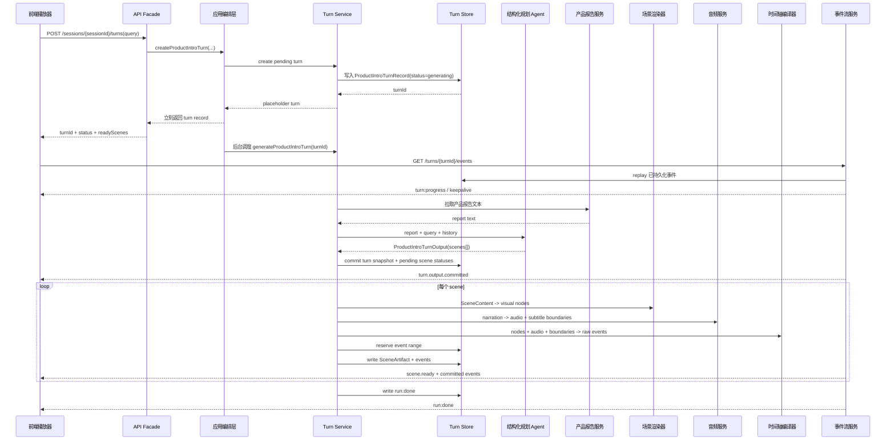

# 从对话到交互式音画同步动画讲解：一次保险产品介绍 AIGC 链路的工程化实践

> 本文讨论的不是“如何让 LLM 回答保险产品问题”，而是如何把一次产品咨询重构成一段可播放、可交互、音画同步、可续传的动画讲解。

保险产品介绍天然不是一段普通文本。用户关心的往往不是“这款产品有哪些条款”，而是“我能不能快速听懂它适合谁、保什么、哪里有限制、接下来该问什么”。如果只把产品报告丢给 LLM，让它生成一段长文本，内容可能是对的，但体验仍然像在读报告。

我们希望构建的是另一种形态：用户发起一次咨询，系统返回的不是一段回答，而是一段由多个场景组成的讲解流。每个场景都有画面、配音、字幕、节点出现节奏和可追问建议；前端不是重新理解业务逻辑，而是消费后端生产好的事件流，按统一时间轴播放。

动画讲解的核心不是生成文件，而是生成一条可播放事件流：音频、字幕、视觉节点和进度都由后端编排，前端按时间轴增量播放。它更接近“可交互播放器”，而不是“文件生成器”。

这个目标背后有两个真实问题。

第一个是音画不同步。早期链路里，文本、画面、音频、字幕和播放状态是多个产物各自生成、各自到达。结果是画面可能已经切到下一个重点，音频还在解释上一段；或者字幕 token 和配音节奏不一致，用户看到与听到的不是同一件事。

第二个是慢。一次完整讲解生成超过 20 秒时，用户感受到的不是“实时智能”，而是在等待一段复杂动画讲解完成生产。这里需要坦诚一点：端到端 20 秒以上的问题目前还没有彻底解决。当前阶段优先解决的是把慢从黑盒等待拆成可观测阶段，并让前端能尽早拿到进度和已完成场景；后续仍需要继续压缩首幕 ready 和整体完成时间。

所以本文的核心主张是：**AIGC 产品讲解不应停留在“生成内容”，而要走向“生产体验”——让 LLM 做内容导演，让后端做确定性制片，让前端播放可续传事件。**

---

## 一、整体架构：从一次 query 到一条动画讲解流

这一章先回答一个工程师最关心的问题：一次用户请求进来后，系统里到底有哪些角色，它们如何协作，哪些模块能修改生成状态，哪些模块只负责观察和播放。

### 1.1 角色分工

为了适合对外表达，本文隐藏内部 RPC 名、存储名、模型名和服务代号，但保留对象结构、字段语义、事件协议、状态流转和工程取舍。

| 正文用语       | 职责                                       | 保留的工程细节                                                                 |
| -------------- | ------------------------------------------ | ------------------------------------------------------------------------------ |
| 产品报告服务   | 提供产品介绍事实来源                       | 返回产品报告文本，作为规划 Agent 的 grounding context                          |
| 结构化规划 Agent | 基于报告、query、历史上下文生成讲解剧本     | 输出 `ProductIntroTurnOutput`，包含 `scenes`、`responseText`、`suggestedQueries` |
| 场景渲染器     | 把 `SceneContent` 渲染为安全视觉节点        | 按 `SceneKind` 分发，输出受控 SVG/KUAICHA node                                  |
| 音频服务       | 为每个 scene 的 narration 生成讲解音频      | 输出音频 URL、时长、文本 hash、字幕边界                                         |
| 时间轴编译器   | 把音频、字幕、视觉节点编译成播放事件       | 输出 `scene:start`、`subtitle:token`、`node:commit`、`scene:end`                 |
| 事件流服务     | 将进度和播放事件推给前端                   | 支持 SSE、`Last-Event-ID`、durable replay、终态事件                             |
| 前端播放器     | 按事件协议播放讲解                         | 不重新解释产品逻辑，只消费后端 committed events                                |

整体数据流如下：

```text
用户 query
   │
   ▼
产品报告服务
   │  report text
   ▼
结构化规划 Agent
   │  ProductIntroTurnOutput
   │  ├─ title
   │  ├─ responseText
   │  ├─ scenes[]
   │  └─ suggestedQueries[]
   ▼
逐 scene 制片流水线
   │
   ├─ 场景渲染器：SceneContent -> visual nodes
   ├─ 音频服务：narration -> audio + subtitle boundaries
   ├─ 时间轴编译器：nodes + audio + boundaries -> ProductIntroEvent[]
   └─ 事件存储：分配连续事件 ID，支持 replay
   │
   ▼
SSE 事件流
   │
   ├─ turn:progress
   ├─ scene:start
   ├─ subtitle:token
   ├─ node:commit
   ├─ scene:end
   └─ run:done / run:error
   │
   ▼
前端播放器
```

这里最重要的边界是：**结构化规划 Agent 不生成动画产物，不生成 SVG、HTML、CSS、音频或事件；它只生成可制片的结构化 scenes。**

### 1.2 请求时序：创建 turn 和播放事件不是同一个阶段

创建 turn 的 HTTP 请求并不会等完整动画讲解生成完成。它先创建一个可见的 placeholder turn，然后后台继续生成 output、scene artifact 和事件流。



这张时序图对应三个体验事实：

1. **创建 turn 要快。** API 返回的是“任务已接收并可订阅”，不是“动画讲解已完成”。
2. **生成过程要可观察。** 前端通过 SSE 先看到 progress，再看到 scene 级播放事件。
3. **播放事件要可恢复。** 已持久化事件可以根据 `Last-Event-ID` replay，live progress 只补充实时等待感。

### 1.3 模块依赖：规划层不能反向依赖制片层

如果把依赖关系画出来，核心是单向流动：越靠前越偏语义，越靠后越偏确定性产物。

```text
API Facade
   │
   ▼
应用编排层
   │
   ▼
Turn Service ───────────────┐
   │                         │
   ├─> 产品报告服务           │
   │                         │
   ├─> Context Assembler      │
   │        │                │
   │        ▼                │
   ├─> 结构化规划 Agent       │
   │        │                │
   │        ▼                │
   │   ProductIntroTurnOutput│
   │                         │
   ├─> Turn Store <──────────┤
   │                         │
   ├─> Scene Artifact Builder│
   │        │                │
   │        ├─> Scene Validator
   │        ├─> 场景渲染器
   │        ├─> 音频服务
   │        └─> 时间轴编译器
   │                         │
   └─> 事件流服务 ───────────> 前端播放器
```

依赖关系里最关键的是几条“不允许反向依赖”的边界：

| 边界                 | 允许                                      | 不允许                          | 原因                                           |
| -------------------- | ----------------------------------------- | ------------------------------- | ---------------------------------------------- |
| 规划 Agent -> 制片层 | 输出 `ProductIntroTurnOutput`             | 输出 SVG、audio、events、Redis key | 避免模型跨过安全和播放协议边界                 |
| Renderer -> Agent    | 消费 `SceneContent`                       | 反向调用 Agent 补字段            | renderer 必须确定性，缺字段应该由 schema/validator 暴露 |
| 前端播放器 -> 业务语义 | 消费 `ProductIntroEvent`                  | 自己理解 `SceneKind` 或产品条款  | 前端越轻，协议越要硬                           |
| SSE -> 生成流程      | 读取 durable events + live progress       | 直接驱动生成                    | SSE 是观察与传输层，不应该改变生产状态         |
| Store -> 业务逻辑    | 保存 record/snapshot/events               | 决定 scene 内容                 | 存储只保证一致性和 replay，不承载业务判断      |

也就是说，`Turn Service` 是这条链路里的生命周期中枢：它知道什么时候创建 placeholder、什么时候调用规划 Agent、什么时候逐 scene 制片、什么时候提交事件、什么时候写终态。其他模块都围绕这个中枢做单一职责。

### 1.4 数据依赖：每一层只消费上一层的稳定产物

对象之间的依赖可以按下面这条链理解：

```text
ProductIntroTurnInput
   │  report + query + history
   ▼
ProductIntroContextText
   │  bounded prompt context + contextHash
   ▼
ProductIntroTurnOutputEnvelope
   │  output + producer metadata
   ▼
SceneContent
   │  semantic scene spec
   ▼
SceneArtifactDraft
   │  nodes + audio + boundaries + rawEvents
   ▼
SceneArtifact
   │  final event IDs + validated events
   ▼
ProductIntroEvent
   │  SSE frame
   ▼
前端播放器状态
```

这条链的好处是每层都有明确的输入输出，可以独立校验：

- `ProductIntroContextText` 校验 prompt 是否越界；
- `ProductIntroTurnOutputEnvelope` 校验模型是否输出非法字段；
- `SceneContent` 校验 scene kind 与字段数量；
- `SceneArtifact` 校验音频 hash、字幕边界、节点白名单、事件时间；
- `ProductIntroEvent` 校验事件类型、`atMs`、payload 形态。

---

## 二、语义规划层：让 LLM 生成导演脚本，而不是页面

这一章聚焦规划层。它解决的问题是：LLM 到底应该输出什么，如何避免它跨过边界，如何把一次 query 组织成可制片的 scenes。

### 2.1 为什么不是让 LLM 直接生成页面

最直观的方案是让 LLM 直接输出页面：HTML、SVG、CSS、时间线、甚至字幕和动画配置。这样看似链路短，但对线上产品并不友好。

第一，视觉不可控。产品讲解需要稳定的品牌风格、字体层级、颜色系统和布局规则。如果让模型直接生成视觉节点，页面每次都可能长得不一样，前端也很难判断哪些差异是设计意图，哪些是模型漂移。

第二，安全不可控。页面产物里一旦混入 `style`、`script`、`class`、事件 handler 或未白名单组件，前端就要承担额外的清洗风险。相比事后过滤，工程上更稳的方式是根本不让模型进入页面生成层。

第三，播放不可控。音频、字幕和画面节点必须共享同一个时间轴。模型可以描述“这里出现一个重点卡片”，但不能可靠地产生和真实 TTS 音频对齐的 `atMs`。

第四，续传不可控。用户刷新、网络抖动、SSE 重连都是常态。播放协议需要稳定事件 ID、终态事件、历史 replay 和 `Last-Event-ID` 处理，这些都应由后端确定性维护，而不是交给模型自由生成。

因此我们选择的是另一种边界：

```text
LLM 负责：讲什么、分几幕、每幕表达什么
后端负责：怎么画、怎么配音、何时出现、如何续传
前端负责：按协议播放 committed events
```

### 2.2 ProductIntroTurnInput：定义“这一轮要回答什么”

生成链路的输入不是裸 query，而是一个完整的 turn input。

```text
ProductIntroTurnInput
  ├─ sessionId
  ├─ turnId
  ├─ prodNo
  ├─ reportVersion
  ├─ query
  └─ previousTurnIds
```

| 字段              | 设计目的                         | 为什么需要                                           |
| ----------------- | -------------------------------- | ---------------------------------------------------- |
| `sessionId`       | 标识一次多轮产品介绍会话         | 多轮追问需要共享 thread history，不能把每轮都当首轮 |
| `turnId`          | 标识当前生成任务                 | 用于幂等、日志、事件 ID 前缀、SSE 订阅和失败定位    |
| `prodNo`          | 标识产品                         | 拉取产品报告、构造缓存 key、生成音频资产路径都需要它 |
| `reportVersion`   | 标识报告版本                     | 避免同一产品不同版本报告混用，便于缓存和回放一致性   |
| `query`           | 当前用户真正问的问题             | 结构化规划 Agent 必须优先回答当前 query，而不是机械做完整总览 |
| `previousTurnIds` | 当前 session 已提交的历史 turn   | 判断首轮/追问，决定报告裁剪策略、输出场景数量和上下文承接方式 |

这里有个容易被忽略的点：`previousTurnIds` 不是为了把所有历史内容拼进 prompt，而是为了告诉系统“这是第几轮、之前是否已经讲过”。首轮可以做短版总览；追问则应该围绕当前 query 聚焦回答，避免每次都重新生成完整产品介绍。

### 2.3 ProductIntroTurnOutput：定义“LLM 要交付什么”

结构化规划 Agent 的输出核心是 `ProductIntroTurnOutput`。

```text
ProductIntroTurnOutput
  ├─ title
  ├─ responseText
  ├─ scenes[]
  └─ suggestedQueries[]
```

| 字段               | 面向谁       | 设计目的                                               |
| ------------------ | ------------ | ------------------------------------------------------ |
| `title`            | 前端和用户   | 给这一轮讲解一个短标题，用于播放器顶部、历史记录或分享摘要 |
| `responseText`     | 对话层       | 保留一份自然语言回答，保证即使不播放动画讲解，用户也能读到完整答复 |
| `scenes`           | 制片流水线   | 把回答拆成 1~8 个可渲染、可配音、可编排的场景          |
| `suggestedQueries` | 下一轮交互   | 把动画讲解重新接回对话，引导用户继续问保障、费用、限制或适用性 |

为什么同时需要 `responseText` 和 `scenes`？因为它们面向的消费场景不同。`responseText` 是“对话回答”，需要语义完整；`scenes` 是“播放剧本”，需要可视化、可配音、可分段。二者可以表达同一轮回答，但不能互相替代。

如果只有 `responseText`，后端无法稳定生成音画同步场景；如果只有 `scenes`，用户在弱网络、无声播放、历史回看或无播放器环境里会缺少完整文本答案。

`ProductIntroTurnOutput` 外面还有一层 envelope：

```text
ProductIntroTurnOutputEnvelope
  ├─ output
  └─ metadata
```

`metadata` 不是给模型自由输出的，而是 adapter 补充的生产元信息：

| 字段              | 设计目的                                           |
| ----------------- | -------------------------------------------------- |
| `producerName`    | 标识由哪类 producer 生成，便于灰度和排查           |
| `producerVersion` | 标识规划策略版本，避免旧缓存污染新策略             |
| `sourceHash`      | 标识原始来源；当前链路主要使用 context hash 表达来源身份 |
| `contextHash`     | 标识本轮拼给 Agent 的上下文，便于复现与缓存判断    |
| `query`           | 记录本轮 query，避免只看 output 时丢失用户意图     |
| `mode`            | 标识生成模式，支持后续多 producer 扩展             |

这个分层的关键是：**模型只输出业务语义，系统补充生产元信息。** 模型不应该输出 `metadata`、`sourceHash`、`events`、`audio` 这类越界字段。

### 2.4 SceneContent：定义“一幕应该表达什么”

`scenes[]` 里的每一项是 `SceneContent`。

```text
SceneContent
  ├─ spec
  │   ├─ sceneId
  │   ├─ title
  │   ├─ eyebrow
  │   ├─ layer
  │   ├─ kind
  │   └─ narration
  ├─ metrics
  ├─ pills
  ├─ warnings
  ├─ checklist
  ├─ comparison
  └─ infoCards
```

`spec` 决定一幕的身份与讲解文案：

| 字段        | 设计目的             | 消费方                                           |
| ----------- | -------------------- | ------------------------------------------------ |
| `sceneId`   | 稳定标识一幕         | 节点 ID 前缀、字幕边界、事件 payload、失败定位  |
| `title`     | 一幕的短判断句       | 画面主标题，帮助用户快速抓重点                   |
| `eyebrow`   | 场景眉标             | 提供轻量分类，例如“费用门槛”“保障范围”           |
| `layer`     | 场景层级             | 表达这一幕在讲解结构里的位置，例如“先看结论”“再看限制” |
| `kind`      | 场景类型             | 决定 renderer 使用哪套布局和字段规则             |
| `narration` | 可直接配音的讲解稿   | TTS 输入、字幕 token 来源、时间轴基准            |

`narration` 是这里最重要的字段之一。它不是给前端展示的普通描述，而是音频服务的输入。后续字幕边界、音频时长、scene end 时间都从它派生出来。

`SceneKind` 则是保险产品讲解里的镜头语言：

```text
identity       产品身份、定位、核心价值
eligibility    适用人群、投保条件
deductible     免赔额、起付线、赔付门槛
coverage       保障责任、权益内容
renewal        续保、连续保障
hospital       医院范围、服务网络
drug_device    药品、器械、特材
risk_summary   限制、风险、除外责任
```

视觉素材字段不是越多越好，每种 `SceneKind` 都有字段数量约束：

| 字段         | 适合表达                       | 设计边界                                             |
| ------------ | ------------------------------ | ---------------------------------------------------- |
| `metrics`    | 数字、比例、期限、额度、次数   | 必须来自报告可支持的信息，并带 `sourceFactId`        |
| `pills`      | 标签、卖点、适用人群、资源类型 | 短文本，适合横向排列                                 |
| `warnings`   | 限制、除外、风险、前提条件     | 压缩成短提醒，避免长段落进入画面                     |
| `checklist`  | 有顺序或并列关系的要点         | 部分 kind 要求特殊格式，如 `value|label`             |
| `comparison` | 明确两侧对比                   | 适合免赔、方案差异、前后变化                         |
| `infoCards`  | 并列短信息                     | 适合保障分层、续保路径、风险/适合人群卡片            |

| SceneKind      | 典型字段要求                                      | 目的                                               |
| -------------- | ------------------------------------------------- | -------------------------------------------------- |
| `identity`     | `metrics>=2`、`pills>=1`、`warnings>=1`、`infoCards>=1` | 让产品身份页同时有数字、标签、边界提醒             |
| `eligibility`  | `metrics>=2`、`warnings>=1`、`checklist>=3`       | 让适用条件以时间线/清单形式表达                    |
| `deductible`   | `metrics>=1`、`warnings>=1`、`comparison` 必填    | 免赔额必须能形成“门槛前/门槛后”的对比              |
| `coverage`     | `infoCards=3`                                     | 保障责任按三层结构稳定呈现                         |
| `renewal`      | `infoCards=2`、`warnings>=1`                      | 续保通常是两条路径或两个条件对照                   |
| `risk_summary` | `infoCards=2`、`checklist>=1`、`warnings>=1`      | 同时表达适合谁、风险点、总结提醒                   |

这套规则的价值是：模型可以决定“讲什么”，但不能产出 renderer 无法承接的数据。

### 2.5 一个实际的 ProductIntroTurnOutput 样例

下面是一个脱敏后的示例。假设用户追问：“免赔额是什么意思？”

```json
{
  "title": "免赔额怎么理解",
  "responseText": "免赔额可以理解为理赔前需要先由自己承担的费用门槛。只有超过免赔额的部分，才会进入后续赔付计算。具体金额和适用范围要以产品报告中的条款为准。",
  "scenes": [
    {
      "spec": {
        "sceneId": "deductible_001",
        "title": "先过费用门槛",
        "eyebrow": "免赔额",
        "layer": "理赔前提",
        "kind": "deductible",
        "narration": "免赔额可以理解为理赔前的费用门槛。没有超过这条线的费用，通常需要自己承担；超过之后，才进入产品约定的赔付计算。"
      },
      "metrics": [
        {
          "value": "门槛",
          "label": "先自付",
          "sourceFactId": "report:deductible"
        }
      ],
      "pills": [],
      "warnings": [
        "具体金额和适用范围以条款为准。"
      ],
      "checklist": [],
      "comparison": {
        "leftLabel": "未超过",
        "leftValue": "自付",
        "rightLabel": "超过后",
        "rightValue": "再计算"
      },
      "infoCards": []
    }
  ],
  "suggestedQueries": [
    "这个免赔额是一年累计吗？",
    "哪些费用不计入免赔额？",
    "超过免赔额后怎么赔？"
  ]
}
```

这段输出里没有 SVG、音频 URL、字幕边界、事件 ID。它只说明“这一幕要讲什么”。后续的视觉、音频、字幕和播放时序由后端制片流水线完成。
