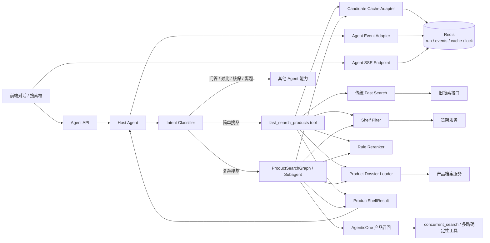
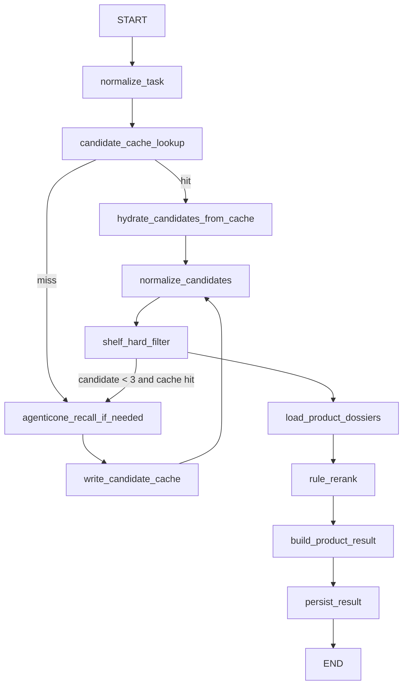
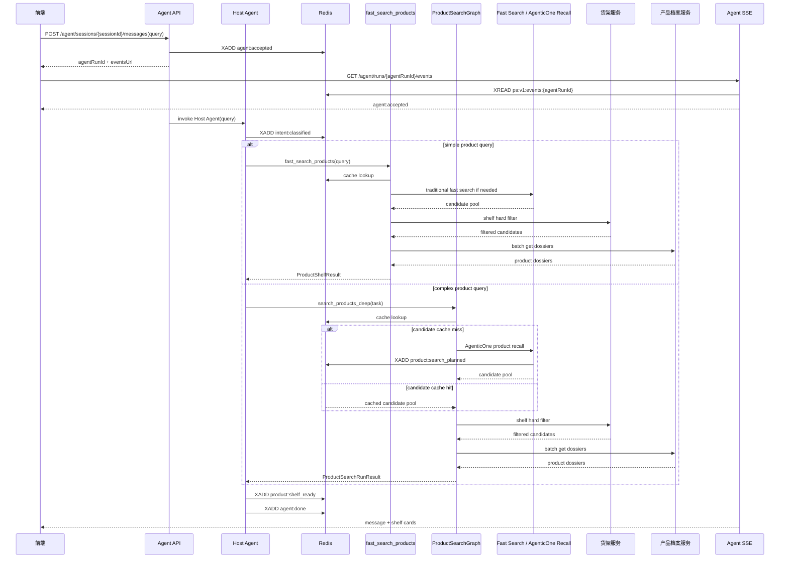

这篇文章最容易写错的地方，是把“搜品能力”写成一个独立的用户入口。

实际不是。

用户不是先进入一个 `Product Search API`，也不是每句话都启动一个商品搜索 `Agent`。用户先进的是主 `Agent` 会话。主 `Agent` 判断这句话要不要搜品；如果要搜品，再决定调用哪一种搜品能力：

```text
简单 query
  -> fast_search_products tool
  -> 传统 fast search

复杂 query
  -> ProductSearchGraph / product_search_subagent
  -> AgenticOne 产品召回链路
```

比如“好医保长期医疗”，大概率是具名产品查询。它应该走快路径：产品名、别名、货架状态、产品档案，尽快给出相关卡片。

比如“给全家买保险”，它不是一个普通搜索词。它里面藏着家庭成员、年龄结构、保障类型、预算、已有保障和健康状况。第一版可以先给候选货架，但应该通过 `subagent/subgraph` 做发散召回，并把待确认条件说清楚。

所以，本文真正讨论的是：

> 主 `Agent` 如何把搜品当成一个可调用能力，并把简单 `tool` 与复杂 `subgraph` 的结果，整理成前端可以消费的交互货架。

这件事的边界先钉住。第一版不是正式推荐系统，不判断“这个人该不该买这款”。它只解决：

```text
用户 query
  -> 主 Agent 判断是否需要搜品
  -> 简单 query 调 fast search tool
  -> 复杂 query 调 ProductSearchGraph
  -> 候选产品池
  -> 当前货架校验
  -> 产品深档案
  -> 规则排序
  -> 主 Agent 输出文本 + 产品卡片 + 待确认条件
```

真正的推荐还要往后走：用户画像、保障缺口、预算、年龄、地区、职业、健康告知、核保、业务策略。第一版不要把这些能力伪装出来。

## 一、系统边界

第一版的输出是候选货架，不是投保建议。

用户可以看到：

```text
可以优先看看这几款
候选理由是
还需要确认这些条件
```

不要写成：

```text
最适合你
建议购买
保证可买
一定能赔
```

这不是文字保守，而是系统事实。没有问年龄、地区、职业、健康告知和预算，就不能假装已经完成了个性化投保判断。

这条链路里有几类角色：

| 层 | 职责 | 不做什么 |
| --- | --- | --- |
| 主 `Agent` | 接收用户 `query`，判断意图，决定是否调用搜品能力，组织最终对话输出 | 不直接拼复杂搜索参数，不把长候选和档案塞进 `messages` |
| `fast_search_products tool` | 处理简单、明确、低发散的搜品请求 | 不做多步规划，不做复杂保障方案拆解 |
| `ProductSearchGraph / subagent` | 处理复杂、宽泛、需要发散召回的搜品请求，缓存未命中时调用 `AgenticOne` 产品召回链路 | 不直接面向前端，不输出模型原始思考链 |
| `Redis` | 保存内部 `run` 状态、候选缓存、可恢复事件、短锁 | 不承载最终业务判断 |
| 旧搜索 / `AgenticOne` 产品召回 | 召回候选产品池 | 不决定最终展示货架 |
| 货架服务 | 判断产品当前是否可展示、可售、在当前渠道内 | 第一版不做用户级投保适配 |
| 产品档案服务 | 提供卡片理由和风险提示所需的产品事实 | 不接收模型编造字段 |
| 前端 | 消费主 `Agent` 的统一业务事件，展示文本、状态和卡片 | 不理解搜品内部链路 |

这里有几个硬规则：

1. 搜品能力是主 `Agent` 的能力，不是用户入口。
2. 简单 `query` 走 `tool`，复杂 `query` 才进 `subagent/subgraph`。
3. 缓存只复用候选池，不复用最终话术。
4. `cache hit` 之后也必须重新走货架过滤。
5. 最终卡片只能依赖搜索命中摘要和产品深档案。
6. 第一版不让 `Agent` 做最终排序。
7. 前端只消费业务事件，不消费 `LangGraph` 原始运行时事件。

## 二、整体架构：主 Agent 调用搜品能力

用户入口应该长这样：

```text
Frontend
  -> Agent API
  -> Host Agent
     -> intent classify
     -> fast_search_products tool
        or ProductSearchGraph / subagent
     -> final assistant response
  -> Agent Event Stream
  -> Frontend UI
```

主 `Agent` 先判断用户要什么。只有当本轮需要搜品时，才会调用搜品能力。



`ProductSearchGraph` 只处理复杂搜品。具名产品和短条件查询直接走 `tool`，减少一次子图调度和模型规划，失败时也可以直接回退到传统搜索。

两种能力的差别：

| 能力 | 适合的 `query` | 运行方式 | 召回后端 | 输出 |
| --- | --- | --- | --- | --- |
| `fast_search_products tool` | 具名产品、明确险种、短条件搜索 | 主 `Agent` 直接调用工具 | 传统 fast search | `ProductShelfResult` |
| `ProductSearchGraph / subagent` | 宽泛需求、多条件、场景化、需要发散 | 主 `Agent` 调用子图 / 子 `Agent` | `AgenticOne` 产品召回链路 | `ProductSearchRunResult` |

主链路可以压缩成：

```text
用户 query
  -> 主 Agent 判断意图
  -> 判断是否需要搜品
  -> 判断搜品复杂度
  -> 简单 query: fast_search_products tool
  -> 复杂 query: ProductSearchGraph / subagent
  -> 候选池
  -> 当前货架校验
  -> 产品深档案
  -> 规则排序
  -> 返回给主 Agent
  -> 主 Agent 输出文本、产品卡片、待确认条件
```

缓存、货架过滤、档案和排序不是主 `Agent` 的事。它们属于搜品能力内部的确定性链路。主 `Agent` 只拿结构化结果，不吞全部候选。

## 三、两个 query 进来后发生什么

两类 `query` 会进入不同的后端链路。

### 3.1 “好医保长期医疗”

这是具名产品查询。主 `Agent` 不需要启动复杂 `subagent`，直接调快搜工具。

```text
用户输入：好医保长期医疗

前端：
  POST /agent/sessions/{sessionId}/messages
  body: { message: "好医保长期医疗" }

Agent API：
  创建 agentRunId
  写 agent:accepted 事件
  返回 agentRunId + eventsUrl

前端：
  GET /agent/runs/{agentRunId}/events
  订阅统一 Agent SSE

Host Agent：
  判断 intent = product_lookup
  判断 complexity = simple
  调 fast_search_products(query, session_context)

fast_search_products tool：
  normalize_query:
    "好医保长期医疗" -> "好医保长期医疗"

  exact candidate cache:
    查产品名 / 别名 / query hash 对应候选

  fast search:
    cache miss 时调传统搜索
    优先产品名、别名、计划名、SKU 映射

  shelf_hard_filter:
    去掉下架、不可展示、渠道不符、运营屏蔽的 SKU

  load_product_dossiers:
    拉 Top10 产品深档案

  rule_rerank:
    产品名强匹配权重大于泛语义匹配
    同产品不同计划做轻去重

  return ProductShelfResult:
    shelfCards
    confirmNeeded
    visibleSummary

Host Agent：
  根据 ProductShelfResult 输出一句短文本
  附产品卡片
  提醒还需要确认年龄、地区、职业和健康情况
```

前端看到的是主 `Agent` 的业务事件，不是快搜工具内部调用栈：

| 事件 | 前端展示 | 关键字段 |
| --- | --- | --- |
| `agent:accepted` | 已收到问题 | `agentRunId` |
| `intent:classified` | 已识别为产品查询 | `intent=product_lookup`、`complexity=simple` |
| `tool:started` | 正在查找相关产品 | `tool=fast_search_products` |
| `product:cache_hit` / `product:cache_miss` | 已复用候选 / 正在搜索产品 | `cacheHitType` |
| `product:candidates_found` | 已找到相关候选 | `candidateCount` |
| `product:filtered` | 正在检查当前货架状态 | `beforeCount`、`afterCount` |
| `product:dossiers_loaded` | 正在读取产品档案 | `loadedCount` |
| `product:shelf_ready` | 已整理出候选产品 | `shelfCount`、`shelfCards` |
| `agent:done` | 完成本轮回复 | `message`、`cards` |

这条路径里，`ProductSearchGraph` 没有出场。它不该为了一个具名产品查询被启动。

### 3.2 “给全家买保险”

这是复杂搜品，不适合直接丢给传统搜索。

主 `Agent` 应该先判断：这是家庭保障配置需求，不是单个产品查询。第一版如果选择“信息不足时先直推”，也必须把待确认条件放进结果里。

```text
用户输入：给全家买保险

Host Agent：
  判断 intent = product_search
  判断 complexity = complex
  构造搜品任务：
    为家庭成员配置基础保障候选，关注成人医疗、成人重疾、儿童保障、老人医疗/防癌医疗、家庭意外险。
    信息不足时先给候选方向，但必须提示需要确认家庭成员年龄、预算、已有保障和健康情况。

  调 ProductSearchGraph(task, session_context)

ProductSearchGraph：
  normalize_task:
    "给全家买保险" -> "给家庭成员配置基础保障"

  candidate cache:
    exact 通常不命中
    semantic 可能命中“家庭保险怎么配置”“一家三口买什么保险”

  agenticone_recall_if_needed:
    deep_search 根据任务规划 search_tasks
    concurrent_search 并发执行 product / underwriting / budget / benefit 任务
    SearchResultCapture 保存命中摘要和结构化上下文
    filter_rank 精选召回候选
    返回 matched_prod_nos + search_context

  normalize_candidates:
    把 matched_prod_nos + search_context 转成统一 Candidate
    保留 hit_summary 和 hit_tags
    截断 Top50

  shelf_hard_filter:
    重新检查当前可展示货架

  load_product_dossiers:
    拉 Top10 产品深档案

  rule_rerank:
    按召回分、货架权重、档案完整度、更新时间排序
    避免 Top3 全是同一类产品

  return ProductSearchRunResult:
    shelfCards
    confirmNeeded
    searchSummary
    productRunId

Host Agent：
  输出候选货架
  说明这些只是可以优先查看的候选
  提醒还需要确认家庭成员年龄、预算、已有保障和健康情况
```

这条路径的事件可以更丰富，但仍然是主 `Agent` 事件流：

| 事件 | 前端展示 | 关键字段 |
| --- | --- | --- |
| `agent:accepted` | 已收到问题 | `agentRunId` |
| `intent:classified` | 已识别为综合保障需求 | `intent=product_search`、`complexity=complex` |
| `subgraph:started` | 正在拆解保障需求 | `graph=ProductSearchGraph` |
| `product:cache_hit` / `product:cache_miss` | 已复用候选 / 正在重新搜索产品 | `cacheHitType` |
| `product:search_planned` | 缓存未命中时，已拆分搜索方向 | `searchTasks` |
| `product:search_started` | 正在多路召回候选 | `searchBackend=agenticone_product_recall` |
| `product:candidates_found` | 已召回多类候选产品 | `candidateCount`、`hitTags` |
| `product:filtered` | 正在检查当前货架状态 | `beforeCount`、`afterCount` |
| `product:dossiers_loaded` | 正在读取候选产品档案 | `loadedCount` |
| `product:shelf_ready` | 已整理候选货架 | `shelfCards`、`confirmNeeded` |
| `agent:done` | 完成本轮回复 | `message`、`cards` |

两类 `query` 的差别在后端能力选择，不在前端入口：

| `query` 类型 | 例子 | 主 `Agent` 判断 | 调用能力 | 结果表达 |
| --- | --- | --- | --- | --- |
| 具名产品 | 好医保长期医疗 | `product_lookup + simple` | `fast_search_products tool` | 展示相关产品 / 计划候选 |
| 明确条件搜品 | 给爸妈买医疗险 | `product_search + simple` 或轻度复杂 | 优先 `fast_search_products tool` | 展示候选产品 + 待确认条件 |
| 宽泛需求 | 给全家买保险 | `product_search + complex` | `ProductSearchGraph / subagent` | 展示候选货架 + 待确认条件 |
| 对比 / 问答 | 好医保和百万医疗有什么区别 | `compare_or_qa` | 先取产品锚点，再走问答 / 对比能力 | 不一定展示货架 |
| 离题 | 明天天气怎么样 | `off_topic` | 不调搜品 | 转普通回答或安全拒答 |

## 四、能力契约：tool 和 subgraph 分开

搜品能力不要只有一个入口。第一版至少拆成两个契约。

简单搜品工具：

```text
fast_search_products(query, session_context) -> ProductShelfResult
```

适合：

```text
好医保长期医疗
百万医疗险
给爸妈买医疗险
儿童重疾险
经常骑电动车买什么意外险
```

复杂搜品子图：

```text
search_products_deep(task, session_context) -> ProductSearchRunResult
```

适合：

```text
给全家买保险
预算不高，想把大人孩子的保障都配一下
经常出国、滑雪、潜水，买什么保险更合适
我有高血压，还想买医疗险和重疾险
```

主 `Agent` 的调用逻辑可以很薄：

```text
if intent not in product intents:
  use other ability

if intent == product_lookup and complexity == simple:
  call fast_search_products

if intent == product_search and complexity == simple:
  call fast_search_products

if intent == product_search and complexity == complex:
  call search_products_deep

if intent == compare_or_qa:
  resolve product anchors first
  then call qa_or_compare ability
```

两个能力返回给主 `Agent` 的结构要统一：

```python
class ProductShelfResult(TypedDict):
    product_run_id: str | None
    source: Literal["fast_tool", "deep_graph"]
    cache_hit_type: Literal["none", "exact", "semantic"]
    shelf_cards: list[ShelfCard]
    confirm_needed: list[str]
    visible_summary: str
    trace_ref: str | None
```

主 `Agent` 不需要拿到完整候选池，也不需要知道每个内部节点的状态。完整状态留在 `Redis`、内部 `state` 或审计系统里。

## 五、复杂搜品子图

`ProductSearchGraph` 只处理复杂搜品。它不是每个搜品 `query` 的必经之路。

```text
Host Agent
  -> search_products_deep(task, session_context)
     -> ProductSearchGraph
        -> normalize_task
        -> candidate_cache_lookup
        -> agenticone_recall_if_needed
        -> normalize_candidates
        -> shelf_hard_filter
        -> load_product_dossiers
        -> rule_rerank
        -> build_product_result
        -> persist_result
  -> ProductShelfResult
```

子图内部可以这样组织：



子图的 `state` 不要只放 `messages`：

```python
class ProductSearchState(TypedDict, total=False):
    product_run_id: str
    agent_run_id: str
    session_id: str

    raw_task: str
    normalized_task: str
    task_hash: str
    search_tasks: list[SearchTask]

    matched_prod_nos: list[str]
    search_context: dict[str, object]

    cache_hit_type: Literal["none", "exact", "semantic"]
    cache_entry_id: str | None

    candidate_pool: list[Candidate]
    normalized_candidates: list[Candidate]
    filtered_candidates: list[Candidate]
    dossiers: dict[str, ProductDossier]
    ranked_shelf: list[ShelfCard]

    visible_steps: list[VisibleStep]
    error: ProductSearchError | None
```

`Candidate` 是召回阶段的轻对象：

```python
class Candidate(TypedDict):
    prod_no: str
    recall_score: float
    recall_sources: list[str]
    hit_summary: str
    hit_tags: list[str]
    source_backend: Literal["exact_cache", "semantic_cache", "fast_search", "agenticone_recall"]
```

`ShelfCard` 才是前端卡片对象：

```python
class ShelfCard(TypedDict):
    prod_no: str
    product_name: str
    tags: list[str]
    candidate_reason: str
    risk_note: str
    confirm_needed: list[str]
    rank_score: float
    dossier_source: str
```

`candidate_reason` 不从缓存里拿旧文案。它应该基于当前 `query`、当前候选命中摘要和产品深档案重新生成或组装。

节点契约：

| 节点 | 输入 | 输出 | 失败策略 |
| --- | --- | --- | --- |
| `normalize_task` | `raw_task` | `normalized_task`、`task_hash` | 清洗失败就用原任务 |
| `candidate_cache_lookup` | `task_hash + search_mode` | 候选缓存 | `miss` 继续 `agenticone_recall_if_needed` |
| `agenticone_recall_if_needed` | `normalized_task`、`session_context` | `matched_prod_nos`、`search_context`、`search_tasks` | 规划失败时回退单个 `product` 任务；查询失败写 `product:error` |
| `normalize_candidates` | `matched_prod_nos + search_context` 或缓存候选 | 统一的候选池 | 丢弃无法校验的产品编号 |
| `shelf_hard_filter` | 候选列表 | 过滤后候选 | 少于 3 个且来自缓存，则补一次实时搜索 |
| `load_product_dossiers` | `Top10 prodNo` | 产品档案 `map` | 单个产品失败就剔除 |
| `rule_rerank` | 候选 + 档案 | 排序货架 | 无候选则返回无结果状态 |
| `build_product_result` | 排序货架 | `ProductShelfResult` | 禁止购买承诺话术 |
| `persist_result` | 完整 `state` | `Redis run snapshot + terminal event` | 持久化失败告警，不改写结果 |

### 5.1 `AgenticOne` 产品召回链路

本文的“`Agentic Search`”不是另一套搜索后端，它指的就是 [[AgenticOne：OneAgent 范式在保险实时咨询中的应用]] 中的产品召回链路。`ProductSearchGraph` 在候选缓存未命中时调用它：

```text
agenticone_recall_if_needed
  -> deep_search
     -> LLM 规划 search_tasks
     -> concurrent_search 并发执行确定性工具
     -> SearchResultCapture 写入 search_context
     -> 解析并校验 matched_prod_nos
  -> filter_rank
  -> matched_prod_nos + search_context
```

`LLM` 只把用户场景拆成 `search_tasks`，可选的产品编号来自确定性工具的返回结果。`concurrent_search` 并发执行四类任务：

| `task_type` | 执行能力 | 在候选池中的作用 |
| --- | --- | --- |
| `product` | 产品结构化过滤与模糊扫描 | 多个 `product` 任务取并集 |
| `underwriting` | 核保查询 | 用户明确给出健康条件时，与产品候选取交集 |
| `budget` | 预算过滤 | 用户明确给出预算时，与产品候选取交集 |
| `benefit` | 收益或责任阈值过滤 | 用户明确给出阈值时，与产品候选取交集 |

`product` 任务不是向量检索。它基于产品 `mapper` 数据执行白名单、产品名、字段条件、责任、目的地除外和模糊正则扫描。语义向量只用于候选缓存复用，不是 `AgenticOne` 产品召回的主搜索方式。

`SearchResultCapture` 把产品轻量信息、命中原因、核保 / 预算 / 收益结果和任务摘要写入 `search_context`。`deep_search` 解析搜索 `Agent` 的最终结果，再校验其中的 `prodNo`，避免模型编造产品编号。

`filter_rank` 从召回结果中精选一批轻量候选，并可排除历史已展示产品，为“换一批”保留后备池。第一版不开放多轮指代，这个后备池不会被前端直接消费。

`filter_rank` 的输出还不是最终货架。候选产品还要经过当前上下架和渠道校验、产品深档案校验以及确定性规则排序。`filter_rank` 减少主链路携带的候选数，`rule_rerank` 才决定用户看到的 `Top3`。

## 六、候选缓存：tool 和 subgraph 共用

`Redis` 第一版承担五个职责：

1. 内部 `product run` 状态；
2. 可恢复业务事件；
3. 精确候选缓存；
4. 语义候选缓存；
5. `cache miss` 防击穿短锁。

统一加版本前缀：

```text
ps:v1:run:{productRunId}
ps:v1:events:{agentRunId}
ps:v1:cache:exact:{searchMode}:{queryHash}
ps:v1:cache:sem:{entryId}
ps:v1:lock:{searchMode}:{queryHash}
```

| `key` | 类型 | `TTL` | 内容 |
| --- | --- | --- | --- |
| `ps:v1:run:{productRunId}` | `Hash` | `24h` | 内部搜品状态、最终结果摘要、错误信息 |
| `ps:v1:events:{agentRunId}` | `Stream` | `24h` | 主 `Agent` 可恢复事件 |
| `ps:v1:cache:exact:{searchMode}:{queryHash}` | `String JSON` | `6h` | 候选缓存 |
| `ps:v1:cache:sem:{entryId}` | `Hash` | `6h` | `query embedding + payload` |
| `ps:v1:lock:{searchMode}:{queryHash}` | `String` | `30s` | 防击穿短锁 |

候选缓存只保存召回信息：

```json
{
  "schemaVersion": 1,
  "entryId": "01J...",
  "searchMode": "fast_tool",
  "normalizedQuery": "好医保长期医疗",
  "queryHash": "sha256:...",
  "sourceBackend": "fast_search",
  "candidateProdNos": ["p1", "p2", "p3"],
  "hitSummaries": {
    "p1": "命中：好医保长期医疗、产品别名、医疗险",
    "p2": "命中：好医保、长期医疗、升级计划"
  },
  "recallSources": {
    "p1": ["product_name", "alias"],
    "p2": ["embedding"]
  },
  "recallScores": {
    "p1": 0.96,
    "p2": 0.84
  },
  "shelfVersion": "20260702-1000",
  "createdAt": "2026-07-02T10:00:00+08:00",
  "expiresAt": "2026-07-02T16:00:00+08:00"
}
```

它不保存：

```text
最终 Top3
最终卡片文案
购买建议
模型推理过程
已过期的货架判断
```

写入时机：

```text
live query 成功
  -> normalize candidate
  -> 截断 Top50
  -> 写 exact cache
  -> 写 semantic cache
```

不要等最终 `Top3` 排完才写缓存。缓存的是候选池，不是货架结论。

如果用 `Redis Stack / RediSearch`，可以给候选缓存建向量索引：

```text
FT.CREATE idx:ps:v1:sem_cache
ON HASH
PREFIX 1 ps:v1:cache:sem:
SCHEMA
  searchMode TAG
  normalizedQuery TEXT
  createdAt NUMERIC
  expiresAt NUMERIC
  embedding VECTOR HNSW 6 TYPE FLOAT32 DIM 1536 DISTANCE_METRIC COSINE
```

语义查询：

```text
FT.SEARCH idx:ps:v1:sem_cache
  '(@searchMode:{deep_graph})=>[KNN 3 @embedding $vec AS distance]'
  PARAMS 2 vec {query_embedding_bytes}
  SORTBY distance
  RETURN 4 searchMode normalizedQuery payload distance
  DIALECT 2
```

第一版可以宽松复用：

```text
semantic hit if:
  searchMode 相同
  cosine similarity >= 0.72
  payload 未过期
```

宽松复用必须配两个护栏：

1. 命中后重新走 `shelf_hard_filter`；
2. 最终卡片理由基于当前 `query` 和产品深档案重算。

精确缓存和语义缓存都 `miss` 时，先抢短锁：

```text
SET ps:v1:lock:{searchMode}:{queryHash} {agentRunId} NX EX 30
```

抢到锁的请求执行实时查询并写缓存。没抢到锁的请求短等 `300~800ms`，再读一次精确缓存；如果仍然 `miss`，就自己走实时查询，不要无限等待。

## 七、查询、过滤、档案和排序

简单搜品和复杂搜品的召回方式不同，但后处理应该尽量一致。

```text
fast_search_products tool:
  normalize_query
  exact cache
  semantic cache
  traditional fast search if miss
  shelf_hard_filter
  load_product_dossiers
  rule_rerank
  build ProductShelfResult

ProductSearchGraph:
  normalize_task
  candidate cache
  AgenticOne product recall if miss
  normalize candidates
  shelf_hard_filter
  load_product_dossiers
  rule_rerank
  build ProductShelfResult
```

### 7.1 货架侧硬过滤

第一版只做货架侧过滤：

```text
上下架
渠道可展示
当前产品池白名单
重复产品 / 同计划 SKU 去重
监管或运营屏蔽
```

货架后处理不会自行补齐下列条件，再做一轮投保适配强过滤：

```text
年龄
地区
预算
职业
健康告知
既往症
```

用户已经明确说出预算、健康情况或责任阈值时，`AgenticOne` 召回链路可以调用对应工具收窄候选。用户没有提供的槽位不由系统猜测，也不能因为候选进入 `Top3` 就声称它适合投保。

最终文案要把未确认条件说出来：

```text
还需要确认被保人年龄、地区、职业和健康情况。
```

### 7.2 深档案

过滤后取 `Top10` 拉产品深档案：

```text
batch_get_product_dossier(prodNos[0:10])
```

深档案至少包含：

```text
prodNo
productName
productType
companyName
coreBenefits
renewalSummary
deductibleSummary
coverageSummary
riskNotes
priceRangeText
sourceVersion
updatedAt
```

最终货架卡片只允许使用两类事实：

1. 搜索命中摘要；
2. 产品深档案。

如果某个产品深档案拉取失败，就从最终排序中剔除。不要让模型凭搜索摘要补全产品责任。

### 7.3 规则排序

第一版不让 `Agent` 做最终排序。

```text
finalScore =
  0.55 * normalizedRecallScore
  + 0.20 * shelfWeight
  + 0.15 * dossierCompleteness
  + 0.10 * freshnessWeight
```

| 因子 | 来源 |
| --- | --- |
| `normalizedRecallScore` | 搜索或缓存中的召回分 |
| `shelfWeight` | 货架或运营侧权重 |
| `dossierCompleteness` | 深档案字段完整度 |
| `freshnessWeight` | 产品档案更新时间或货架版本 |

排序后做一次轻去重：

```text
同公司 + 同险种 + 名称高度相似
  -> Top3 中最多保留 1 个
```

最终返回 `Top3`。候选池保留在内部 `state` 里，后续可以支持“换一批”，但第一版不开放多轮指代。

## 八、前端事件：统一 Agent 流，不是 Product Search 流

前端只面对主 `Agent`：

```text
POST /agent/sessions/{sessionId}/messages  创建本轮 Agent run
GET  /agent/runs/{agentRunId}/events       订阅可恢复 SSE
GET  /agent/runs/{agentRunId}              查询 run 快照
```

搜品能力内部可以有 `productRunId`，但它不是第一版的用户入口。

请求时序：



前端状态可以很小：

```text
idle
  -> running
     -> understanding
     -> searching_products
     -> filtering_products
     -> loading_dossiers
     -> composing_answer
  -> done
  -> error
```

事件到 `UI` 的映射：

| `eventType` | 前端状态 | 展示 |
| --- | --- | --- |
| `agent:accepted` | `running` | 已收到问题 |
| `intent:classified` | `understanding` | 正在理解需求 |
| `tool:started` | `searching_products` | 正在查找相关产品 |
| `subgraph:started` | `searching_products` | 正在拆解保障需求 |
| `product:cache_hit` | `searching_products` | 已复用相似需求候选 |
| `product:cache_miss` | `searching_products` | 正在重新搜索产品 |
| `product:search_planned` | `searching_products` | 缓存未命中，已拆分搜索方向 |
| `product:candidates_found` | `searching_products` | 已召回候选产品 |
| `product:filtered` | `filtering_products` | 正在检查当前货架 |
| `product:dossiers_loaded` | `loading_dossiers` | 正在读取产品档案 |
| `product:shelf_ready` | `composing_answer` | 正在整理候选货架 |
| `agent:done` | `done` | 展示文本和产品卡片 |
| `agent:error` | `error` | 展示安全失败提示 |

前端保留最后一个 `SSE event id`。刷新或断线后带上：

```http
Last-Event-ID: 1720000000-0
```

服务端从 `Redis Stream` 续传，直到 `agent:done` 或 `agent:error`。

`LangGraph` 会产生很多运行时事件：节点开始、节点结束、工具调用、模型 `token`、子图事件、异常事件。如果直接转发给前端，用户看到的是内部调用栈，不是业务过程。

中间要加一层 `AgentEventAdapter`：

```text
Tool / LangGraph runtime events
  -> AgentEventAdapter
  -> AgentProductEvent
  -> Redis Stream
  -> SSE
  -> Frontend state machine
```

这里不输出 `thought`。如果需要排查模型为什么选择 `tool` 还是 `subgraph`，写内部 `trace` 或审计表，不给 C 端用户展示。

用户可见文案可以是：

```text
正在理解你的保险需求
正在查找相关产品
正在重新检查当前货架状态
已读取候选产品档案
已整理出 3 个可以优先查看的候选
```

不要展示：

```text
模型认为用户真正想要的是……
我的推理过程是……
我先假设……
```

这和 [[LangGraph Agent Event 消费指南]] 里的原则一致：运行时事件是原料，产品事件才是契约。

## 九、失败路径和观测指标

失败路径不要藏在实现里。

| 失败点 | 行为 |
| --- | --- |
| 主 `Agent` 意图识别失败 | 回退普通问答，必要时追问 |
| `fast_search_products` 失败 | 尝试降级到普通产品搜索结果；仍失败则返回安全失败 |
| `AgenticOne` 搜索任务规划失败 | 回退单个 `product` 任务搜索 |
| `Redis exact cache` 失败 | 跳过精确缓存，继续语义缓存 |
| `Redis Vector` 失败 | 跳过语义缓存，继续实时查询 |
| 实时查询失败 | 写 `product:error`，主 `Agent` 输出安全失败 |
| 货架过滤后无结果 | 返回无候选状态，不编造商品卡片 |
| 深档案批量失败 | 剔除失败产品，少于 1 个则返回无候选 |
| `SSE` 写事件失败 | 继续主链路，但记录告警；最终 `agent run snapshot` 仍要写 |

无候选文案：

```text
当前货架里没有找到足够匹配的候选产品。你可以换一种描述，或者补充被保人年龄、地区、预算和健康情况。
```

线上指标要分开看：

| 指标 | 目的 |
| --- | --- |
| `product_intent_rate` | 主 `Agent` 有多少请求进入搜品 |
| `fast_tool_rate` | 简单搜品占比 |
| `deep_graph_rate` | 复杂搜品占比 |
| `exact_cache_hit_rate` | 精确缓存是否有效 |
| `semantic_cache_hit_rate` | 语义缓存是否真的复用 |
| `live_query_rate` | 缓存未命中的压力 |
| `filter_empty_rate` | 货架过滤是否过严或缓存污染 |
| `dossier_load_fail_rate` | 产品档案服务稳定性 |
| `fast_tool_p50/p95` | 快搜工具延迟 |
| `deep_graph_p50/p95` | 复杂搜品子图延迟 |
| `shelf_card_ctr` | 候选货架是否被点击 |
| `query_rewrite_rate` | 用户是否频繁重新提问 |
| `agent_run_error_rate` | 主链路错误率 |

上线前最小测试集：

```text
好医保长期医疗
给爸妈买医疗险
孩子重疾险怎么选
给全家买保险
出国去日本旅游买什么保险
经常骑电动车买什么意外险
预算不高想买个寿险
这款和百万医疗有什么区别
推荐一个保险
```

测试必须覆盖：

1. 具名产品走 `fast_search_products tool`；
2. 宽泛需求走 `ProductSearchGraph / subagent`；
3. 精确缓存命中；
4. 语义缓存命中；
5. 缓存未命中后走传统 fast search；
6. 缓存未命中后走 `AgenticOne` 产品召回链路；
7. 货架下架后，缓存命中仍被过滤；
8. 深档案失败时，不生成虚假卡片；
9. `SSE` 断线后能从 `Last-Event-ID` 续传；
10. 主 `Agent` 不把完整候选池塞进 `messages`。

## 十、第一版不做什么

这些能力先不放进第一版：

- 把搜品做成独立用户入口；
- `template cache`；
- 用户画像强过滤；
- 年龄、健康、职业、预算等投保适配判断；
- “换一批”“第一款多少钱”“和刚才比”的多轮指代；
- `Agent` 最终排序；
- 展示模型原始思考链；
- 缓存最终货架文案。

画像、保障缺口、核保和业务策略留到后续版本。第一版只验证主 `Agent` 调用搜品能力、候选复用、当前货架校验、深档案卡片和可恢复事件。

前一篇 [[从对话到交互式音画同步动画讲解：一次保险产品介绍 AIGC 链路的工程化实践]] 里有个判断：`LLM` 做导演，后端做确定性制片，前端消费事件。

搜品链路也是同一件事，只是对象从动画变成了货架：

```text
主 Agent 负责：
  理解用户 query / 判断是否搜品 / 选择 tool 或 subgraph / 组织最终回复

搜品能力负责：
  fast search / AgenticOne 产品召回 / cache / 货架过滤 / 深档案 / 规则排序

前端负责：
  展示主 Agent 的阶段过程、文本和产品卡片
```

搜品能力坐在主 `Agent` 的工具箱里。简单问题走快工具，复杂问题走子图。无论候选从哪条链路回来，最后一张卡片都必须通过当前货架和产品深档案的校验。
