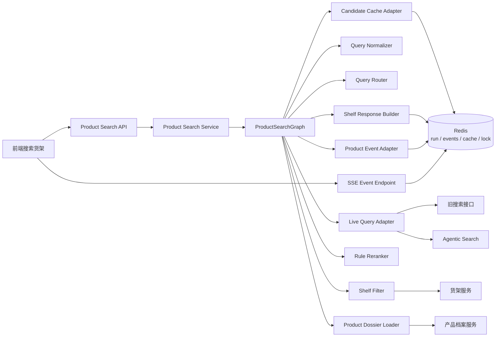
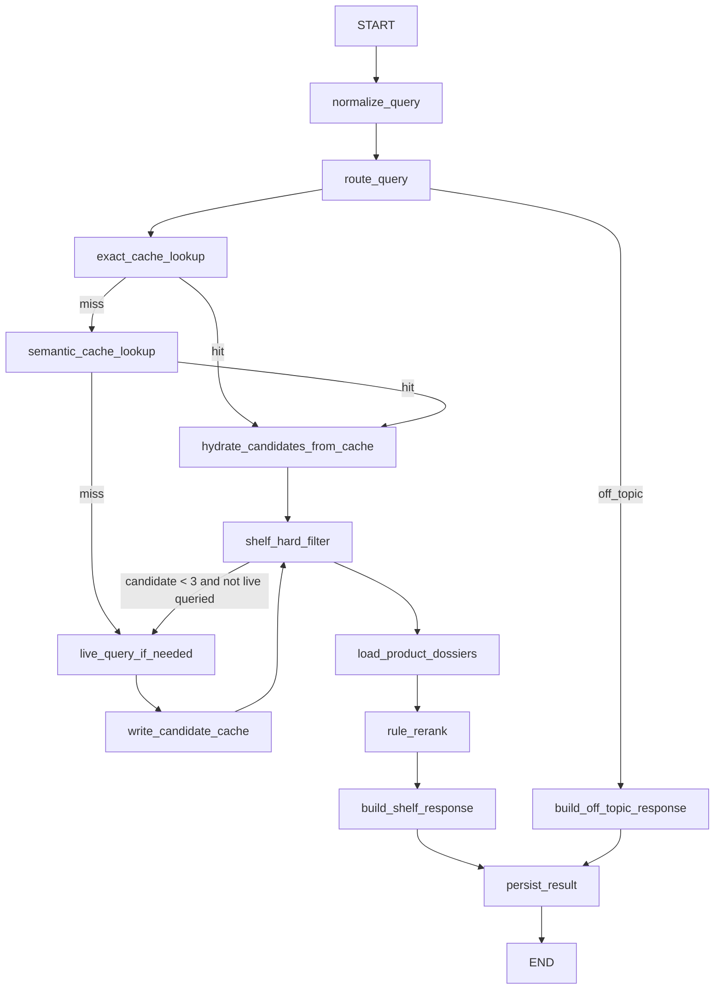
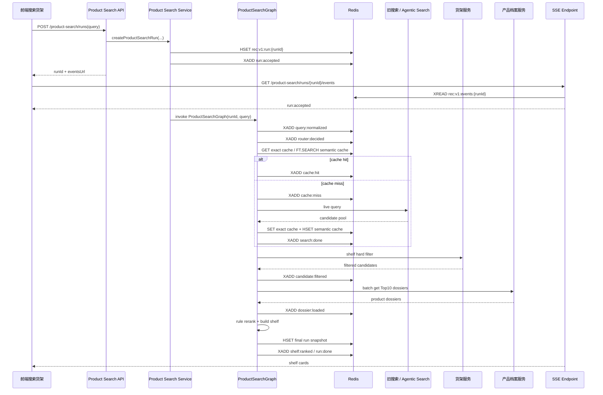

这篇只写给一类人：要把保险自然语言搜品能力落到线上链路里的工程同学。

它不是一篇推荐算法设计，也不是给业务看的概念稿，更不是一篇 `LangGraph` 入门。这里要回答的是一个更具体的问题：用户说一句“想给爸妈买个医疗险”，系统怎样稳定地产生一个可以展示、可以追踪、可以刷新续传的商品货架。

我一开始也想把它叫“推荐 `Agent`”。后来越写越觉得不对。第一版真正要做的不是推荐，而是搜索。

推荐要判断“这个人该不该买这款”。那需要用户画像、年龄、地区、职业、健康告知、预算、保障缺口、业务策略，甚至还要接核保和合规口径。本文讨论的第一版先不碰这些。它只解决一件事：

```text
自然语言需求
  -> 候选产品池
  -> 当前货架校验
  -> 产品深档案
  -> 规则排序
  -> 可交互货架
```

所以这条链路的名字应该更朴素一点：保险商品搜索 `Agent`。

它可以借助 `LLM` 理解用户需求，也可以用 `Agentic Search` 做更聪明的召回，但最终展示给用户的货架，不能是模型“想出来”的。它必须重新经过当前货架、产品档案、规则排序和事件协议。

一句话概括：

> 保险商品搜索 `Agent` 不是一个会聊天的推荐黑盒，而是一条可缓存、可过滤、可取证、可排序、可观测的货架生产链路。

## 一、先把边界钉住

第一版的输出是候选货架，不是正式投保建议。

用户能看到的是：

```text
可以优先看看这几款
候选理由是
还需要确认这些条件
```

不要写成：

```text
最适合你
建议购买
保证可买
一定能赔
```

这不是文字保守，而是系统边界。第一版没有做年龄、地区、职业、健康告知和预算强过滤，就不能假装自己已经完成了个性化投保判断。

这条链路里，每一层只做自己的事：

| 层 | 职责 | 不做什么 |
| --- | --- | --- |
| `OneAgent / LangGraph` | 编排商品搜索子图，处理需求理解、路由、缓存、查询、过滤、取档案、排序 | 不把所有候选和档案塞进主 `messages` |
| `Redis` | 保存 `run` 状态、可恢复事件、精确缓存、语义缓存、短锁 | 不承载最终业务判断 |
| 旧搜索 / `Agentic Search` | 召回候选产品池 | 不直接决定最终展示货架 |
| 货架服务 | 判断产品当前是否可展示、可售、在当前渠道内 | 第一版不做用户级投保适配 |
| 产品档案服务 | 提供卡片理由和风险提示所需的产品事实 | 不接收模型编造字段 |
| 前端 | 消费产品事件，展示阶段过程和最终货架 | 不理解保险搜品业务逻辑 |

这里有几个硬规则，后面所有细节都围绕它们展开：

1. 缓存只复用候选池，不复用最终话术。
2. `cache hit` 之后也必须重新走货架过滤。
3. 最终卡片只能依赖搜索命中摘要和产品深档案。
4. 第一版不让 `Agent` 做最终排序。
5. 前端只消费产品事件，不消费 `LangGraph` 原始运行时事件。

把这五条守住，系统不会因为加了 `Agent` 就变成一团雾。

## 二、主链路：先候选，后货架

主路径不要从“模型怎么想”开始，而要从“系统怎么生产货架”开始。

```text
query normalize
  -> router 判断 query 类型和查询后端
  -> exact candidate cache
  -> semantic candidate cache
  -> cache hit 复用 candidate pool
  -> cache miss 走实际查询
  -> 重新执行货架侧硬过滤
  -> 拉产品深档案
  -> 纯规则轻量 rerank
  -> 返回货架卡片 + 阶段事件
```

这里最容易误解的是缓存。缓存不是为了绕过业务链路，而是为了少做一次候选召回。缓存命中后，仍然要重新检查当前货架。产品可能下架，渠道可能关闭，运营可能屏蔽，档案也可能更新。

整体架构可以画成这样：



各模块的边界要写清楚：

| 模块 | 作用 | 边界 |
| --- | --- | --- |
| `Product Search API` | 创建搜索 `run`，返回订阅地址 | 不等待完整货架生成 |
| `ProductSearchGraph` | 用 `LangGraph` 编排搜索生命周期 | 不直接把运行时事件暴露给前端 |
| `Candidate Cache Adapter` | 查精确缓存和语义缓存 | 只返回候选池，不返回最终展示话术 |
| `Live Query Adapter` | 按路由调用旧搜索或 `Agentic Search` | 不关心前端展示 |
| `Shelf Filter` | 重新校验当前货架状态 | `cache hit` 也必须执行 |
| `Product Dossier Loader` | 拉最终候选的产品深档案 | 没有档案就不生成卡片 |
| `Rule Reranker` | 做轻量确定性排序 | 不调用模型重排 |
| `Product Event Adapter` | 把 `LangGraph` 事件翻译成产品事件 | 不透出模型原始思考链 |
| `Redis` | 存 `run`、事件、缓存、向量索引、短锁 | 不承载推荐决策 |

这样分层之后，`Agent` 的位置就清楚了。它不是货架的“裁判”，更像一个搜索任务编排器：理解需求，选择召回后端，组织中间状态，然后把确定性工作交给对应服务。

## 三、`LangGraph` 子图怎么跑

这个能力应该作为 `AgenticOne` 里的一个商品搜索子图存在。

主 `Agent` 不直接拼搜索参数，也不直接排序商品。它只把本轮用户需求交给商品搜索子图，拿回结构化货架和简短过程摘要。

```text
Host Agent
  -> search_products tool
     -> ProductSearchGraph
        -> normalize_query
        -> route_query
        -> exact_cache_lookup
        -> semantic_cache_lookup
        -> live_query_if_needed
        -> shelf_hard_filter
        -> load_product_dossiers
        -> rule_rerank
        -> build_shelf_response
        -> persist_result
  -> terminal shelf response
```

子图内部可以这样组织：



`route_query` 至少输出两个判断：

```text
routeType:
  product_search
  qa_or_compare
  off_topic

searchBackend:
  legacy_search
  agentic_search
```

`qa_or_compare` 第一版也可以先召回候选。用户问“这种保险哪个好”“这个和百万医疗有什么区别”时，如果没有产品锚点，后面的回答很容易空转。区别只是后续不一定直接进入货架展示，也可以交给问答或对比链路。

### 3.1 `State` 不是 `messages`

商品搜索链路不能只靠 `messages`。候选池、缓存命中、过滤结果、档案、排序结果都应该放在结构化 `state` 里。

```python
class ProductSearchState(TypedDict, total=False):
    run_id: str
    session_id: str
    raw_query: str
    normalized_query: str
    query_hash: str

    route_type: Literal["product_search", "qa_or_compare", "off_topic"]
    search_backend: Literal["legacy_search", "agentic_search"]

    cache_hit_type: Literal["none", "exact", "semantic"]
    cache_entry_id: str | None

    candidate_pool: list[Candidate]
    filtered_candidates: list[Candidate]
    dossiers: dict[str, ProductDossier]
    ranked_shelf: list[ShelfCard]

    visible_steps: list[VisibleStep]
    error: ProductSearchError | None
```

`Candidate` 是召回阶段的轻对象：

```python
class Candidate(TypedDict):
    prod_no: str
    recall_score: float
    recall_sources: list[str]
    hit_summary: str
    hit_tags: list[str]
    source_backend: Literal["exact_cache", "semantic_cache", "legacy_search", "agentic_search"]
```

`ShelfCard` 才是最终返回给前端的对象：

```python
class ShelfCard(TypedDict):
    prod_no: str
    product_name: str
    tags: list[str]
    candidate_reason: str
    risk_note: str
    confirm_needed: list[str]
    rank_score: float
    dossier_source: str
```

`candidate_reason` 不从缓存里拿旧文案。它应该基于当前 `query`、当前候选命中摘要和产品深档案重新生成或组装。

### 3.2 节点契约

| 节点 | 输入 | 输出 | 失败策略 |
| --- | --- | --- | --- |
| `normalize_query` | `raw_query` | `normalized_query`、`query_hash` | 清洗失败就用原 `query` |
| `route_query` | `raw_query`、`normalized_query` | `route_type`、`search_backend` | 回退 `product_search + legacy_search` |
| `exact_cache_lookup` | `route_type + query_hash` | 候选缓存 | `miss` 继续语义缓存 |
| `semantic_cache_lookup` | `query embedding + route_type` | 候选缓存 | `miss` 继续实时查询 |
| `live_query_if_needed` | 路由结果 | 候选列表 | 查询失败写 `run:error` |
| `shelf_hard_filter` | 候选列表 | 过滤后候选 | 少于 3 个且还没实时查询，则补一次实时查询 |
| `load_product_dossiers` | `Top10 prodNo` | 产品档案 `map` | 单个产品失败就剔除 |
| `rule_rerank` | 候选 + 档案 | 排序货架 | 无候选则返回无结果状态 |
| `build_shelf_response` | 排序货架 | 最终响应 | 禁止购买承诺话术 |
| `persist_result` | 完整 `state` | `Redis run snapshot + terminal event` | 持久化失败告警，不改写搜索结果 |

这个表比代码更重要。代码可以变，节点契约最好不要轻易漂。

## 四、候选缓存：只缓存候选，不缓存结论

`Redis` 第一版承担五个职责：

1. `run` 状态；
2. 可恢复 `SSE` 事件；
3. 精确候选缓存；
4. 语义候选缓存；
5. `cache miss` 防击穿短锁。

统一加版本前缀，方便之后整体迁移：

```text
rec:v1:run:{runId}
rec:v1:events:{runId}
rec:v1:cache:exact:{routeType}:{queryHash}
rec:v1:cache:sem:{entryId}
rec:v1:lock:{routeType}:{queryHash}
```

| `key` | 类型 | `TTL` | 内容 |
| --- | --- | --- | --- |
| `rec:v1:run:{runId}` | `Hash` | `24h` | `run` 状态、最终结果摘要、错误信息 |
| `rec:v1:events:{runId}` | `Stream` | `24h` | 可恢复 `SSE` 事件 |
| `rec:v1:cache:exact:{routeType}:{queryHash}` | `String JSON` | `6h` | 候选缓存 |
| `rec:v1:cache:sem:{entryId}` | `Hash` | `6h` | `query embedding + payload` |
| `rec:v1:lock:{routeType}:{queryHash}` | `String` | `30s` | 防击穿短锁 |

`run` 状态示例：

```text
HSET rec:v1:run:{runId}
  status running
  sessionId {sessionId}
  rawQuery {rawQuery}
  normalizedQuery {normalizedQuery}
  routeType product_search
  searchBackend legacy_search
  cacheHitType semantic
  candidateCount 50
  filteredCount 23
  shelfCount 3
  createdAt 2026-07-02T10:00:00+08:00
  updatedAt 2026-07-02T10:00:03+08:00
```

候选缓存的 `payload` 只保存召回信息：

```json
{
  "schemaVersion": 1,
  "entryId": "01J...",
  "routeType": "product_search",
  "normalizedQuery": "给父母买医疗险",
  "queryHash": "sha256:...",
  "sourceBackend": "legacy_search",
  "candidateProdNos": ["p1", "p2", "p3"],
  "hitSummaries": {
    "p1": "命中：父母、医疗险、住院医疗",
    "p2": "命中：中老年、百万医疗、续保"
  },
  "recallSources": {
    "p1": ["inverted_index", "embedding"],
    "p2": ["embedding"]
  },
  "recallScores": {
    "p1": 0.91,
    "p2": 0.87
  },
  "shelfVersion": "20260702-1000",
  "createdAt": "2026-07-02T10:00:00+08:00",
  "expiresAt": "2026-07-02T16:00:00+08:00"
}
```

它不保存：

```text
最终 Top3
最终卡片文案
购买建议
模型推理过程
已过期的货架判断
```

写入时机也要提前：

```text
live query 成功
  -> normalize candidate
  -> 截断 Top50
  -> 写 exact cache
  -> 写 semantic cache
```

不要等最终 `Top3` 排完才写缓存。缓存的是候选池，不是货架结论。

### 4.1 语义缓存

如果用 `Redis Stack / RediSearch`，可以给候选缓存建向量索引：

```text
FT.CREATE idx:rec:v1:sem_cache
ON HASH
PREFIX 1 rec:v1:cache:sem:
SCHEMA
  routeType TAG
  normalizedQuery TEXT
  createdAt NUMERIC
  expiresAt NUMERIC
  embedding VECTOR HNSW 6 TYPE FLOAT32 DIM 1536 DISTANCE_METRIC COSINE
```

语义查询：

```text
FT.SEARCH idx:rec:v1:sem_cache
  '(@routeType:{product_search})=>[KNN 3 @embedding $vec AS distance]'
  PARAMS 2 vec {query_embedding_bytes}
  SORTBY distance
  RETURN 4 routeType normalizedQuery payload distance
  DIALECT 2
```

第一版可以宽松复用：

```text
semantic hit if:
  routeType 相同
  cosine similarity >= 0.72
  payload 未过期
```

宽松复用的代价是必须有护栏：

1. 命中后重新走 `shelf_hard_filter`；
2. 最终卡片理由基于当前 `query` 和产品深档案重算。

### 4.2 防击穿

精确缓存和语义缓存都 `miss` 时，先抢短锁：

```text
SET rec:v1:lock:{routeType}:{queryHash} {runId} NX EX 30
```

抢到锁的请求执行实时查询并写缓存。没抢到锁的请求短等 `300~800ms`，再读一次精确缓存；如果仍然 `miss`，就自己走实时查询，不要无限等待。

## 五、实时查询、货架过滤、深档案

`router` 决定走旧搜索还是 `Agentic Search`。商品搜索入口不需要知道 `Agentic Search` 内部怎么发散关键词，只把它当成一个候选召回后端。

```python
async def live_query_if_needed(state: ProductSearchState) -> ProductSearchState:
    if state["cache_hit_type"] != "none":
        return state

    backend = state["search_backend"]
    if backend == "legacy_search":
        candidates = await legacy_search_tool(
            query=state["normalized_query"],
            route_type=state["route_type"],
            top_k=80,
        )
    else:
        candidates = await agentic_search_tool(
            query=state["raw_query"],
            normalized_query=state["normalized_query"],
            route_type=state["route_type"],
            top_k=80,
        )

    state["candidate_pool"] = normalize_candidates(candidates)[:50]
    state["visible_steps"].append({
        "stage": "search.done",
        "message": f"已从 {backend} 召回候选产品",
    })
    return state
```

### 5.1 货架侧硬过滤

第一版只做货架侧过滤：

```text
上下架
渠道可展示
当前产品池白名单
重复产品 / 同计划 SKU 去重
监管或运营屏蔽
```

第一版不做这些强过滤：

```text
年龄
地区
预算
职业
健康告知
既往症
```

原因很简单：用户当前选择了“信息不足时先直推”。既然不问槽位，就不能假装已经做了个性化投保校验。

最终文案要把未确认条件说出来：

```text
还需要确认被保人年龄、地区、职业和健康情况。
```

### 5.2 深档案

过滤后取 `Top10` 拉产品深档案：

```text
batch_get_product_dossier(prodNos[0:10])
```

深档案至少包含：

```text
prodNo
productName
productType
companyName
coreBenefits
renewalSummary
deductibleSummary
coverageSummary
riskNotes
priceRangeText
sourceVersion
updatedAt
```

最终货架卡片只允许使用两类事实：

1. 搜索命中摘要；
2. 产品深档案。

如果某个产品深档案拉取失败，就从最终排序中剔除。不要让模型凭搜索摘要补全产品责任。

### 5.3 规则排序

第一版不让 `Agent` 做最终排序。

```text
finalScore =
  0.55 * normalizedRecallScore
  + 0.20 * shelfWeight
  + 0.15 * dossierCompleteness
  + 0.10 * freshnessWeight
```

| 因子 | 来源 |
| --- | --- |
| `normalizedRecallScore` | 搜索或缓存中的召回分 |
| `shelfWeight` | 货架或运营侧权重 |
| `dossierCompleteness` | 深档案字段完整度 |
| `freshnessWeight` | 产品档案更新时间或货架版本 |

排序后做一次轻去重：

```text
同公司 + 同险种 + 名称高度相似
  -> Top3 中最多保留 1 个
```

最终返回 `Top3`。候选池保留在 `run state` 里，后续可以支持“换一批”，但第一版不开放多轮指代。

## 六、接口和前端事件

前端不应该只拿一个最终 `JSON`。自然语言搜品和传统搜索框不一样，用户需要知道系统正在理解需求、复用候选、检查货架、读取档案，最后才看到货架卡片。

接口上采用三段式：

```text
POST /product-search/runs              创建搜索任务，立即返回 runId
GET  /product-search/runs/{id}/events  订阅可恢复 SSE
GET  /product-search/runs/{id}         查询 run 快照和最终货架
```

### 6.1 请求时序



这个时序有两个重点：

1. `POST` 不等货架生成完成，只返回 `runId`；
2. 前端只消费产品事件，不消费 `LangGraph` 原始事件。

### 6.2 前端状态机

前端可以用一个很小的状态机消费事件：

```text
idle
  -> creating
  -> running
     -> understanding
     -> cache_reusing / searching
     -> filtering
     -> loading_dossier
     -> ranking
  -> done
  -> error
```

事件到 `UI` 的映射：

| `eventType` | 前端状态 | 展示 |
| --- | --- | --- |
| `run:accepted` | `running` | 创建搜索任务 |
| `query:normalized` | `understanding` | 正在理解需求 |
| `router:decided` | `understanding` | 已识别为商品搜索、问答或离题 |
| `cache:hit` | `cache_reusing` | 已复用相似需求候选 |
| `cache:miss` | `searching` | 正在重新搜索产品 |
| `search:done` | `searching` | 已召回候选 |
| `candidate:filtered` | `filtering` | 正在检查当前货架 |
| `dossier:loaded` | `loading_dossier` | 正在读取产品档案 |
| `shelf:ranked` | `ranking` | 正在整理候选货架 |
| `run:done` | `done` | 展示产品卡片 |
| `run:error` | `error` | 展示安全失败提示 |

前端保留最后一个 `SSE event id`。刷新或断线后带上：

```http
Last-Event-ID: 1720000000-0
```

服务端从 `Redis Stream` 续传，直到 `run:done` 或 `run:error`。

### 6.3 `LangGraph` 事件适配

`LangGraph` 会产生很多运行时事件：节点开始、节点结束、工具调用、模型 `token`、子图事件、异常事件。如果直接转发给前端，用户看到的是内部调用栈，不是商品搜索过程。

中间要加一层 `ProductSearchEventAdapter`：

```text
LangGraph runtime events
  -> ProductSearchEventAdapter
  -> ProductSearchEvent
  -> Redis Stream
  -> SSE
  -> Frontend state machine
```

映射规则示例：

| `LangGraph runtime event` | 条件 | 产品事件 |
| --- | --- | --- |
| `node start` | `normalize_query` | `query:normalizing` |
| `node end` | `normalize_query` | `query:normalized` |
| `node end` | `route_query` | `router:decided` |
| `node end` | `exact_cache_lookup` 或 `semantic_cache_lookup` 且命中 | `cache:hit` |
| `node end` | 两层缓存均 `miss` | `cache:miss` |
| `tool start` | `legacy_search_tool` / `agentic_search_tool` | `search:started` |
| `tool end` | 搜索工具成功 | `search:done` |
| `node end` | `shelf_hard_filter` | `candidate:filtered` |
| `tool end` | `batch_get_product_dossier` | `dossier:loaded` |
| `node end` | `rule_rerank` | `shelf:ranked` |
| `graph end` | 最终货架已生成 | `run:done` |
| `graph error` | 任意未处理异常 | `run:error` |

`ProductSearchEventAdapter` 要做三件事：

1. 降噪：不转发模型 `token`、工具原始入参、内部 `traceback`、`prompt`。
2. 重排：并发工具事件按业务阶段输出，避免前端看到乱序。
3. 补语义：给事件补上 `message`、`stage`、`candidateCount`、`cacheHitType` 这类产品字段。

产品事件结构：

```json
{
  "id": "1720000000-0",
  "eventType": "candidate:filtered",
  "payload": {
    "runId": "rec_abc",
    "stage": "filtering",
    "message": "正在重新检查当前货架状态",
    "beforeCount": 50,
    "afterCount": 23,
    "timestamp": "2026-07-02T10:00:03+08:00"
  }
}
```

这里不输出 `thought`。如果需要排查模型为什么选了某个后端，写内部 `trace` 或审计表，不给 C 端用户展示。

用户可见文案可以是：

```text
正在理解你的保险需求
已复用相似需求的候选池
正在重新检查当前货架状态
已读取候选产品档案
已整理出 3 个可以优先查看的候选
```

不要展示：

```text
模型认为用户真正想要的是……
我的推理过程是……
我先假设……
```

这和 [[LangGraph Agent Event 消费指南]] 里的原则一致：`LangGraph` 运行时事件是原料，产品事件才是契约。

## 七、`OneAgent` 集成方式

商品搜索能力不要变成主 `Agent` 里的长 `prompt`。它应该注册成一个终末工具或子图工具：

```text
search_products(query, session_id) -> ProductSearchRunResult
```

工具返回给主 `Agent` 的内容要短：

```json
{
  "runId": "rec_abc",
  "routeType": "product_search",
  "cacheHitType": "semantic",
  "shelfProdNos": ["p1", "p2", "p3"],
  "summary": "已根据当前需求整理出 3 个候选产品，均已重新检查货架状态。"
}
```

完整候选、档案、排序细节留在 `ProductSearchState` 和 `Redis`，不要塞进主 `messages`。如果前端需要完整货架，直接消费 `run:done` 事件，或者查询：

```http
GET /product-search/runs/{runId}
```

这也呼应 [[AgenticOne：OneAgent 范式在保险实时咨询中的应用]] 里的原则：主 `Agent` 做薄，领域能力做厚；主上下文保持干净，复杂信息放到可管理的外部状态里。

## 八、失败路径和观测指标

失败路径不要藏在实现里。第一版至少要把这些行为写进契约：

| 失败点 | 行为 |
| --- | --- |
| `normalize_query` 失败 | 使用原 `query` 继续 |
| `route_query` 失败 | 回退 `product_search + legacy_search` |
| `Redis exact cache` 失败 | 跳过精确缓存，继续语义缓存 |
| `Redis Vector` 失败 | 跳过语义缓存，继续实时查询 |
| 实时查询失败 | 写 `run:error`，返回安全失败 |
| 货架过滤后无结果 | 返回无候选状态，不编造商品卡片 |
| 深档案批量失败 | 剔除失败产品，少于 1 个则返回无候选 |
| `SSE` 写事件失败 | 继续主链路，但记录告警；最终 `run snapshot` 仍要写 |

无候选文案：

```text
当前货架里没有找到足够匹配的候选产品。你可以换一种描述，或者补充被保人年龄、地区、预算和健康情况。
```

线上指标也要按链路分段看：

| 指标 | 目的 |
| --- | --- |
| `exact_cache_hit_rate` | 精确缓存是否有效 |
| `semantic_cache_hit_rate` | 语义缓存是否真的复用 |
| `live_query_rate` | 缓存未命中的压力 |
| `filter_empty_rate` | 货架过滤是否过严或缓存污染 |
| `dossier_load_fail_rate` | 产品档案服务稳定性 |
| `product_search_p50/p95` | 整体延迟 |
| `search_p50/p95` | 实际查询耗时 |
| `redis_vector_p50/p95` | 语义缓存耗时 |
| `shelf_card_ctr` | 候选货架是否被点击 |
| `query_rewrite_rate` | 用户是否频繁重新提问 |
| `run_error_rate` | 线上错误率 |

上线前最小测试集：

```text
给爸妈买医疗险
孩子重疾险怎么选
出国去日本旅游买什么保险
经常骑电动车买什么意外险
预算不高想买个寿险
这款和百万医疗有什么区别
推荐一个保险
```

测试必须覆盖：

1. 精确缓存命中；
2. 语义缓存命中；
3. 缓存未命中后走旧搜索；
4. 缓存未命中后走 `Agentic Search`；
5. 货架下架后，缓存命中仍被过滤；
6. 深档案失败时，不生成虚假卡片；
7. `SSE` 断线后能从 `Last-Event-ID` 续传。

## 九、第一版不做什么

这些能力先不放进第一版：

- `template cache`；
- 用户画像强过滤；
- 年龄、健康、职业、预算等投保适配判断；
- “换一批”“第一款多少钱”“和刚才比”的多轮指代；
- `Agent` 最终排序；
- 展示模型原始思考链；
- 缓存最终货架文案。

这不是说它们不重要。真正的推荐系统，迟早要接画像、保障缺口、核保和业务策略。但第一版先把“候选复用、当前货架校验、深档案卡片、可恢复事件”这条主链路打稳。

前一篇 [[从对话到交互式音画同步动画讲解：一次保险产品介绍 AIGC 链路的工程化实践]] 里有个判断：`LLM` 做导演，后端做确定性制片，前端消费事件。

商品搜索链路也是同一件事，只是对象从动画变成了货架：

```text
Agent 负责：
  query normalize / router / 选择查询后端 / 生成候选理由摘要

确定性后端负责：
  cache / 货架过滤 / 深档案 / 规则排序 / SSE replay / 审计

前端负责：
  展示阶段过程和最终货架
```

保险商品搜索 `Agent` 的难点，不是让模型多说几句像样的话，而是把模型的灵活性压进一条硬链路里。候选可以来自 `Agent`，货架必须回到事实。
