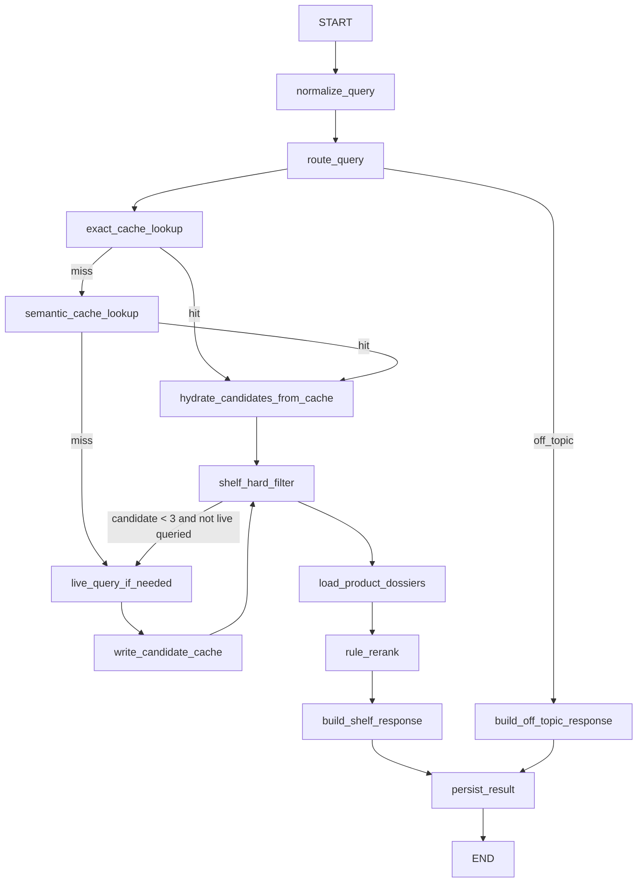

这篇不是重新讨论“推荐 Agent 要不要发散关键词”。那个方向已经确定了：`Agentic Search` 是一种新的实际查询后端，但第一版先不展开它内部怎么做。

现在要落的是推荐入口这条链路：

```text
query normalize
  -> router 判断 query 类型和查询后端
  -> exact candidate cache
  -> semantic candidate cache
  -> cache hit 复用 candidate pool
  -> cache miss 按 router 走实际查询
  -> 重新执行货架侧硬过滤
  -> 拉产品深档案
  -> 纯规则轻量 rerank
  -> 返回货架卡片 + 阶段理由
```

这里的核心判断是：**缓存只复用候选，不复用结论；Agent 可以参与理解和查询，但最终货架必须重新过当前货架事实。**

---

## 一、系统边界

第一版推荐系统不是一个“LLM 自由推荐商品”的接口，而是一条有缓存、有状态、有事件、有审计的候选货架生产链路。

| 层 | 职责 | 不做什么 |
|---|---|---|
| `OneAgent / LangGraph` | 编排推荐子图，做 query normalize、router、cache lookup、实际查询、过滤、取档案、排序 | 不把所有候选和档案塞进主 `messages` |
| `Redis` | 保存 run 状态、SSE 事件、exact cache、semantic vector cache、短锁 | 不承载最终业务判断 |
| 旧搜索 / `Agentic Search` | 提供实际候选召回 | 不直接决定最终货架展示 |
| 货架服务 | 判断产品当前是否可展示、可售、在当前渠道内 | 第一版不按用户年龄/健康/预算做强过滤 |
| 产品档案服务 | 返回产品深档案，支撑卡片理由和风险提示 | 不接收模型编造字段 |
| 前端 | 消费阶段事件和最终货架 | 不理解保险推荐逻辑 |

第一版的推荐表达也要收紧。用户看到的是候选产品清单，不是正式投保建议：

```text
可以优先看看这几款
候选理由是
还需要你确认这些条件
```

不要写：

```text
最适合你
建议购买
保证可买
一定赔
```

---

## 二、LangGraph 子图

这个能力应该作为 `AgenticOne` 里的一个推荐子图存在。主 `Agent` 不直接写搜索参数，也不直接排序商品；它只把本轮用户需求交给推荐子图，拿回结构化货架和简短过程摘要。

```text
Host Agent
  -> recommend_products tool
     -> RecommendationGraph
        -> normalize_query
        -> route_query
        -> exact_cache_lookup
        -> semantic_cache_lookup
        -> live_query_if_needed
        -> shelf_hard_filter
        -> load_product_dossiers
        -> rule_rerank
        -> build_shelf_response
        -> persist_result
  -> terminal shelf response
```

推荐子图内部结构：



`route_query` 输出两个东西：

```text
routeType:
  recommendation
  qa_or_compare
  off_topic

searchBackend:
  legacy_search
  agentic_search
```

`qa_or_compare` 第一版也先召回候选，因为很多用户会问“这种保险哪个好”“这个和百万医疗有什么区别”，不先定产品，后面的问答很容易空转。区别只是它后续不一定直接进入推荐货架，也可以交给问答/对比链路。

### 2.1 RecommendationState

`LangGraph state` 不要只放 `messages`。推荐链路至少需要这些字段：

```python
class RecommendationState(TypedDict, total=False):
    run_id: str
    session_id: str
    raw_query: str
    normalized_query: str
    query_hash: str

    route_type: Literal["recommendation", "qa_or_compare", "off_topic"]
    search_backend: Literal["legacy_search", "agentic_search"]

    cache_hit_type: Literal["none", "exact", "semantic"]
    cache_entry_id: str | None

    candidate_pool: list[Candidate]
    filtered_candidates: list[Candidate]
    dossiers: dict[str, ProductDossier]
    ranked_shelf: list[ShelfCard]

    visible_steps: list[VisibleStep]
    error: RecommendationError | None
```

`Candidate` 是召回阶段的轻对象：

```python
class Candidate(TypedDict):
    prod_no: str
    recall_score: float
    recall_sources: list[str]
    hit_summary: str
    hit_tags: list[str]
    source_backend: Literal["exact_cache", "semantic_cache", "legacy_search", "agentic_search"]
```

`ShelfCard` 是最终返回给前端的对象：

```python
class ShelfCard(TypedDict):
    prod_no: str
    product_name: str
    tags: list[str]
    candidate_reason: str
    risk_note: str
    confirm_needed: list[str]
    rank_score: float
    dossier_source: str
```

注意，`candidate_reason` 不是从缓存里拿旧文案。它应该基于当前 query、当前候选命中摘要和产品深档案重新生成或组装。

### 2.2 Node 契约

| 节点 | 输入 | 输出 | 失败策略 |
|---|---|---|---|
| `normalize_query` | `raw_query` | `normalized_query`、`query_hash` | 清洗失败就用原 query |
| `route_query` | `raw_query`、`normalized_query` | `route_type`、`search_backend` | router 失败回退 `recommendation + legacy_search` |
| `exact_cache_lookup` | `route_type + query_hash` | candidate cache payload | miss 继续走 semantic |
| `semantic_cache_lookup` | query embedding + `route_type` | candidate cache payload | miss 继续 live query |
| `live_query_if_needed` | router 输出 | candidate list | 搜索失败写 `run:error` |
| `shelf_hard_filter` | candidate list | filtered candidates | 少于 3 个且还没 live query，则补 live query |
| `load_product_dossiers` | Top10 `prodNo` | dossiers map | 单个产品失败就剔除，不影响其他候选 |
| `rule_rerank` | candidates + dossiers | ranked shelf | 无候选则返回无结果卡片 |
| `build_shelf_response` | ranked shelf | final response | 禁止购买承诺话术 |
| `persist_result` | full state | Redis run snapshot + terminal event | 持久化失败要告警，但不改写推荐结论 |

---

## 三、Redis 落地

`Redis` 第一版同时承担 5 个职责：

1. run 状态；
2. 可恢复 SSE 事件；
3. exact candidate cache；
4. semantic candidate cache；
5. cache miss 防击穿短锁。

### 3.1 Key 设计

统一加版本前缀，方便之后整体迁移：

```text
rec:v1:run:{runId}
rec:v1:events:{runId}
rec:v1:cache:exact:{routeType}:{queryHash}
rec:v1:cache:sem:{entryId}
rec:v1:lock:{routeType}:{queryHash}
```

| key | 类型 | TTL | 内容 |
|---|---|---|---|
| `rec:v1:run:{runId}` | Hash | 24h | run 状态、最终结果摘要、错误信息 |
| `rec:v1:events:{runId}` | Stream | 24h | SSE replay 事件 |
| `rec:v1:cache:exact:{routeType}:{queryHash}` | String JSON | 6h | candidate cache payload |
| `rec:v1:cache:sem:{entryId}` | Hash | 6h | query embedding + cache payload |
| `rec:v1:lock:{routeType}:{queryHash}` | String | 30s | cache miss 防击穿 |

`run` 状态示例：

```text
HSET rec:v1:run:{runId}
  status running
  sessionId {sessionId}
  rawQuery {rawQuery}
  normalizedQuery {normalizedQuery}
  routeType recommendation
  searchBackend legacy_search
  cacheHitType semantic
  candidateCount 50
  filteredCount 23
  shelfCount 3
  createdAt 2026-07-02T10:00:00+08:00
  updatedAt 2026-07-02T10:00:03+08:00
```

### 3.2 CandidateCachePayload

缓存只保存候选池，不保存最终货架文案。

```json
{
  "schemaVersion": 1,
  "entryId": "01J...",
  "routeType": "recommendation",
  "normalizedQuery": "给父母买医疗险",
  "queryHash": "sha256:...",
  "sourceBackend": "legacy_search",
  "candidateProdNos": ["p1", "p2", "p3"],
  "hitSummaries": {
    "p1": "命中：父母、医疗险、住院医疗",
    "p2": "命中：中老年、百万医疗、续保"
  },
  "recallSources": {
    "p1": ["inverted_index", "embedding"],
    "p2": ["embedding"]
  },
  "recallScores": {
    "p1": 0.91,
    "p2": 0.87
  },
  "shelfVersion": "20260702-1000",
  "createdAt": "2026-07-02T10:00:00+08:00",
  "expiresAt": "2026-07-02T16:00:00+08:00"
}
```

写 exact cache：

```text
SET rec:v1:cache:exact:{routeType}:{queryHash} {payload_json} EX 21600
```

写 semantic cache：

```text
HSET rec:v1:cache:sem:{entryId}
  routeType recommendation
  normalizedQuery "给父母买医疗险"
  queryHash "sha256:..."
  embedding <float32-bytes>
  payload {payload_json}
  createdAt 1782976800
  expiresAt 1782998400
EXPIRE rec:v1:cache:sem:{entryId} 21600
```

### 3.3 Redis Vector Index

如果用 `Redis Stack / RediSearch`，建一个候选缓存向量索引：

```text
FT.CREATE idx:rec:v1:sem_cache
ON HASH
PREFIX 1 rec:v1:cache:sem:
SCHEMA
  routeType TAG
  normalizedQuery TEXT
  createdAt NUMERIC
  expiresAt NUMERIC
  embedding VECTOR HNSW 6 TYPE FLOAT32 DIM 1536 DISTANCE_METRIC COSINE
```

语义查询：

```text
FT.SEARCH idx:rec:v1:sem_cache
  '(@routeType:{recommendation})=>[KNN 3 @embedding $vec AS distance]'
  PARAMS 2 vec {query_embedding_bytes}
  SORTBY distance
  RETURN 4 routeType normalizedQuery payload distance
  DIALECT 2
```

第一版选择宽松复用：

```text
semantic hit if:
  routeType 相同
  cosine similarity >= 0.72
  payload 未过期
```

宽松复用必须配两个护栏：

1. cache hit 后重新走 `shelf_hard_filter`；
2. 最终卡片理由基于当前 query 和产品深档案重算，不复用旧理由。

### 3.4 防击穿

exact 和 semantic 都 miss 时，先抢短锁：

```text
SET rec:v1:lock:{routeType}:{queryHash} {runId} NX EX 30
```

抢到锁的请求执行 live query 并写 cache。没抢到的请求最多短等 300~800ms，再读一次 exact cache；仍 miss 就自己走 live query，避免无限等待。

---

## 四、实际查询与缓存回写

`router` 已经决定了走旧搜索还是 `Agentic Search`。推荐入口不需要知道 `Agentic Search` 内部怎么发散关键词，只把它当成一个候选召回后端。

```python
async def live_query_if_needed(state: RecommendationState) -> RecommendationState:
    if state["cache_hit_type"] != "none":
        return state

    backend = state["search_backend"]
    if backend == "legacy_search":
        candidates = await legacy_search_tool(
            query=state["normalized_query"],
            route_type=state["route_type"],
            top_k=80,
        )
    else:
        candidates = await agentic_search_tool(
            query=state["raw_query"],
            normalized_query=state["normalized_query"],
            route_type=state["route_type"],
            top_k=80,
        )

    state["candidate_pool"] = normalize_candidates(candidates)[:50]
    state["visible_steps"].append({
        "stage": "search.done",
        "message": f"已从 {backend} 召回候选产品",
    })
    return state
```

候选 cache 写入时机：

```text
live query 成功
  -> normalize candidate
  -> 截断 Top50
  -> 写 exact cache
  -> 写 semantic cache
```

不要等最终 Top3 排完才写 cache。缓存的是召回候选池，越早写越符合它的职责。

---

## 五、货架过滤、深档案和规则排序

### 5.1 货架侧硬过滤

第一版只做货架侧过滤：

```text
上下架
渠道可展示
当前产品池白名单
重复产品 / 同计划 SKU 去重
监管或运营屏蔽
```

第一版不做这些强过滤：

```text
年龄
地区
预算
职业
健康告知
既往症
```

原因不是这些不重要，而是用户当前选择了“信息不足时先直推”。既然不问槽位，就不能假装已经做了个性化投保校验。最终文案要提醒：

```text
还需要确认被保人年龄、地区、职业和健康情况。
```

### 5.2 深档案

过滤后取 Top10 拉深档案：

```text
batch_get_product_dossier(prodNos[0:10])
```

深档案至少包含：

```text
prodNo
productName
productType
companyName
coreBenefits
renewalSummary
deductibleSummary
coverageSummary
riskNotes
priceRangeText
sourceVersion
updatedAt
```

最终货架卡片只允许使用这两类事实：

1. 搜索命中摘要；
2. 产品深档案。

如果某个产品深档案拉取失败，就从最终排序中剔除。不要让模型凭搜索摘要补全产品责任。

### 5.3 纯规则 rerank

第一版不让 `Agent` 做最终排序。规则排序公式：

```text
finalScore =
  0.55 * normalizedRecallScore
  + 0.20 * shelfWeight
  + 0.15 * dossierCompleteness
  + 0.10 * freshnessWeight
```

| 因子 | 来源 |
|---|---|
| `normalizedRecallScore` | 搜索或 cache 中的召回分 |
| `shelfWeight` | 货架/运营侧权重 |
| `dossierCompleteness` | 深档案字段完整度 |
| `freshnessWeight` | 产品档案更新时间或货架版本 |

排序后做一次轻去重：

```text
同公司 + 同险种 + 名称高度相似
  -> Top3 中最多保留 1 个
```

最终返回 Top3。候选池保留在 `run state` 里，后续做“换一批”时再用，但第一版不开放多轮指代。

---

## 六、SSE 事件和可见过程

用户需要看到过程，但不需要看到模型原始思考链。可以展示的是“阶段 + 理由摘要”。

事件写入 `Redis Stream`：

```text
XADD rec:v1:events:{runId} * eventType run:accepted payload {...}
EXPIRE rec:v1:events:{runId} 86400
```

事件类型：

| eventType | payload |
|---|---|
| `run:accepted` | `runId`、`sessionId` |
| `query:normalized` | `normalizedQuery` |
| `router:decided` | `routeType`、`searchBackend` |
| `cache:hit` | `hitType`、`matchedQuery`、`candidateCount` |
| `cache:miss` | `reason` |
| `search:started` | `searchBackend` |
| `search:done` | `candidateCount` |
| `candidate:filtered` | `beforeCount`、`afterCount`、`filterSummary` |
| `dossier:loaded` | `loadedCount` |
| `shelf:ranked` | `shelfCount` |
| `run:done` | final shelf |
| `run:error` | safe error message |

用户可见文案示例：

```text
正在理解你的保险需求
已复用相似需求的候选池
正在重新检查当前货架状态
已读取候选产品档案
已整理出 3 个可以优先查看的候选
```

不要展示：

```text
模型认为用户真正想要的是……
我的推理过程是……
我先假设……
```

这和 [[LangGraph Agent Event 消费指南]] 里的原则一致：`LangGraph` runtime event 是原料，产品事件才是契约。

---

## 七、接口形态

### 7.1 创建推荐 run

```http
POST /recommendation/runs
Content-Type: application/json
```

```json
{
  "sessionId": "s_123",
  "query": "想给爸妈买个医疗险"
}
```

返回：

```json
{
  "runId": "rec_abc",
  "status": "running",
  "eventsUrl": "/recommendation/runs/rec_abc/events"
}
```

创建接口只负责：

1. 生成 `runId`；
2. 写 `rec:v1:run:{runId}`；
3. 后台调度 `RecommendationGraph`；
4. 立刻返回可订阅地址。

### 7.2 订阅事件

```http
GET /recommendation/runs/{runId}/events
Last-Event-ID: 1720000000-0
```

服务端从 `rec:v1:events:{runId}` replay。`Last-Event-ID` 不属于当前 run 时直接返回续传错误，不做模糊容错。

### 7.3 查询结果快照

```http
GET /recommendation/runs/{runId}
```

返回 `run` 当前状态和最终货架。这个接口给刷新、排查和降级使用。

---

## 八、OneAgent 集成方式

推荐能力不要变成主 `Agent` 里的长 prompt。它应该注册成一个终末工具或子图工具：

```text
recommend_products(query, session_id) -> RecommendationRunResult
```

工具返回给主 `Agent` 的内容要短：

```json
{
  "runId": "rec_abc",
  "routeType": "recommendation",
  "cacheHitType": "semantic",
  "shelfProdNos": ["p1", "p2", "p3"],
  "summary": "已根据当前需求整理出 3 个候选产品，均已重新检查货架状态。"
}
```

完整候选、档案、排序细节留在 `RecommendationState` 和 `Redis`，不要塞进主 `messages`。如果前端需要完整货架，直接消费 `run:done` 事件或查询 `GET /recommendation/runs/{runId}`。

---

## 九、失败路径

| 失败点 | 行为 |
|---|---|
| `normalize_query` 失败 | 使用原 query 继续 |
| `route_query` 失败 | 回退 `recommendation + legacy_search` |
| Redis exact cache 失败 | 跳过 exact，继续 semantic |
| Redis Vector 失败 | 跳过 semantic，继续 live query |
| live query 失败 | 写 `run:error`，返回安全失败 |
| 货架过滤后无结果 | 返回无候选状态，不编造推荐 |
| 深档案批量失败 | 剔除失败产品，少于 1 个则无候选 |
| SSE 写事件失败 | 继续主链路，但记录告警；最终 run snapshot 仍要写 |

无候选文案：

```text
当前货架里没有找到足够匹配的候选产品。你可以换一种描述，或者补充被保人年龄、地区、预算和健康情况。
```

---

## 十、验收指标

第一版看线上指标，但必须同时保留链路分段指标，否则只看转化率很难定位问题。

| 指标 | 目的 |
|---|---|
| `exact_cache_hit_rate` | exact cache 是否有效 |
| `semantic_cache_hit_rate` | semantic cache 是否真的复用 |
| `live_query_rate` | cache miss 压力 |
| `filter_empty_rate` | 货架过滤是否过严或缓存污染 |
| `dossier_load_fail_rate` | 产品档案服务稳定性 |
| `recommendation_p50/p95` | 整体延迟 |
| `search_p50/p95` | 实际查询耗时 |
| `redis_vector_p50/p95` | semantic cache 耗时 |
| `shelf_card_ctr` | 候选货架是否被点击 |
| `query_rewrite_rate` | 用户是否频繁重新提问 |
| `run_error_rate` | 线上错误率 |

上线前最小测试集：

```text
给爸妈买医疗险
孩子重疾险怎么选
出国去日本旅游买什么保险
经常骑电动车买什么意外险
预算不高想买个寿险
这款和百万医疗有什么区别
推荐一个保险
```

测试必须覆盖：

1. exact cache 命中；
2. semantic cache 命中；
3. cache miss 后走旧搜索；
4. cache miss 后走 `Agentic Search`；
5. 货架下架后 cache hit 仍被过滤；
6. 深档案失败时不生成虚假卡片；
7. SSE 断线后能从 `Last-Event-ID` 续传。

---

## 十一、第一版不做什么

这些能力先不放进第一版：

- `template cache`；
- 用户画像强过滤；
- 年龄、健康、职业、预算等投保适配判断；
- “换一批”“第一款多少钱”“和刚才比”的多轮指代；
- `Agent` 最终排序；
- 展示模型原始思考链；
- 缓存最终推荐文案。

这不是能力不重要，而是第一版先把“候选复用 + 当前货架校验 + 深档案卡片 + 可恢复事件”这条主链路打稳。等这条链路可观测、可回放、能解释，再往上叠画像、核保和多轮推荐。

---

## 十二、和前一篇动画讲解链路的关系

前一篇 [[从对话到交互式音画同步动画讲解：一次保险产品介绍 AIGC 链路的工程化实践]] 里有一个原则：`LLM` 做导演，后端做确定性制片，前端消费事件。

推荐链路也是同一件事：

```text
Agent 负责：
  query normalize / router / 选择查询后端 / 生成候选理由摘要

确定性后端负责：
  cache / 货架过滤 / 深档案 / 规则排序 / SSE replay / 审计

前端负责：
  展示阶段过程和最终货架
```

真正可上线的推荐 `Agent`，不应该把“想一想推荐什么”直接暴露成产品能力。它需要一条硬链路，把模型的灵活性压进候选、缓存、过滤、档案、排序和事件协议里。
