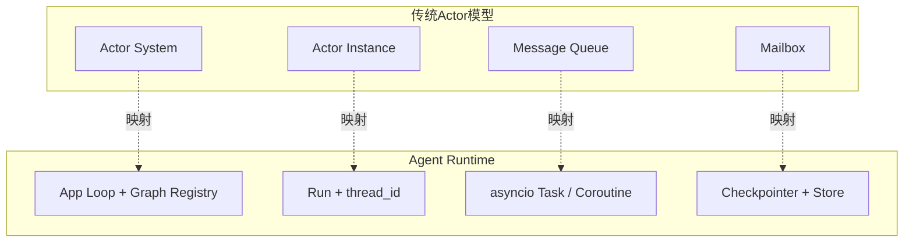
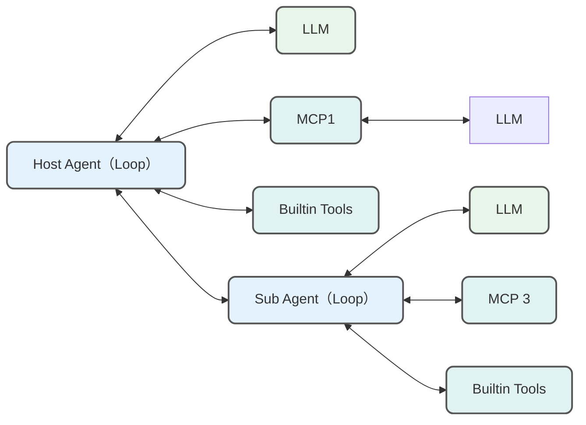
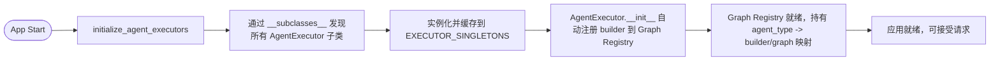
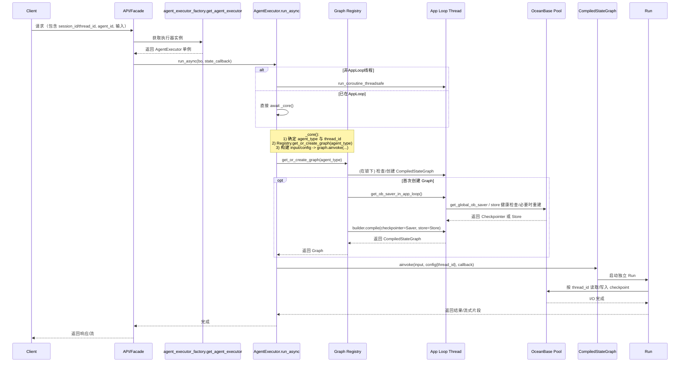

## 目录

0. 前言与适用范围
1. 项目简介
2. Agent Runtime 组成
3. 运行期调用链：请求 → 执行器 → Graph → Run → Checkpointer & Store
4. 容量规划与性能调优
5. 总结

---

## 0. 前言与适用范围

之前我在 [[领域 Agent 如何像 Manus 交付业务需求|OneAgent + MCPs 范式]] 一文中梳理了四个 `Agent` 构建范式：单一 `LLM` 调用、`Workflow` 编排、`Multi-Agent` 系统，以及受 `Manus` 和 `Claude Code` 启发的 `OneAgent + MCPs` 模式。

本地脚本能跑之后，问题才刚开始。一个通过 `MCP` 服务器派生出来的领域 `Agent`，怎么部署成长期运行的服务？多用户并发、多轮对话、用户画像、断点恢复，分别落在哪一层？

我之前是 `Javaer`，后来因为 `AI Agent` 转向了 `Python` 技术栈。本文写的是自己实际做过的应用部署架构，一个 `Python` 技术栈下的服务化 `Agent Runtime`。

先把一个容易误导人的说法拨正。`Agent` 不应该被理解成每个会话一份、自己带状态的对象。一个进程里复用同一个编译后的 `CompiledStateGraph`，每次请求在它上面启动独立的 `Run`，运行状态由本次输入、`config`、`thread_id` 和 `Checkpointer` 隔离。

## 1. 项目简介

项目原型来自我在蚂蚁做的一个智能体应用。如果读者了解过 `Actor` 模型，大概会发现一个长期工作的 `Agent` 很容易被类比成 `Actor`： 

这个类比可以用，但边界要画清楚。`CompiledStateGraph` 不是每个用户一份的 `Actor` 实例，它更像一个进程级执行模板；每次 `ainvoke` 才是一次独立执行。对应关系大概是这样：



项目整体架构与技术栈先放在这里： 

## 2. Agent Runtime 组成

`Agent Runtime` 抽象为“构造器 + 执行器 + 图注册表”的组合：

- **构造器（Builder）**：`Agent Builder` 集中在 `service` 层，每个 `service` 文件负责构造某类 `Graph` 或 `Agent`。
- **执行器（Executor）**：`AgentExecutor` 的子类，封装统一的 `run` 接口，负责把请求转换成一次 `Run`。
- **图注册表（Graph Registry）**：历史代码里可能叫 `UniversalAgentPool`，但它更适合缓存进程级 `CompiledStateGraph`，而不是缓存“每个会话一个有状态 `Agent` 实例”。

业务只关心“如何构造 `Graph`”，基础设施关心“如何调度一次 `Run`，如何传入 `thread_id`，如何让 `Checkpointer` 找到对应状态”。

### 2.1 Agent Builder

`Agent` 构造方法集中在 `service` 层，每个 `service` 文件负责构造一个领域能力。比如我在 `deep_search_agent_service` 构造 `deep_search_agent`，你也可以在某个业务下构造自己的 `xx_agent`。这里不应该限制 `Agent` 的构造方式，单一 `LLM` 调用、`Workflow` 编排、`Multi-Agent` 编排、`OneAgent + MCPs` 模式都可以。不过在 `LangGraph` 落地时，`builder.compile(checkpointer=checkpointer)` 返回的应该是可并发调用的 `CompiledStateGraph`，不是一份绑定用户状态的对象。



`Agent` 构建方式不限制，不过所有 `Agent` 都需要遵循统一的调用接口。接口参数的设计中，入参需要考虑不同业务的诉求，除了通用的 `prompt`、内置工具、`MCP` 配置等，还需要考虑是否需要审计、是否需要压缩 `ToolMessage`；出参则更要克制，因为 `Agent` 不仅会用于流式对话，还可能用于批处理或者简单的同步调用。参考 `LangGraph` 的设计，一个 `Agent` 应该支持以下 4 个接口：

| 接口名 | 设计理念 | 设计原理 | 应用场景 |
| --- | --- | --- | --- |
| **stream()** | 同步流式处理，实现实时数据流输出 | • 返回 `Iterator` 迭代器<br>• 支持多种 `StreamMode` 组合<br>• 内置调试和中断机制<br>• 支持子图流式处理<br>• 可控制输出键和检查点 | • 需要实时反馈的同步应用<br>• 调试开发阶段监控执行过程<br>• 简单的流式数据处理场景 |
| **astream()** | 异步流式处理，支持高并发实时输出 | • 返回 `AsyncIterator` 异步迭代器<br>• 与同步版本保持接口一致性<br>• 内置异步队列和事件循环管理<br>• 支持并发执行多个流处理任务 | • **实时聊天/交互系统**<br>• 高并发场景下的流式处理<br>• **长时间运行任务**（配合 `checkpoints`）<br>• **调试开发**（配合 `debug=True`）<br>• **MCP 工具集成的流式场景** |
| **invoke()** | 同步一次性调用，获取完整执行结果 | **• 内部基于 `stream()` 实现**<br>• 收集所有流式输出后返回最终结果<br>• 支持 `values` 和 `updates` 模式选择<br>• 简化的参数接口设计 | • 只需要最终结果的同步简单调用 |
| **ainvoke()** | 异步一次性调用，高性能获取完整结果 | **• 内部基于 `astream()` 实现**<br>• 异步收集所有流式输出<br>• 支持高并发环境下的批量调用 | • **批处理任务**（推荐场景）<br>• **MCP 工具集成**（关键在连接管理）<br>• 高并发环境下的一次性调用<br>• 只需最终结果的异步应用场景 |

### 2.2 Agent Executor

执行器为 `AgentExecutor` 接口的子类，

- 基于底层统一的 `Agent` 接口，封装面向 `API` 的接口，供应用的 `Facade` 或 `Controller` 层调用。
- 统一内聚问题改写相关逻辑，也可以委托给对应 `service` 中的 `build_input` 接口。
- 管理线程和 `DB` 连接池的运行资源。

这里展开第三点。如果是在 `Java` 应用中，这个问题通常没这么显眼。`Java` 线程模型基于操作系统原生线程实现 1:1 的映射，即每个 `Java` 线程对应一个操作系统线程。`Python`（`CPython` 实现）虽然也是如此，但还有 **GIL（Global Interpreter Lock）**，同一时刻只有一个线程能执行 `Python` 字节码。下面是 `Python` 和 `Java` 一个简单的线程模型对比关系： 

真正会把应用打趴下的不是 `GIL` 本身，而是 `asyncio` 对象的事件循环归属。数据库连接池、`Future`、异步锁、`aiomysql` 连接都不能随便跨 `Event Loop` 用。我的项目里，所有 `OceanBase`/`aiomysql` 的创建、使用、关闭，都统一放在一个长寿命 `App Loop` 线程里执行。如果不这样做，`got Future ... attached to a different loop` 大概会崩到脸上。

数据库作为 `Agent` 底层设施，凡是涉及多轮对话、用户画像、`checkpoint` 的调用都绕不开它。所以 `Executor` 中需要对原有 `Agent` 接口再封一层线程和协程调度逻辑，禁止到处写 `asyncio.run`，也不能在错误的 `loop` 上创建和复用 `asyncio.Lock`：

- 异步优先：`AgentExecutor.run_async()` 始终保证在 App Loop 上执行核心逻辑，避免跨 Loop 误用 DB 资源。
- 同步包装：`AgentExecutor.run_sync()` 通过`run_in_app_loop(self.run_async(...))` 获取 `Future` ，用于需要同步返回的调用者。

那么不用连接池可以吗？当然可以。这样没有池管理，不用考虑事件循环归属、并发、泄漏、优雅关闭。不过缺点也明显：

- 高并发下频繁握手成本高：每次请求/步骤新建 `TCP` 和认证，延迟与 `CPU` 开销大。
- 无连接复用与背压：容易出现瞬时连接风暴，触发 OceanBase/MySQL 最大连接数限制。
- 无资源共享：每个执行上下文独占连接，无法平滑限制并发与保护数据库。

### 2.3 Graph 复用与 Run 隔离

这部分是我之前最容易说错的地方。

不能把 `Agent` 理解成“每个会话一份、自己带状态的实例”。放到 `LangGraph` 里，它更接近下面这个形状：

> 一个进程级 `CompiledStateGraph`，多个并发协程，每个协程一个独立 `Run`；`Graph` 共享，运行状态不共享。

“每个协程一个单例”这句话本身就有点自相矛盾。每人一个的东西，通常不配叫单例，人类命名系统又险些失守。

```python
graph = builder.compile(checkpointer=checkpointer)  # 进程内复用这一份

async def request_a():
    return await graph.ainvoke(input_a, config_a)

async def request_b():
    return await graph.ainvoke(input_b, config_b)

await asyncio.gather(
    request_a(),
    request_b(),
)
```

内存结构可以粗略理解为：

```text
Python 进程
|
+-- CompiledStateGraph 单例
|       ^            ^
|       | 引用       | 引用
|
+-- 协程 A
|   +-- Run A
|       +-- State A
|       +-- Config A
|       +-- thread_id=A
|
+-- 协程 B
    +-- Run B
        +-- State B
        +-- Config B
        +-- thread_id=B
```

两个协程里看到的 `id(graph)` 是同一个对象，但每次 `graph.ainvoke(...)` 都会产生独立的调用过程，拥有自己的输入参数、`Graph State`、执行进度、运行时上下文、输出结果、异常和取消状态。`thread_id` 则告诉 `Checkpointer`，本次 `Run` 应当读取和更新哪一份持久化状态。`LangGraph` 文档里，`Thread` 是跨多次运行保留状态的容器，`Run` 是某个 `Graph`/`Assistant` 在该 `Thread` 上的一次执行。

#### 应用启动时初始化池

- `initialize_agent_executors()` 会遍历 `AgentExecutor` 子类，实例化并缓存到 `EXECUTOR_SINGLETONS`。
- 在 `AgentExecutor.__init__()` 中，执行器会调用 `get_global_agent_pool()`，把自身的 `build_agent` 注册为对应 `agent_type` 的构造器。
- 第一次请求某个 `agent_type` 时，注册表在 `App Loop` 上获取健康的 `Checkpointer`/`Store`，调用 `builder.compile(...)` 得到 `CompiledStateGraph`，之后在进程内复用这一份图对象。

有 `Java` 背景的同学看到这里，会觉得这就是做了个最简单的 `Spring` 容器。这个类比可以继续用，但要换一个落点：

```java
@Service
public class AgentService {
    public Result run(Request request) {
        // 每次调用有独立的方法栈
    }
}
```

多个线程不是各自拥有一个 `AgentService` 单例，而是并发调用同一个 `AgentService` 对象，每次调用有自己的参数和局部变量。对应到 `LangGraph`，就是多个协程并发调用同一个 `CompiledStateGraph`，每次 `ainvoke` 有独立的 `Run` 和 `State`。

所以这里注册的不是“用户状态”，而是“如何拿到可运行的图”。构造器（`build_agent`）作为回调注入注册表中，注册表在运行期按需编译或取回图对象，解耦“注册时机”和“构造时机”。



#### Thread 生命周期与复用策略

- `UniversalAgentPool.get_or_create_graph(...)`：
  - 命中：返回对应 `agent_type` 的 `CompiledStateGraph`。
  - 未命中：在 `App Loop` 上获取健康的 `Checkpointer`/`Store`，调用注册的 `builder_func` 编译图对象，并缓存到进程级注册表。
- `thread_id`：
  - 单次独立任务：每次生成新的 `thread_id`。
  - 多轮对话：同一个会话复用同一个 `thread_id`，让 `Checkpointer` 读取和写回同一条状态链。
- 周期性清理：
  - 可以清理会话元数据、过期 `thread_id`、缓存索引和临时资源，但不要把“清理会话”理解成关闭某个用户专属 `Agent`。进程级 `Graph`、全局连接池、模型客户端属于另一层生命周期。

#### 仍然可能共享的危险数据

`Run` 独立，不代表所有东西都自动安全。`Graph` 引用的 `Node`、`Tool`、模型客户端等对象仍然可能是共享的。共享对象里不要塞请求级可变状态。

不要这样写：

```python
class Node:
    def __init__(self):
        self.current_user = None

    async def __call__(self, state):
        self.current_user = state["user_id"]  # 并发覆盖
        return await process(self.current_user)
```

应该使用局部变量，或者把请求级数据放在 `state`/`config` 里向下传：

```python
class Node:
    async def __call__(self, state):
        current_user = state["user_id"]
        return await process(current_user)
```

## 3. 运行期调用链：请求 → 执行器 → Graph → Run → Checkpointer & Store

当前对于每一个 `Gunicorn` 启动的 `Python` 应用 `worker`，即每个应用进程：

- 只有一个长寿命 `App Loop` 线程。
- 一个 `OceanBase`/`aiomysql` 连接池 + 若干 `DB Saver`/`Store` 实例（在 `App Loop` 上创建并绑定）。
- 每个 `agent_type` 可以缓存一份进程级 `CompiledStateGraph`。
- 用户请求时，多个 `WSGI` 请求线程（如 `Gunicorn gthread`）并发接入，协程执行统一投递到 `App Loop`。

目前应用中一个请求的主链路时序如下（略去了缓存和消息中间件的逻辑）：



当前项目中基于 `LangGraph` 区分 `Saver` 和 `Store` 的运用：

- **DB Saver** 用作 `Agent Checkpointer` 的实现：持久化某个 `thread` 的 `Graph State` 快照，用于可回溯、可重放、断点续跑。多轮对话依赖 `Saver` 实现，但状态不在 `CompiledStateGraph` 对象本身。
- **DB Store** 用作 `Agent` 个性化的实现：比如初始化时加载用户画像、偏好信息，会话异步总结为 `Memory` 等。它更接近跨 `thread` 的长期记忆。
- 读多写少和一致性要求不高的场景可配合“缓存层”降低 DB 压力。这里没有标出。

这两点不能放松：

- 创建/获取 `Graph` 与 `DB Saver`/`Store` 均在 `App Loop` 内进行，确保连接池归属正确。
- 同一 `thread_id` 的请求复用同一条持久化状态链；不同 `thread_id` 的请求可以并发调用同一个 `CompiledStateGraph`，但不会共享运行期 `Graph State`。

---

## 4. 容量规划与性能调优

### 当前应用现状

当前项目并没有使用 `Uvicorn` 这类原生异步服务，而是使用 `Gunicorn + gthread`。理论上如果项目切换为 `Gunicorn + Uvicorn`，每个 `worker` 内部可以由 `Uvicorn` 直接接管 `asyncio` 事件循环。之所以继续使用 `Gunicorn + gthread`，主要是 `SofaApp` 本身是 `Flask`。

`Gunicorn` 启动时会至少启动一个 `Master` 进程和一个 `worker` 子进程，`worker` 才是实际应用所在的进程。一个用户请求过来后，会占用一个请求线程；因为核心协程还要投递到 `App Loop`，请求完成前这个线程也不会释放。此时应用对外承接请求的上限，先受 `worker` 数量和每个 `worker` 内线程数限制；进入 `App Loop` 后，再受下游连接池、模型服务并发和阻塞代码影响。

- 一个 `App Loop` 线程调度所有协程（协作式并发，I/O 处 `await` 让出）。
- `aiomysql` 连接池限制并发连接数（`maxsize`），超出部分在“获取连接”处 `await`，形成自然背压（Natural Backpressure），防止高并发数据库被压垮。
- `App Loop` 仅承载 `async I/O`；`CPU` 密集或同步阻塞 `I/O`（如大批量解析、第三方同步 `SDK`）应该隔离到线程/进程池，不然 `App Loop` 可能因为阻塞所有协程导致整个应用假死。
- 同步阻塞 `I/O` 可以先用 `asyncio.to_thread(...)` 丢到线程池；`CPU` 极重的场景建议使用 `ProcessPoolExecutor`，从协程调用 `loop.run_in_executor(process_pool, fn, ...)` 以获得真正多核并行。下面是一个例子：

```python
import asyncio
from concurrent.futures import ProcessPoolExecutor

process_pool = ProcessPoolExecutor(max_workers=4)

def cpu_heavy_fn(payload: str) -> str:
    # CPU 密集任务，例如大文本解析、复杂计算
    return payload.upper()

async def step():
    loop = asyncio.get_running_loop()
    result = await loop.run_in_executor(process_pool, cpu_heavy_fn, "payload")
    return result
```

### Agent 系统薛定谔的并发上限

传统的 `API` 接口，通过压测可以比较明确地得到系统的 `QPS` 和 `TPS`。但对于 `Agent` 系统来说，因为 `LLM` 这个“不确定性”源头存在，`Agent` 的行为取决于输入和上下文，评估并发会困难很多，主要有 2 点：

#### 非线性放大效应

一个 `Agent` 请求可能触发几十次下游调用。举个例子，假如你问“阿里的股价走势如何？”，`Agent` 会先经过意图路由，继而加载用户画像和偏好（如果有的话），之后进入反复搜索的过程。它可能搜索 4 次，也可能搜索 14 次，直到它觉得自己可以写一篇 5000 字以上的报告。报告撰写后交给 `verifyAgent` 验证，验证步骤数正比于报告中的引用数，这也是不确定的；验证过程是否需要写代码反复测试，同样不确定。每次验证之后，主 `Agent` 还要根据意见修改，再借助 `verifyAgent` 验证，直到验证通过。相比于传统 `API` 的放大倍数，这里的放大倍数不仅大，而且难以估计。

#### 时间累积效应

还是上面的例子，一个需要交付结果的 `Agent` 往往是长时工作的。一次 `Run` 会持续占用资源，比如数据库连接、模型服务的 `SSE` 连接、外部工具请求配额。异步可以提高等待期间的调度效率，但不能把下游资源变出来；如果每个任务都跑很久，资源池迟早会被占满。

### 压力测试与水平扩展

压力测试可以选用 `Locust`，比较方便地模拟用户数和 `RPS`。读者也应该注意到当前部署架构的缺陷：当机器上只部署了一个 `worker` 时，通常只会有一个 `CPU` 核被充分利用。如果是 `CPU` 密集型任务，要充分利用机器资源，需要在一台机器上水平扩展多个 `worker`，这时候每个进程各有一套 `Loop`、连接池和 `CompiledStateGraph` 缓存。

水平扩展后，下游资源要重新评估。以连接池为例，总连接消耗约等于 `进程数 × pool.maxsize`，`DSN` 查询参数（`pool_size/maxsize/minsize/pool_recycle/saver_count`）需要按并发和 `OceanBase` 限额调优。一般来说，`OB` 还是比较稳，`LLM` 的接口就不一定了（可能根本没有那么多卡...）

## 5. 总结

当前项目的设计不是把 `Python` 的劣势“转化”为优势，而是承认 `asyncio` 资源有明确的 `Loop` 归属：数据库连接池、`Checkpointer`、`Store` 都在同一个长寿命 `App Loop` 上创建和使用；`CompiledStateGraph` 作为进程级对象复用；每次请求通过独立 `Run` 和 `thread_id` 隔离状态。

最后这个 `Agent Runtime` 还只是很基础的版本。理论上应该做到，对于任意 `thread`，一次 `Run` 可以随时被中断、回滚、热切换；`Agent` 工作时可以调度多个跨应用 `Agent`；用户也可以在一个 `Agent` 工作时继续调度其他 `Agent`。目前我只能做到中断、回滚、热切换，工作时跨应用调度 `Agent` 做了一半，其他还没做。这里涉及意图路由和基于消息队列的 `A2A` 交互，后面有时间再分享。

希望后面可以做到多个 `Agent` 和人像在一个群里一样干活。我把任务给 `Agent` 甲，甲干活的时候我又给 `Agent` 乙布置了个任务，然后我再和甲说：我走了，你待会儿收一下乙的作业一起给丙。这个东西暂时叫 `Human-In-The-Group`。
