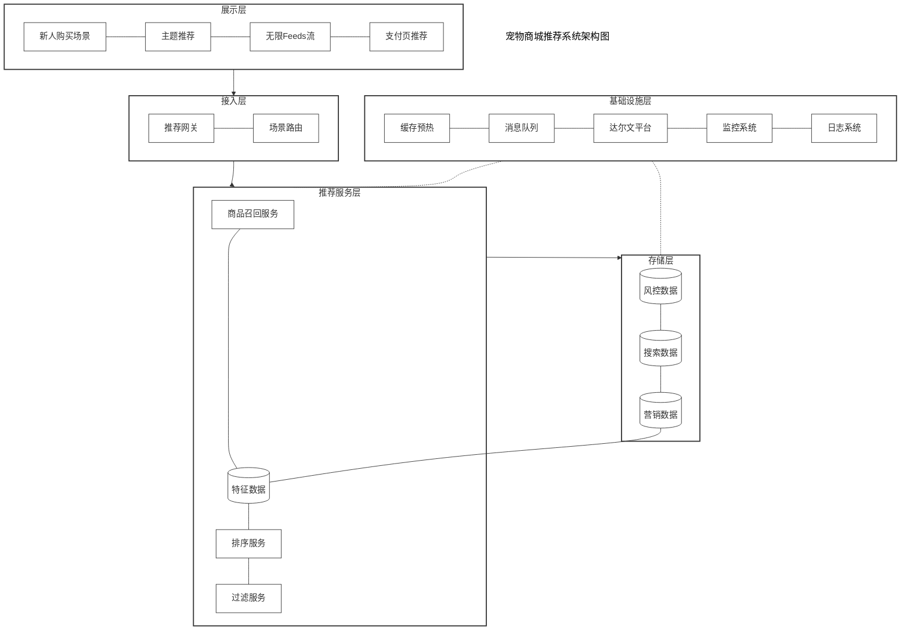

```mermaid
flowchart TD
    %% 设置整体样式
    classDef default fill:#fff,stroke:#333,stroke-width:1px
    classDef storage fill:#fff,stroke:#333,stroke-width:1px,shape:cylinder
    classDef title-style fill:none,stroke:none,color:#000,font-size:18px

    %% 标题
    title[宠物商城推荐系统架构图]
    class title title-style

    %% 展示层
    subgraph Layer1[展示层]
        direction LR
        NewUser[新人购买场景] --- Theme[主题推荐] --- Feed[无限Feeds流] --- Pay[支付页推荐]
    end

    %% 接入层
    subgraph Layer2[接入层]
        direction LR
        Gateway[推荐网关] --- Router[场景路由]
    end

    %% 推荐服务层
    subgraph Layer3[推荐服务层]
        direction LR
        Recall[商品召回服务] --- 
        Feature[特征服务] --- 
        Rank[排序服务] --- 
        Filter[过滤服务]
    end

    %% 存储层
    subgraph Layer4[存储层]
        direction LR
        Risk[(风控数据)] --- 
        Search[(搜索数据)] --- 
        Marketing[(营销数据)] ---
        Feature[(特征数据)]
        class Risk,Search,Marketing,Feature storage
    end

    %% 基础设施层
    subgraph Layer5[基础设施层]
        direction LR
        Cache[缓存预热] --- 
        Queue[消息队列] --- 
        Darwin[达尔文平台] --- 
        Monitor[监控系统] --- 
        Log[日志系统]
    end

    %% 层级连接
    Layer1 --> Layer2
    Layer2 --> Layer3
    Layer3 --> Layer4
    Layer5 -.- Layer3
    Layer5 -.- Layer4

    %% 设置子图样式
    style Layer1 fill:#fff,stroke:#333,stroke-width:2px
    style Layer2 fill:#fff,stroke:#333,stroke-width:2px
    style Layer3 fill:#fff,stroke:#333,stroke-width:2px
    style Layer4 fill:#fff,stroke:#333,stroke-width:2px
    style Layer5 fill:#fff,stroke:#333,stroke-width:2px
```
